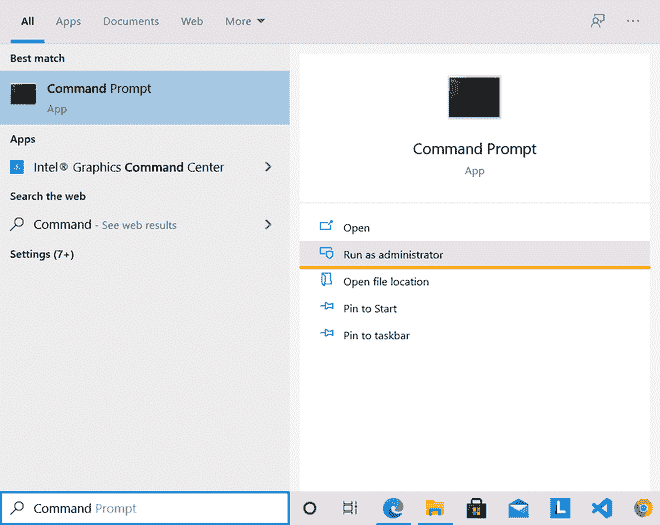
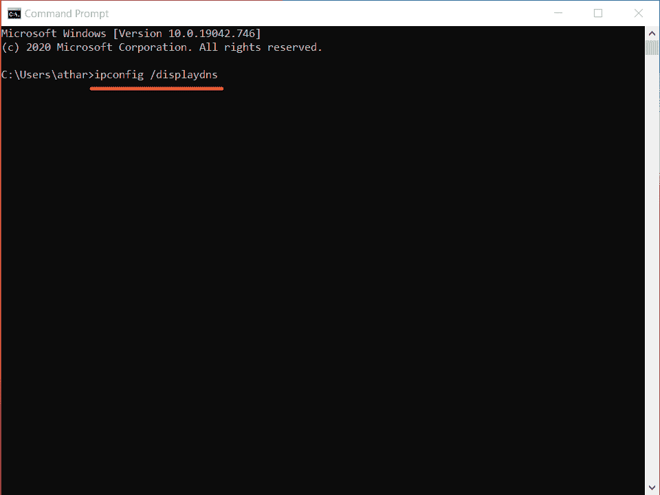
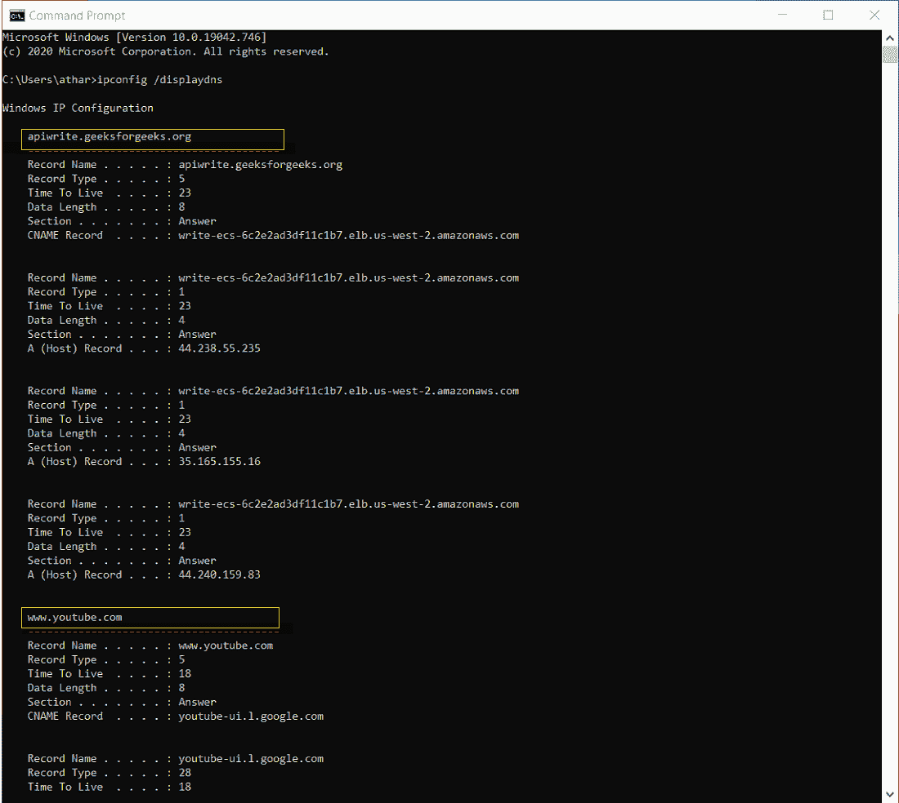
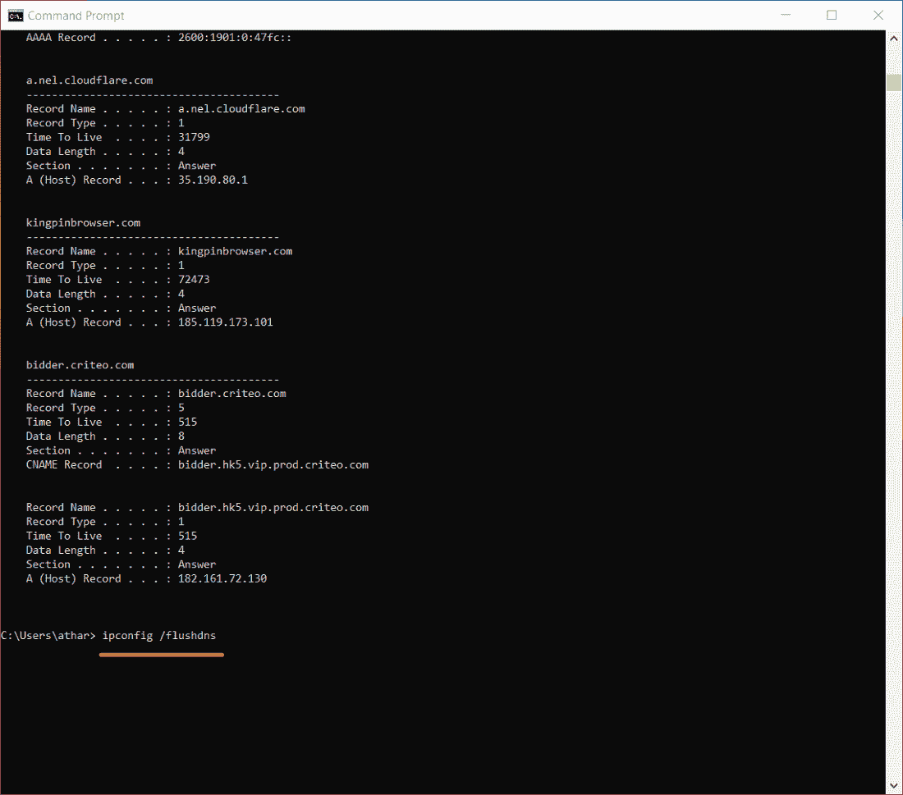
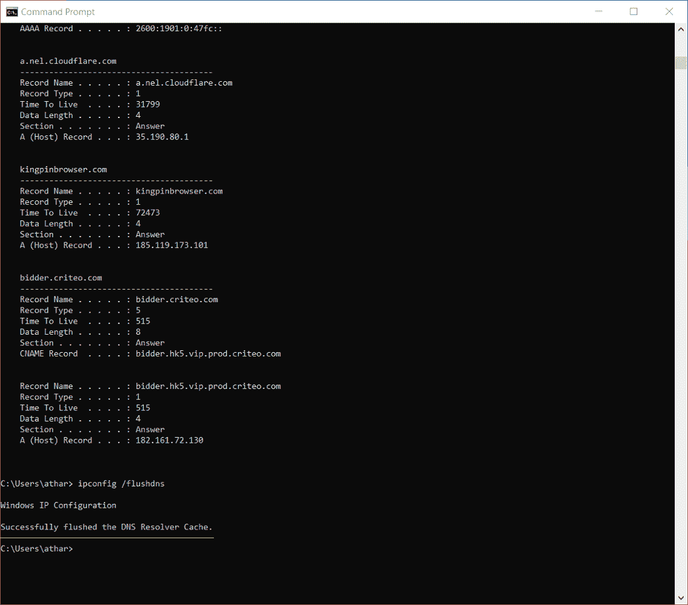

# 如何在谷歌 Chrome 中查看隐姓埋名历史并删除？

> 原文:[https://www . geeksforgeeks . org/how-check-income-history-and-delete-in-Google-chrome/](https://www.geeksforgeeks.org/how-to-check-incognito-history-and-delete-it-in-google-chrome/)

隐姓埋名模式是你可以私下浏览的模式，使用同一设备的其他人不会看到你的活动。这种模式不会留下任何浏览痕迹，因此出于不同的原因，它对私人浏览很有用。

隐姓埋名/私人模式

但是可能会发生这样的情况，你想回到之前以隐姓埋名模式打开的网站，但是你不能去，因为隐姓埋名的历史根本没有保存，除非在谷歌上再次搜索。我们中的许多人可能认为隐姓埋名模式下的浏览历史根本不会被检索到，但事实并非如此。在 Windows 操作系统中有一种方法，通过它我们可以看到我们的隐姓埋名历史并删除它。互联网上有许多第三方应用程序可以用来检查它，但是我们没有使用任何这个应用程序，我们将从使用 windows 命令提示符的 DNS Cache 中看到。

## 域名系统是如何工作的，什么是域名系统缓存？

域名系统代表域名系统。它将任何网站的统一资源定位符(URL)转换为其等效的 IP 地址。

我们所有人都是通过键入 geeksforgeeks.org 或 youtube.com 这样的网址来访问我们最喜欢的网站，但是你的浏览器并不了解这一点，浏览器需要知道你试图访问的网站的 IP 地址。因此，当我们在搜索栏中键入网址时，浏览器会向域名系统发送一个请求。当域名系统从浏览器获得查询时，它会将网站网址与一个 IP 地址进行匹配，并将 IP 地址返回给浏览器。

域名系统缓存(有时也称为域名系统解析器缓存)是本地存储在您的计算机上的最近域名系统查询的内存。它包含最近网站访问的所有记录，以便下次您访问同一网站时，可以从 DNS 服务器获得快速响应。简而言之，域名系统缓存通过在请求发送到互联网之前处理最近访问过的地址的名称来加快匹配 IP 地址的过程。

由于域名系统缓存存储在我们的计算机本地，因此我们可以使用命令提示符轻松查看和清除它。为此，请正确遵循以下步骤。

您可以从这里了解更多关于 DNS [的信息。](https://www.geeksforgeeks.org/working-of-domain-name-system-dns-server/)

## 如何看隐姓埋名的历史？

以下是所提到的查看隐姓埋名历史的步骤，请正确遵循。

**第一步:**打开命令提示符(管理员)，在搜索框中搜索。

**步骤 2:** 键入命令***ipconfig/display dns***查看 DNS 缓存历史。

**第三步:**现在可以看到最近访问过的，历史上没有出现过的网站的详细信息。

## 如何删除隐姓埋名历史？

要删除该历史记录，您必须执行以下步骤:

**第一步:**如上所述打开命令提示符

**第二步:**键入命令***ipconfig/flush dns***清除 DNS。

**步骤 3:** 这将刷新 DNS 条目，现在没有人可以查看您访问过的网站。

这是您清除匿名浏览历史和刷新域名系统查询的方法。