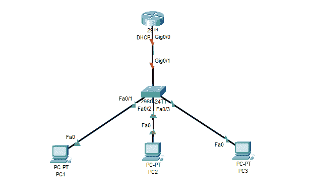
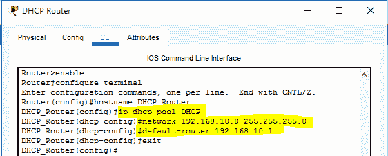
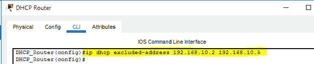
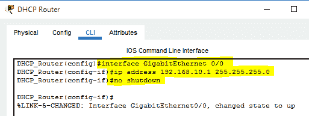
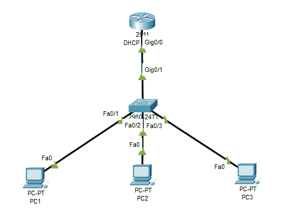
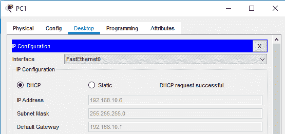
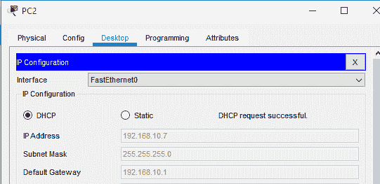
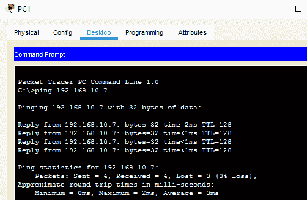

# 如何在思科路由器上配置 DHCP 服务器？

> 原文:[https://www . geesforgeks . org/如何配置-DHCP-服务器对思科-路由器/](https://www.geeksforgeeks.org/how-to-configure-dhcp-server-on-a-cisco-router/)

在本文中，我们将讨论 DHCP 的概述，并将重点介绍如何在思科路由器上逐步实施 DHCP 服务器配置。我们一个一个来讨论。

**概述:**
DHCP(动态主机配置协议)配置在路由器上执行，为主机系统分配一个 IP 地址、子网掩码、网关地址和 DNS 服务器地址。通过这种配置，分配了动态 IP 地址，这使管理员能够轻松地在配置的网络中连接新主机。

**如何在思科路由器上配置 DHCP 服务器:**
下面提供了在思科路由器上配置 DHCP 以向网络中部署的主机系统分配动态 IP 地址的步骤:

**步骤-1 :**
在 Cisco Packet Tracer 中创建了一个网络拓扑，其中包括一个路由器、一个交换机和三个连接到网络的主机系统。

网络拓扑结构

**步骤 2 :**
访问路由器的命令行界面，执行高亮显示的命令，成功配置 DHCP。首先，执行“IP DHCP 池 pool_name”命令。此后，定义网络地址及其子网掩码。此外，“默认路由器 IP 地址”命令用于定义默认路由地址。

DHCP 池的创建

**步骤-3 :**
在此步骤中，从 DHCP 池的子网掩码中定义的地址中排除一系列 IP 地址。排除的 IP 地址不会分配给网络中的任何主机系统。

用于排除 IP 范围的命令

**步骤-4 :**
在 DHCP 配置过程中，与交换机连接的路由器的接口被分配了定义为默认路由器的 IP 地址。数据包将采用此路由到达目的系统。此外,“不关机”命令用于将已连接接口的状态更改为 up。

为路由器接口分配 IP 地址

**步骤-5 :**
在网络中连接的所有设备之间建立成功的连接。在进一步的步骤中，网络中的主机系统由路由器上配置的 DHCP 服务分配动态 IP 和默认网关地址。

所有设备都已成功连接

**步骤-6 :**
访问主机系统的桌面设置并选择 DHCP 选项。系统转发的 DHCP 请求得到确认，并为其分配了 IP 地址、相关子网掩码和默认网关地址。

分配给主机系统的动态 IP 地址

通过在思科路由器上配置的 DHCP 服务器，为网络中部署的另一个主机系统分配所需的逻辑地址。此外，在排除范围内定义的 IP 地址不会分配给计算机系统。

逻辑地址被分配给主机系统

**步骤-7 :**
要检查主机系统之间的连通性，使用“ping”命令交换数据包。所有数据包都成功传输，这确保了通信信道的建立。

连通性测试