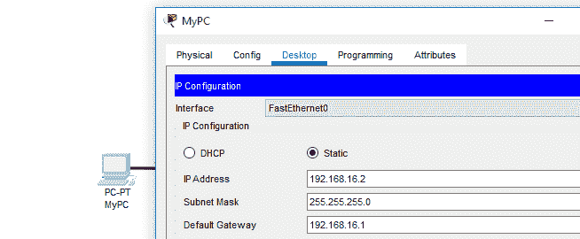
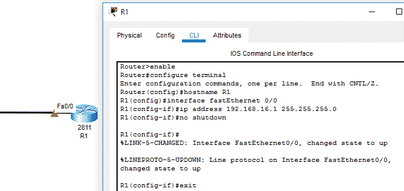
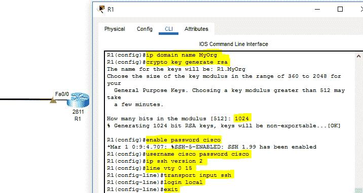

# 如何在思科路由器和交换机上配置 SSH？

> 原文:[https://www . geesforgeks . org/如何配置思科路由器和交换机 ssh/](https://www.geeksforgeeks.org/how-to-configure-ssh-on-cisco-routers-and-switches/)

**概述:**
SSH 是一种安全机制，可用于从远程位置访问路由器和交换机的权限和配置模式，以执行所需的操作。配置 SSH 的主要目的是从远程位置访问网络中部署的设备，以便可以执行所需的配置，并以无缝方式提供资源。为了了解 SSH 配置，思科 Packet Tracer 工具用于演示为此目的要遵循的步骤和要执行的相关命令。除此之外，屏幕截图中还提供了每个命令的语法和解释。

**思科路由器上的 SSH 配置:**
按照下面列出的步骤配置 SSH，如下所示。

**步骤-1 :**
打开思科 Packet Tracer，在计算机系统和路由器之间创建网络拓扑。

**步骤 2 :**
需要访问计算机系统的桌面设置，为其分配网络的 IP 地址、相关子网掩码和网关地址。



为电脑分配 IP 地址、子网掩码和默认网关地址。

**步骤-3 :**
此外，需要访问路由器的命令行接口，为连接的接口分配一个 IP 地址(本场景中为快速以太网 0/0)。

**步骤-4 :**
通过路由器的命令行界面使用配置终端命令进入配置模式。IP 地址 192.168.16.1 被分配给子网掩码为 255.255.255.0 的接口。除此之外，不会执行关闭命令来将接口状态更改为 up。成功配置分配 IP 地址后，计算机系统和路由器之间就建立了通信通道。



一个 IP 地址被分配给路由器的接口

**第 5 步:**
**SSH 命令执行–**

*   用于启用 SSH 的所有命令都在下面提供的思科数据包跟踪器屏幕截图中突出显示。
*   首先，使用“ip 域名域名”命令设置域名。
*   然后，为了保持安全的 SSH 连接，使用“加密密钥生成 RSA”命令生成加密密钥。输入值“1024 ”,然后单击 enter 键成功生成密钥。
*   启用密码*执行密码‘*命令是为了维护安全，只允许授权用户访问路由器命令行界面。
*   此外，“用户名密码”命令用于设置用户名，以建立与网络设备的 SSH 连接。
*   “IP ssh version 2”命令用于定义 ssh 的版本，该版本将在此路由器上配置。
*   此外，执行“线路 vty 0 15 ”,以便可以从连接到网络的远程系统访问路由器。
*   然后，执行“传输输入 ssh”和“本地登录”命令，以便在思科路由器上成功配置 SSH。



SSH 配置

**步骤-6 :**
要测试在思科路由器上配置的 SSH，在计算机系统上打开命令提示符，并执行“ssh -l 用户名 IP 地址”命令。

**命令–**

```
ssh -l cisco 192.168.16.1  
```


SSH 测试