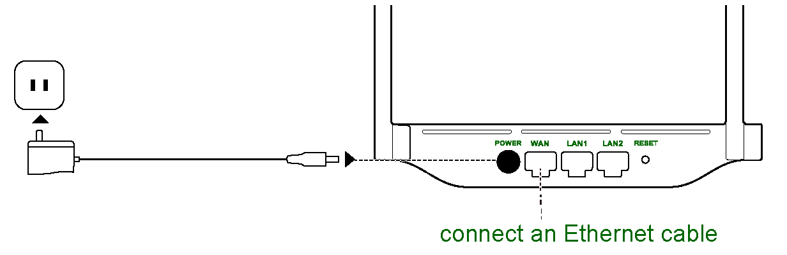
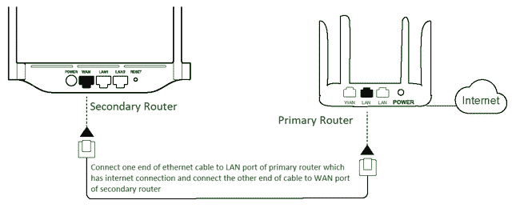
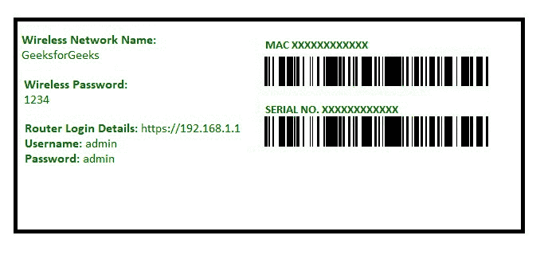
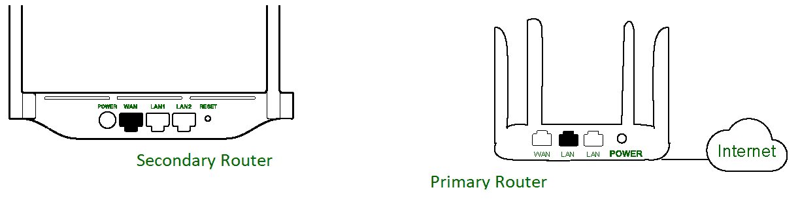

# 如何将一台路由器连接到另一台路由器来扩展网络？

> 原文:[https://www . geesforgeks . org/如何将一台路由器连接到另一台路由器以扩展网络/](https://www.geeksforgeeks.org/how-to-connect-one-router-to-another-to-expand-the-network/)

先决条件–[路由器](https://www.geeksforgeeks.org/introduction-of-a-router/)

**步骤 1 :** 设置主路由器

**Figure –** Set Up Primary Router

要设置您的主路由器，请将您的互联网服务提供商提供的承载互联网的以太网电缆连接到路由器的广域网端口。在许多路由器上，**“广域网”**端口也被标为**“互联网”**。

一旦安装了主路由器，并且 internet 正常工作，有两种方法可以扩展您的网络。

### 方法 1–

**步骤 2 :** 通过以太网电缆设置辅助路由器

**Figure –** Setting up Secondary Router via Ethernet Cable

设置辅助路由器来扩展网络。为此，请使用一根以太网电缆，并将其中一根电缆连接到主路由器的局域网端口，该端口具有互联网连接。将另一根以太网电缆插入辅助路由器的广域网端口。

**步骤 3 :** 配置辅助路由器

**Figure –** Login Credentials for a Router

登录二级路由器，将路由器翻过来，在登录详情前面写的浏览器上进入网站。使用用户名和密码登录路由器后:

1.  将互联网连接设置为 DHCP。
2.  设置您的 WiFi 路由器名称。
3.  设置路由器密码。
4.  保存并应用。

单击“保存并应用”后，您的辅助路由器现在已经设置好，可以使用了。这台辅助路由器扩展了您的网络。

### 方法 2–

**注意–**
在执行此方法之前，请确保在主路由器上启用了桥接。

**步骤 2 :** 将辅助路由器设置为无线中继器

**Figure –** Setting up Secondary Router as Wireless Repeater

要将辅助路由器设置为无线中继器，请将辅助路由器放在主 WiFi 路由器信号质量良好的地方。如果接收到的信号较少，那么这种方法可能无法正常工作。

**步骤-3 :** 将辅助路由器配置为无线中继器
按照方法 1:步骤 3 中说明的相同方式登录辅助路由器。登录后，请按照下列步骤操作:

1.  转到无线页面。
2.  设置您的 WiFi 路由器名称。
3.  设置路由器密码。
4.  保存并应用。
5.  转至无线页面上的无线中继器部分。
6.  启用无线中继器选项(如果禁用)。
7.  单击“现场勘测”按钮。
8.  从可用 WiFi 列表中选择主路由器名称。
9.  在预共享密钥部分输入主路由器的密码。
10.  单击应用。

有一个无线页面，您需要在其中设置辅助路由器的 SSID 和密码。然后，您需要转到无线页面上的无线中继器部分。在那里，在启用无线中继器选项和完成调查后，将出现一个 WiFi 名称列表，其信号可由辅助路由器访问。选择主路由器的名称，并输入主路由器的密码。完成上述步骤后，您的网络将扩展，因为辅助路由器将充当无线中继器。

**注意–**
通过方法 1 接收的网速始终大于方法 2。因此，要以良好的互联网速度扩展网络，请使用方法 1。