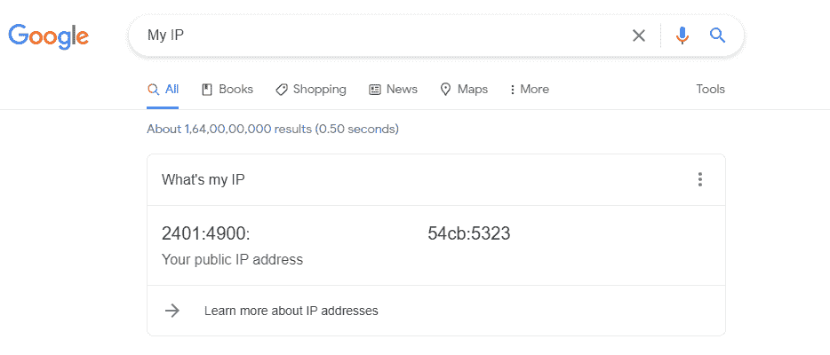
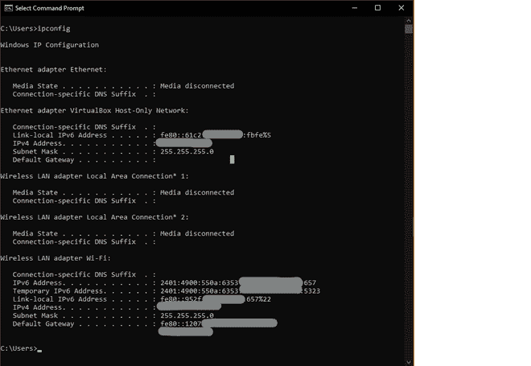
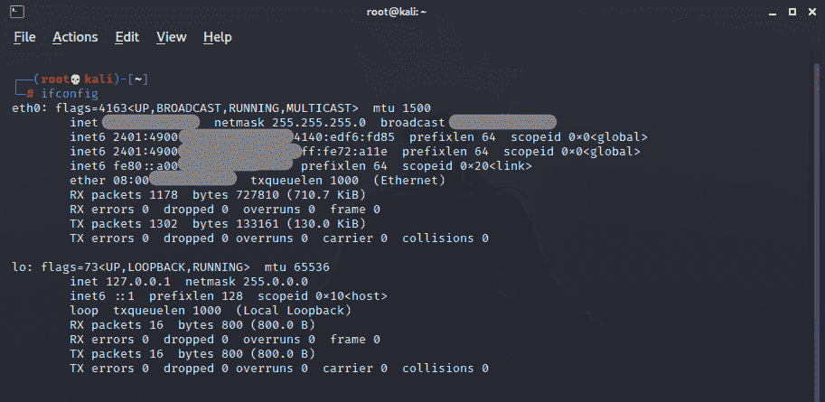

# 如何找到自己的 IP 地址？

> 原文:[https://www.geeksforgeeks.org/how-to-find-your-ip-address/](https://www.geeksforgeeks.org/how-to-find-your-ip-address/)

计算机网络使用两种类型的 [IP 地址](https://www.geeksforgeeks.org/ip-addressing-gq/):

1.**公共 IP /外部 IP** : A [公共 IP](https://www.geeksforgeeks.org/difference-between-private-and-public-ip-addresses/) 是您的住所或公司路由器从您的 ISP 接收的 IP 地址。它是一个用于在本地网络之外通信的 IP 地址。

2.**私有 IP /内部 IP** :一个[私有 IP](https://www.geeksforgeeks.org/know-public-private-ip-addresses/) 地址对于连接同一个网络内的设备非常有用，同一个网络内的每台设备都有一个唯一的私有 IP 地址。

### **使用浏览器查找公共 IP**

下面是一些有用的网站，可以识别你的公共 IP 地址。您可以在手机或电脑上浏览这些网站，让它们显示互联网地址:

1.  我的知识产权
2.  你叫什么名字
3.  whatsismipiaddress

**示例输出:**

我的知识产权

### **在 Windows 上查找 IP 的步骤:**

**1。**点击开始或点击搜索框，输入 cmd。

**2。**点击命令提示符。在 Windows cmd 中键入 ***ipconfig*** 并按回车键。

1.  您可以在 ipconfig 命令输出后分别找到您的 IP 地址。
2.  如果您通过以太网连接到互联网，则该 IP 地址将出现在**以太网适配器以太网**部分。
3.  如果您通过无线网络连接到互联网，则该 IP 地址将出现在**无线局域网适配器无线网络**部分。
4.  如果您同时连接到两个网络，则会显示两个 IP 地址。

视窗上的知识产权

### **在 Linux 上查找 IP 的步骤**

**1。**打开 Linux 终端或使用(Ctrl+Alt+T)。

**2。**点击终端，输入**并按回车键。**

1.  **Linux 终端中的 IP 地址列在 **eth0** 名称旁边，如下图所示。**

**

Linux 上的知识产权** 

### ****步骤至**在 MacOS 上找到 **IP 地址****

1.  **打开苹果菜单。**
2.  **打开系统偏好设置。**
3.  **单击网络窗格。**
4.  **查找状态部分下列出的 IP 地址。**