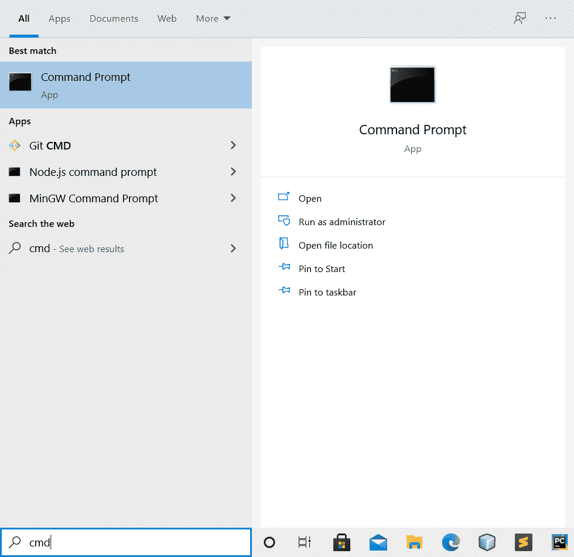
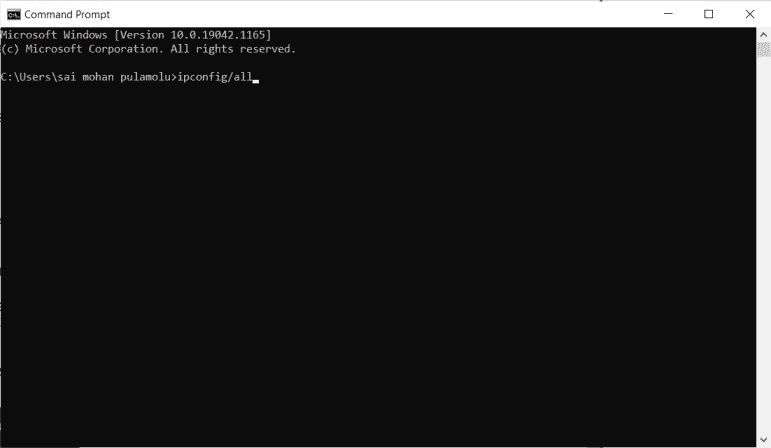
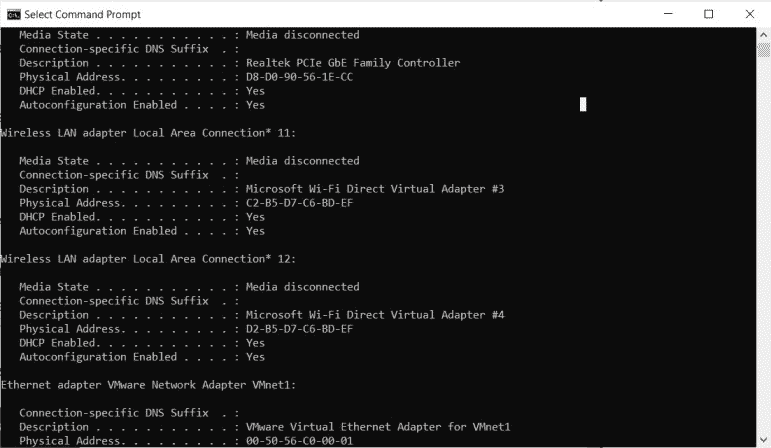
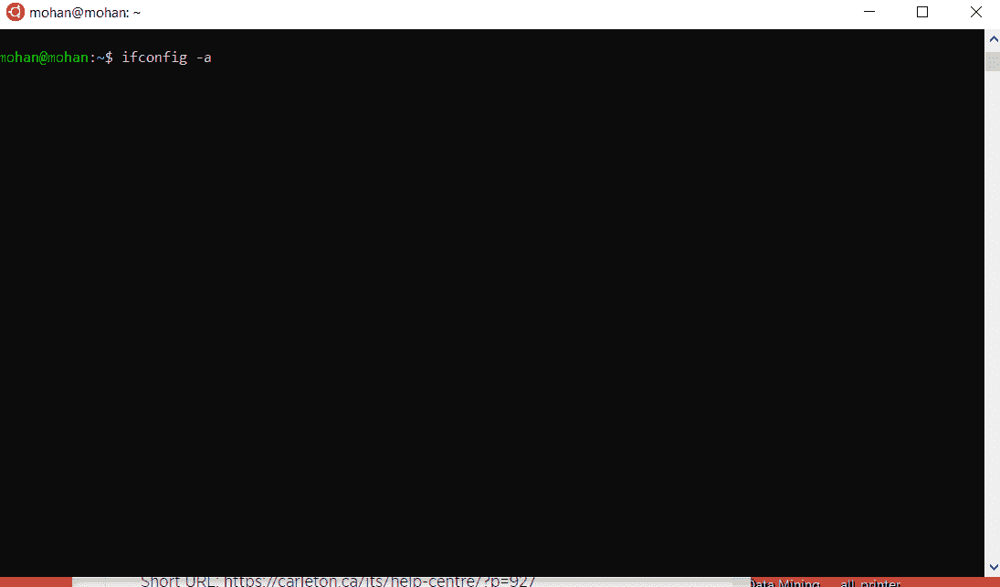
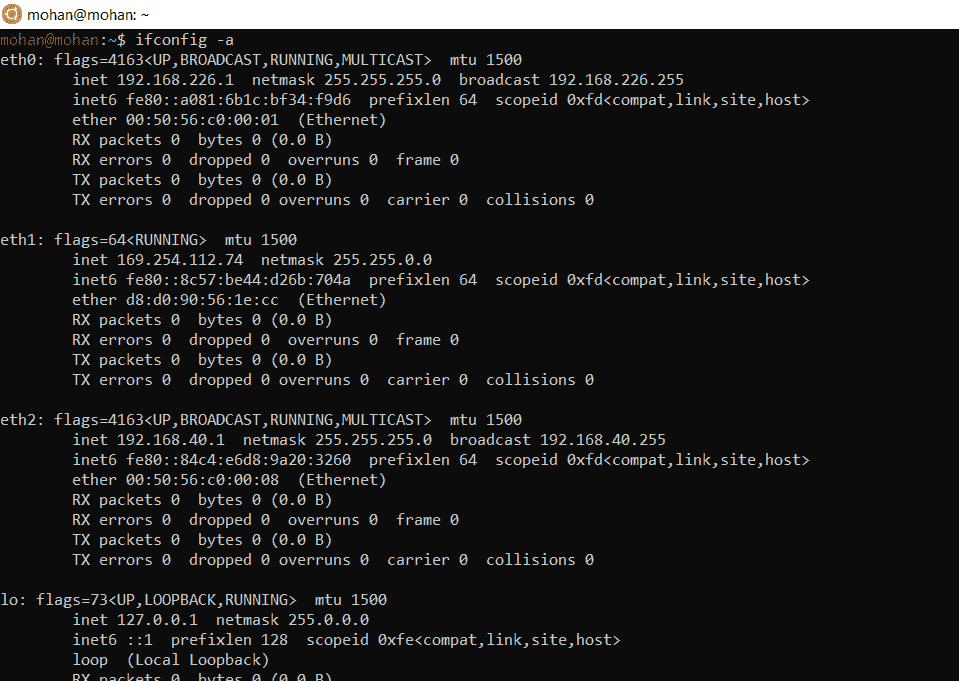

# 如何找到自己的 Mac 地址？

> 原文:[https://www.geeksforgeeks.org/how-to-find-your-mac-address/](https://www.geeksforgeeks.org/how-to-find-your-mac-address/)

**先决条件:**[**MAC 地址介绍**](https://www.geeksforgeeks.org/introduction-of-mac-address-in-computer-network/)

**在这篇文章中，我们将学习如何找到我们的 Mac 地址。**

****1。在 Windows 中查找 mac 地址:****

*   **单击开始或在搜索框中单击并键入 cmd。**

****

*   **单击命令提示符。**
*   **在 cmd 窗口中，键入 ipconfig /all，然后按 enter 键。**

****

*   **列出了所有的适配器，每个适配器都有一个称为 mac 地址的物理地址。**

****

****2。在 UNIX 或 Linux 设备中查找媒体访问控制地址:****

*   **开放式终端。**

****

*   **输入 ifconfig -a，然后按回车键。**

****

****3。在苹果或 MAC 中查找 MAC 地址:****

1.  **打开苹果菜单。**
2.  **打开系统偏好设置。**
3.  **开放网络和开放高级。**
4.  **选择无线网络标签**
5.  **无线地址是设备的媒体访问控制地址。**