# 如何在 Windows 上安装 Wireshark？

> 原文:[https://www . geesforgeks . org/如何在 windows 上安装 wireshark/](https://www.geeksforgeeks.org/how-to-install-wireshark-on-windows/)

Wireshark 是广泛用于分析网络中数据包的软件。Wireshark 是完全免费和开源的。该数据包分析器用于各种目的，如排除网络故障、了解两个系统之间的通信、开发新协议等。Wireshark 的原名是 Ethereal，由于一些公司的版权问题，它在 2006 年被更改。这个软件是用 C 和 C++写的，最初发布是在 1998 年。它的最新版本是 3.6.0，于 2021 年 11 月 22 日发布。Wireshark 是一款跨平台的软件，它可以运行在 Linux、windows、mac 等任何操作系统上。

### 在 Windows 上安装 Wireshark:

按照以下步骤在 Windows 上安装 Wireshark:

**第一步:**使用任何网络浏览器访问【Wireshark 官方网站。

**第二步:**点击下载，会打开一个新的网页，里面有 Wireshark 的不同安装程序。

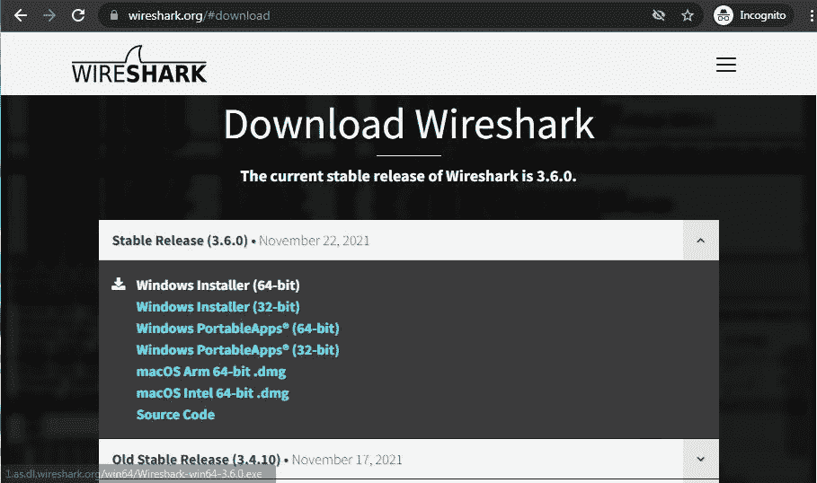

**步骤 3:** 可执行文件的下载将很快开始。这是一个 73.69 MB 的小文件，需要一些时间。

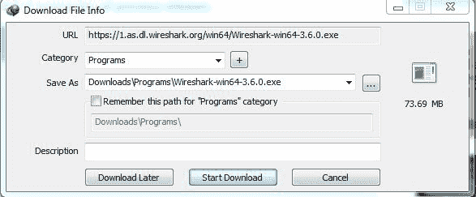

**第 4 步:**现在检查系统下载中的可执行文件并运行它。

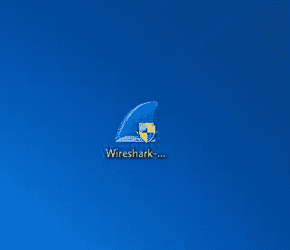

**第五步:**会提示确认对你的系统进行修改。单击是。

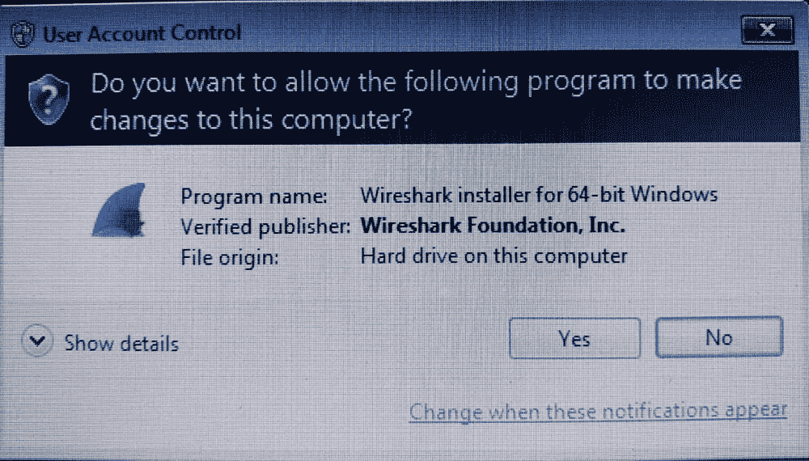

**第 6 步:**设置画面出现，点击下一步。

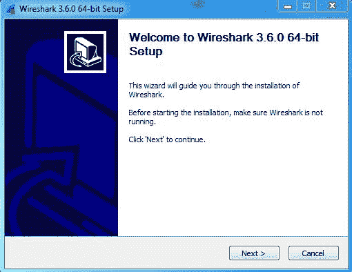

**第 7 步:**下一个屏幕是许可协议，点击注意。

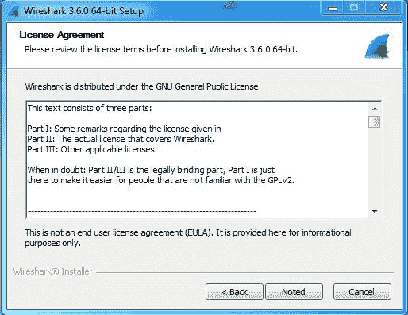

**第八步:**这个屏幕是选择组件的，所有组件都已经标记好了，所以不要更改任何东西，只需点击下一步按钮。

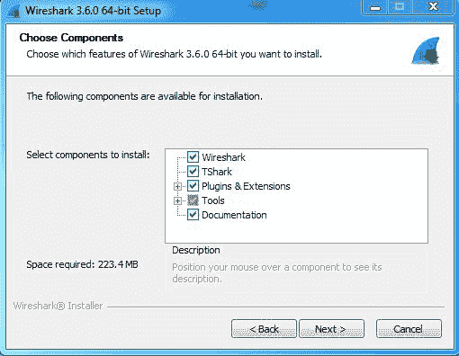

**第 9 步:**该屏幕是选择快捷方式，如开始菜单或桌面图标以及 Wireshark 可以截取的文件扩展名，勾选所有框，然后点击下一步按钮。

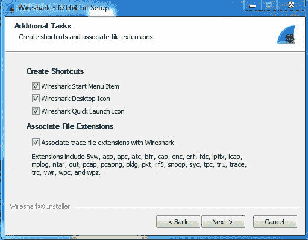

**步骤 10:** 下一个屏幕将是安装位置，因此选择有足够内存空间进行安装的驱动器。它只需要 223.4 兆的内存空间。

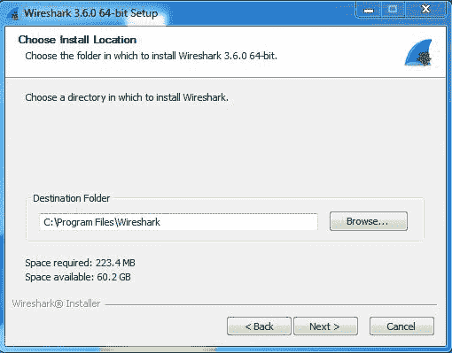

**第 11 步:**下一屏有一个安装 Npcap 的选项，与 Wireshark 一起使用来捕获数据包 *pcap* 表示数据包捕获，所以安装选项已经勾选了不要更改任何内容，点击下一步按钮。

**第 12 步:**下一个屏幕是关于 USB 网络捕获的，所以使用与否是自己的选择，点击安装。

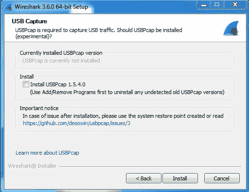

**第 13 步:**之后，安装过程将开始。

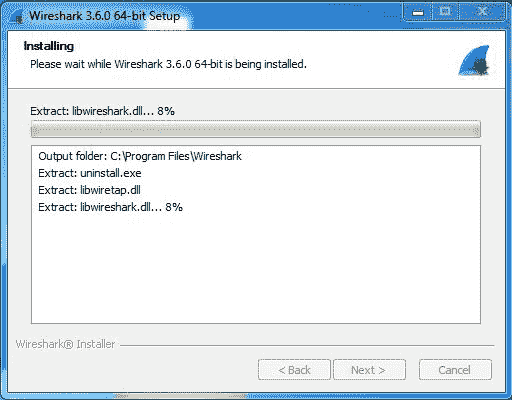

**第 14 步:**该安装将提示已检查过的 Npcap 安装，因此 Npcap 的许可协议将显示为点击*我同意*按钮。

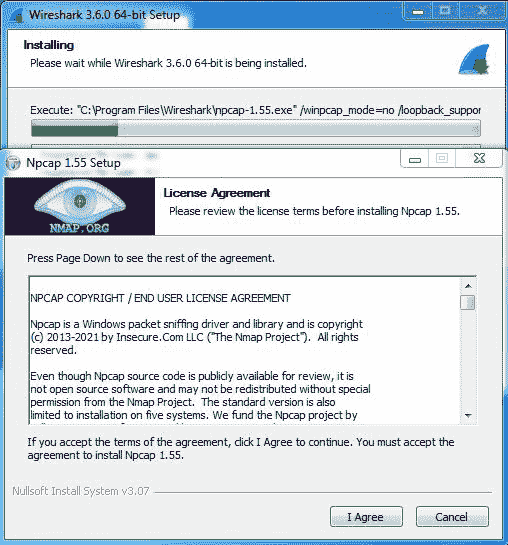

**第 15 步:**下一屏是关于 *npcap* 的不同安装选项，不要做任何事情点击安装。

**步骤 16:** 之后，安装过程将开始，只需一分钟。

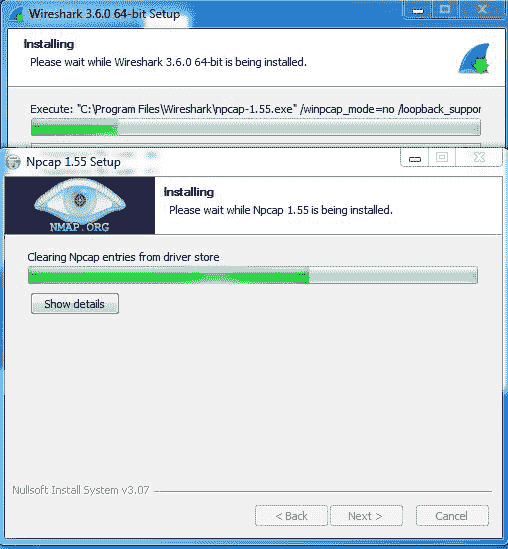

**步骤 17:** 此安装过程完成后点击下一步按钮。

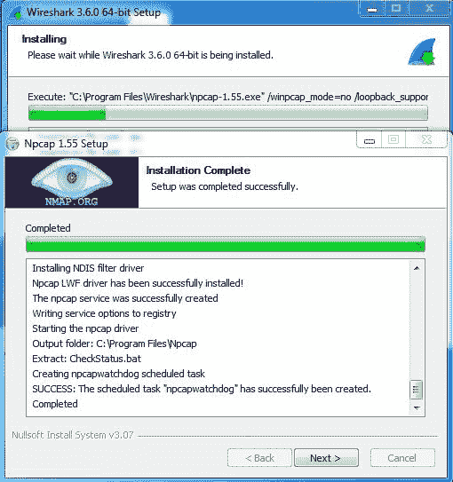

**步骤 18:** 安装过程完成后，点击完成。

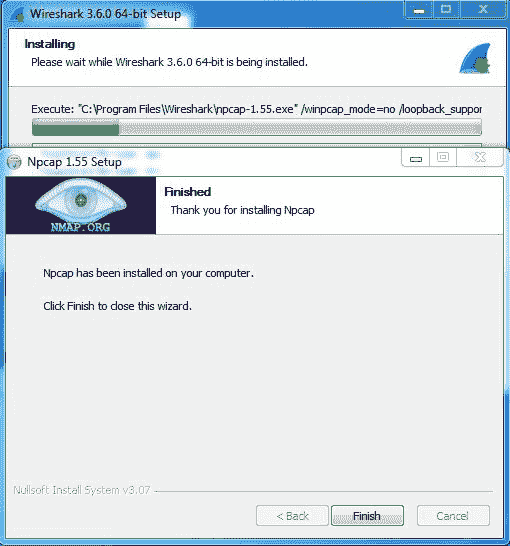

**第 19 步:**Wireshark 的安装过程完成后，点击下一步按钮。

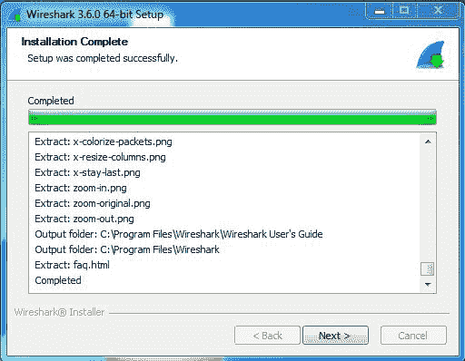

**步骤 20:**Wireshark 安装过程完成后，点击完成。

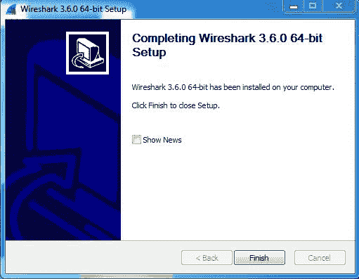

Wireshark 已成功安装在系统上，桌面上会创建一个图标，如下所示:

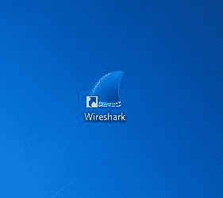

现在运行软件，看到界面。

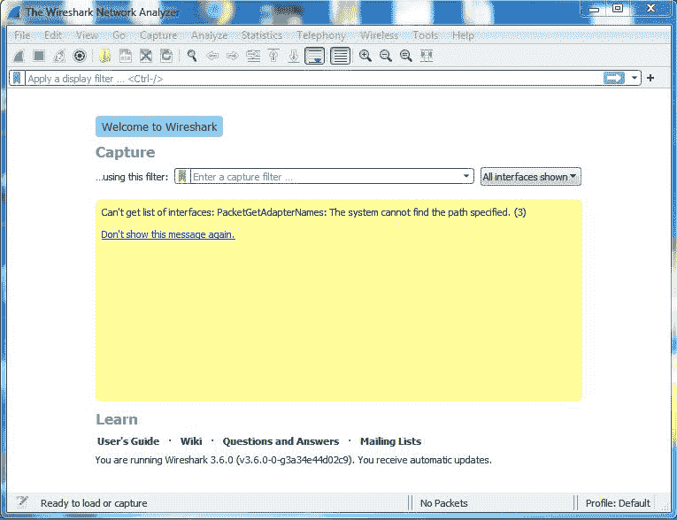

恭喜你！！此时，您已经在 windows 系统上成功安装了 Wireshark。