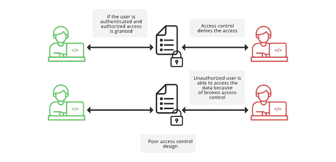

# 如何防止访问控制中断？

> 原文:[https://www . geesforgeks . org/如何防止访问控制中断/](https://www.geeksforgeeks.org/how-to-prevent-broken-access-control/)

**访问控制**是一种安全机制，用于对资源的可访问性进行限制，并决定谁或什么可以查看或使用公司的资源。这是在**认证**后检查的，**授权**用户可以做什么。这不是一件容易的事情，检查时的任何失败都可能导致数据修改或数据破坏或未经授权执行业务功能等。有时，开发人员并不专门设计访问控制，而是简单地将它们与网站一起设计。因此，这种特殊的规则集合变得难以理解。

### 什么是损坏的访问控制？

访问控制机制执行不力导致访问控制存在缺陷，很容易被利用。这被称为破坏访问控制。由于访问控制被破坏，未经授权的用户可以查看他们不被允许查看的内容，可以执行未经授权的功能，甚至攻击者可以删除内容，或者接管网站管理。

访问控制中断

### 访问控制漏洞

我们可以将访问控制漏洞主要分为**三个**类别:

#### 1.横向权限升级:

当用户可以访问与其具有相同权限级别的其他用户的数据时。
***例如*** ，当你登录你的社交媒体账户时，你可以看到你的内容并对其进行更改，但不允许你访问其他用户的账户。然而，如果访问控制有缺陷，事情可能会出错。

#### 2.垂直权限升级:

当用户可以访问那些有权限执行一些普通用户没有的操作的用户的数据时，通过垂直访问控制，不同类型的用户可以访问不同的应用程序功能。
*比如*，要执行某些功能，到达某些资源，用户需要有管理员权限，普通用户没有这样的权限。中断的垂直访问控制让攻击者能够访问这些功能。

#### 3.依赖于上下文的权限提升:

当允许用户以错误的顺序执行操作时。
*例如*，从电商网站购买商品后，用户不应该被允许修改他/她的购物车。依赖于上下文的访问控制不允许用户在付款后更改项目，但是如果它被破坏，那么用户将被允许进行更改。

### 访问控制中断的影响

**1。**每当我们在网站上建立账户时，我们都会被赋予一个唯一的 ID。通过使用该 ID，我们可以访问保存所有敏感内容的数据库。假设你已经登录了一个网站，你的用户 ID 是 *986* 。你的个人资料页面的网址应该是这样的:*https://brokenaccesscontrol.com/profile?id=986*。我们必须记住，像您一样，在该网站上创建他/她的帐户的每个人都被赋予了唯一的用户标识。因此，如果你用别人的用户 ID 替换你的 ID，那么你就可以访问他/她的个人资料。是的，如果在服务器中没有正确实施访问控制，就会发生这种情况。

**2。**黑客可以利用访问漏洞获取正常用户不应该访问的资源和服务。
*例如*，网络应用程序的管理页面应该只对管理员开放，不应该对任何其他用户开放。然而，如果访问控制被破坏，黑客只需在网址上做一些改变就可以很容易地访问它。有了这种特权，他们可以窃取其他用户的数据或部署恶意负载来破坏整个应用程序托管生态系统。

**3。**存在**分布式拒绝服务攻击** [**(DDOS)**](https://www.geeksforgeeks.org/denial-of-service-ddos-attack/) 的可能。通过访问这些用户帐户，攻击者可以通过部署僵尸工具来尝试中断目标服务器的正常流量。这使得服务器很难区分合法用户流量和攻击流量。

### 如何防止访问控制中断？

[**在线社区 OWASP(开放 web 应用安全项目)**](https://www.geeksforgeeks.org/owasp-top-10-vulnerabilities-and-preventions/) 分析 Web 应用的弱点和攻击，给出了十大最危险的漏洞列表，breaked Access Control 就是其中之一。这表明大多数 web 应用程序的安全性很差。为了防止访问控制中断，安全团队可以采用以下做法-

#### 1.持续检查和测试访问控制:

高效的持续测试和检查访问控制机制是检测新漏洞并尽快纠正它们的有效方法。

#### 2.默认情况下拒绝访问:

设计[访问控制](https://www.geeksforgeeks.org/access-control-in-computer-network/)的方式是，不是每个人都可以访问资源和功能，除非它打算公开访问。您可以应用**准时制**访问，这有助于消除与长期特权相关的风险。

#### 3.限制 CORS 的使用:

CORS(跨来源资源共享)协议提供了一种受控的方式来共享跨来源资源。CORS 的实现依赖于在客户端和目标应用程序之间的通信中使用的超文本传输协议(HTTP)头。当 CORS 协议配置错误时，一个域可能被恶意方控制，从而向您的域发送请求。

#### 4.启用基于角色的访问控制:

这是一种广泛使用的访问控制机制。据此，用户根据其角色被授予权限。用户被分配到一组角色，而不是单独识别每个用户，这样可以减少信息技术支持和管理的工作量，并最大限度地提高运营效率。

#### 5.启用基于权限的访问控制:

这是一种访问控制方法，其中授权层检查用户是否有权访问特定数据或执行特定操作，通常是通过检查用户的角色是否拥有此权限。

#### 6.启用强制访问控制:

这是一种安全方法，它基于资源包含的信息的敏感性来限制访问资源的能力。该安全策略只能由管理员控制，普通用户没有能力更改该策略。由于这种集中管理，它被认为是非常安全的。