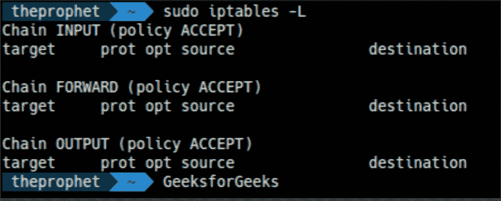
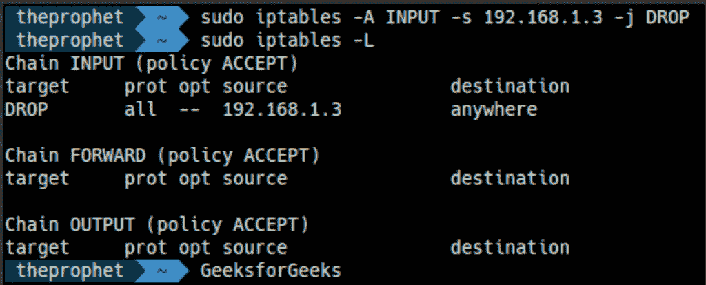
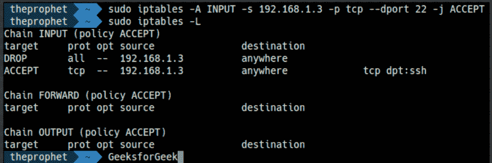
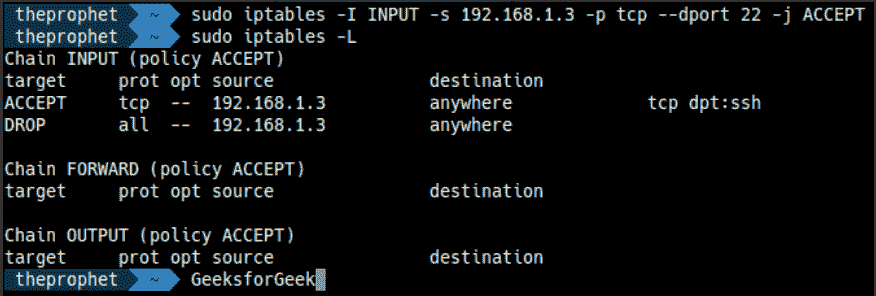
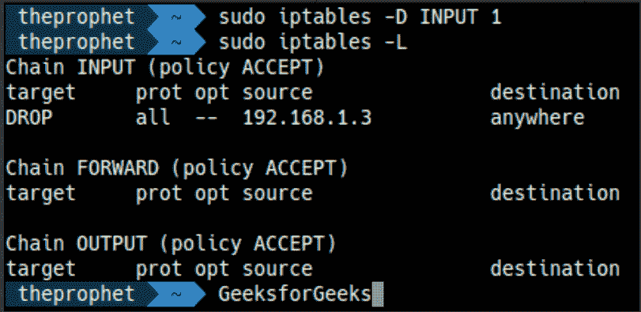

# 如何在 Linux 中设置防火墙？

> 原文:[https://www . geeksforgeeks . org/如何设置-linux 中的防火墙/](https://www.geeksforgeeks.org/how-to-setup-firewall-in-linux/)

**什么是防火墙？**
防火墙是一个网络安全系统，它根据一组预定的规则过滤和控制流量。这是设备和互联网之间的中介系统。

**注意:-** 如果你已经了解了 Linux 中防火墙的工作原理，只是想知道命令，那么请到教程的最后。

**Linux 的防火墙是如何工作的:**
大多数 Linux 发行版都附带了可以用来配置它们的默认防火墙工具。我们将使用 Linux 中提供的默认工具“IPTables”来建立防火墙。Iptables 用于在 Linux 内核中设置、维护和检查 IPv4 和 IPv6 包过滤规则的表。

**注意** :-以下所有命令都需要 sudo 权限。

### 链条:-

链是为特定任务定义的一组规则。

我们有三个用于处理流量的链(规则集)

1.  输入链
2.  输出链
3.  前进链

**1。输入链**
任何从互联网(网络)流向本地机器的流量都必须通过输入链。这意味着他们必须通过输入链中设置的所有规则。

**2。输出链**
任何从本地机器到互联网的流量都需要通过输出链。

**3。前向链**
任何来自外部网络并去往另一个网络的流量都需要通过前向链。当两台或多台计算机连接在一起，我们想在它们之间发送数据时，就会用到它。

### 不同的政策:-

iptables 可以对流量执行三种操作

1.  接受
2.  滴
3.  拒绝

**1。接受**
当流量通过其指定链中的规则时，则 iptable 接受流量。
这意味着它打开了大门，允许这个人进入灭霸王国。

**2。丢弃**
当流量无法通过其指定链中的规则时，iptable 会阻止该流量。
表示防火墙关闭。

**3。拒绝**
这种类型的操作类似于丢弃操作，但它会向流量发送方发送消息，说明数据传输失败。
一般来说，当你想让另一端知道端口不可达时，使用 REJECT，用 DROP 连接到你不想让别人看到的主机。

 ***注:-**
这里需要记住一个简单的规则:-
在 iptables 中设置的规则是从最上面的规则到最下面的规则进行检查的。每当数据包通过任何顶级规则时，它都被允许通过防火墙。不检查较低的规则。所以在制定规则的时候要小心。*

# 基本 iptables 命令:

### 1.列出 iptable 的当前规则:

列出当前 iptables 的规则:-

```
sudo iptables -L
```

*输出*将是:-


如您所见，我们有三个链(输入、转发、输出)。我们也可以看到列标题，但它们不是实际的规则。这是因为大多数 Linux 没有预定义的规则。

*让我们看看每一列是什么意思。*

***目标:-***
这定义了需要对数据包执行什么操作(ACCEPT、DROP 等)..)

***prot:-***
这定义了数据包的协议(TCP，IP)。

***来源:-***
这告诉了数据包的源地址。

***目的地:-***
这定义了数据包的目的地址

### 2.清除规则:

如果你想清除所有现存的规则。运行以下命令:-

```
sudo iptables -F
```

这将重置 iptables。

### 3.更改链的默认策略:

```
sudo iptables -P Chain_name Action_to_be_taken

```

如上图所示，每个链的默认策略是 ACCEPT。

**例如:**–
如果您看到正向链，您将看到“正向链(策略接受)”。这意味着您的计算机允许任何流量转发到另一台计算机。

为了将转发策略更改为丢弃:-

```
sudo iptables -P FORWARD DROP
```

上述命令将阻止任何通过您的系统转发的流量。这意味着没有其他系统可以将您的系统作为传递数据的中介。

# 制定你的第一条规则:

### 1.实现 DROP 规则:

我们现在将开始构建防火墙策略。我们将首先处理输入链，因为输入流量将通过输入链发送。
 ***语法:-***

```
sudo iptables -A/-I chain_name -s source_ip -j action_to_take
```

我们再举一个*的例子来理解这个话题。*

*假设我们想要阻止来自 IP 地址 192.168.1.3 的流量。可以使用以下命令:-*

```
*sudo iptables -A INPUT -s 192.168.1.3 -j DROP*
```

*这看起来可能很复杂，但当我们检查组件时，大部分都是有意义的:-
***-A INPUT :-****

*标志-A 用于将规则附加到链的末尾。命令的这一部分告诉 iptable，我们希望在 INPUT 链的末尾添加一个规则。*

****-I INPUT:-***
在此标志中，规则被添加到链的顶部。*

****-s 192 . 168 . 1 . 3:-***
该标志-s 用于指定数据包的来源。这告诉 iptable 寻找来自源 192.168.1.3 的数据包*

****-j DROP***
这指定了 iptable 应该如何处理数据包。*

*简而言之，上面的命令给 INPUT 链增加了一条规则，即如果有源地址为 192.168.1.3 的数据包到达，则丢弃该数据包，这意味着不允许该数据包到达计算机。*

*执行上述命令后，您可以使用以下命令查看更改*

```
*sudo iptables -L*
```

**输出*将为:-*

**

### *2.实现 ACCEPT 规则:*

*如果您想向网络的特定端口添加规则，可以使用以下命令。
 ***语法:-****

```
*sudo iptables -A/-I chain_name -s source_ip -p protocol_name --dport port_number -j Action_to_take*
```

****-p protocol_name:-***
此选项用于匹配遵循 protocol _ name 的数据包。*

****-dport 端口号:***
仅当您给出-p protocol_name 选项时，此选项才可用。它指定查找发往端口“端口号”的数据包。*

***示例:-**
假设我们想要保持 SSH 端口打开(我们将在本指南中假设默认 SSH 端口为 22)，来自我们在上述情况下阻止的 192.168.1.3 网络。也就是说，我们只希望允许来自 192.168.1.3 的数据包进入端口 22。*

**我们做什么:-*
让我们试试下面的命令:-*

```
*sudo iptables -A INPUT -s 192.168.1.3 -p tcp --dport 22 -j ACCEPT*
```

*上面的命令说寻找来自 IP 地址 192.168.1.3 的数据包，它有一个 TCP 协议，谁想在我的计算机的端口 22 传递什么。如果你找到那些包，那么接受它们。*

*命令的*输出*为:-
*

*但是，上面的命令有一个问题。它实际上不允许数据包。你能猜到是什么吗？
*提示:-它与访问规则的方式有关。**

*请记住，正如我们之前讨论的，您在 iptables 中设置的规则是从上到下检查的。每当数据包被处理到最高规则之一时，就不会用较低的规则进行检查。*

*好的。答案如下:-
在我们的例子中，数据包是用最顶层的规则检查的，该规则规定 iptable 必须丢弃来自 192.168.1.3 的任何数据包。因此，一旦通过这个规则访问了分组，它就不会进入允许分组到达端口 22 的下一个规则。因此它失败了。*

****能做什么？***
最简单的答案是，将规则添加到链的顶端。你所需要做的就是把-A 选项改为-I 选项。*(在我们的场景中，我们首先删除上一节添加的规则【参考下一节】，然后再次添加下面的规则)**

*这样做的命令是:-*

```
*sudo iptables -I INPUT -s 192.168.1.3 -p tcp --dport 22 -j ACCEPT*
```

*现在使用-L 命令检查 iptable 配置。输出将是:-

因此，来自 192.168.1.3 的任何数据包首先被检查它是否要到达端口 22，如果不是，则它
通过链中的下一个规则运行。否则允许它通过防火墙。*

*现在，您已经了解了如何阻止和接受传入的流量，让我们看看如何删除规则:-*

### *3.从 iptable 中删除规则:*

***语法:-***

```
*sudo iptables -D chain_name rule_number*
```

***示例:-**
如果我们想要删除接受到端口 22 的流量的规则，并且我们已经在前面的部分中添加了该规则，那么:-*

```
*sudo iptables -D INPUT 1*
```

**记住规则号从 1*
开始*输出* :-
*

### *4.保存您的配置:*

*如果您在不是服务器的个人计算机上实施，这一部分是不必要的，但是如果
您在服务器上实施防火墙，那么您的服务器很有可能被破坏，并且
您可能丢失所有数据。因此，保存您的配置总是更好。*

*有很多方法可以做到这一点，但我发现最简单的方法是用***iptables-persistent***包。您可以从 Ubuntu 的默认存储库中下载该包:*

```
*sudo apt-get update
sudo apt-get install iptables-persistent* 
```

*安装完成后，您可以使用以下命令保存您的配置*

```
*sudo invoke-rc.d iptables-persistent save*
```

*好了，教程到此结束。
让我们简单介绍一下目前为止所学的所有命令:-*

# *总结:*

### *1.列出 iptables 的当前规则:*

```
*sudo iptables -L*
```

### *2.要更改默认策略，请执行以下操作:*

```
*sudo iptables -P Chain_name Action_to_be_taken*
```

****例:-****

```
*sudo iptables -P FORWARD DROP*
```

### *3.清除/刷新所有规则*

```
*sudo iptables -F*
```

### *4.要在链的末端附加规则:*

```
*sudo iptables -A*
```

### *5.要在链的开头附加规则，请执行以下操作:*

```
*sudo iptables -I*
```

### *6.要实现 ACCEPT 规则:-*

```
*sudo iptables -A/-I chain_name -s source_ip -j action_to_take*
```

****例:-****

```
*iptables -A INPUT -s 192.168.1.3 -j ACCEPT*
```

### *7.要实现 DROP 规则，请执行以下操作:-*

```
*sudo iptables -A/-I chain_name -s source_ip -j action_to_take*
```

****例:-****

```
*iptables -A INPUT -s 192.168.1.3 -j DROP*
```

### *8.在特定端口/协议上实施规则:-*

```
*sudo iptables -A/-I chain_name -s source_ip -p protocol_name --dport port_number -j Action_to_take*
```

****例:-****

```
*sudo iptables -I INPUT -s 192.168.1.3 -p tcp --dport 22 -j ACCEPT*
```

### *9.删除规则:-*

```
*sudo iptables -D chain_name rule_number*
```

****例:-****

```
*sudo iptables -D INPUT 1*
```

### *10.保存配置:-*

```
*sudo invoke-rc.d iptables-persistent save*
```

*教程到此结束。我们已经看到了在本地计算机上实现防火墙所需的所有必要命令。我们可以让防火墙做其他各种动作，但不可能在一篇文章中涵盖所有这些动作。因此，我将写更多的文章来解释所有的命令。在那之前，继续尝试！！*