# 如何解决 RSA 算法问题？

> 原文:[https://www . geesforgeks . org/how-to-solution-RSA-algorithm-problems/](https://www.geeksforgeeks.org/how-to-solve-rsa-algorithm-problems/)

[RSA 算法](https://www.geeksforgeeks.org/rsa-algorithm-cryptography/)是一种非对称密码算法，这意味着在通信时应该有两个密钥参与，即公钥和私钥。有一些简单的步骤可以解决 RSA 算法中的问题。

**示例-1:**

*   **第一步:选择两个质数** 和
    让我们取和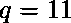
*   **第二步:计算**
    的值，给出如下:

```
 and 
```

这里的例子中，
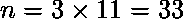
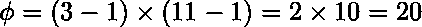

*   **Step-3: Find the value of** 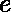 **(public key)**
    Choose , such that  should be co-prime. Co-prime means it should not multiply by factors of  and also not divide by 

    的因子是，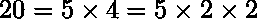所以不要乘以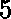和，不要除以 20。

    所以，质数是 3，7，11，17，19…，当取 3 和 11 时，选择作为 7

    因此，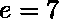

    *   **Step-4: Compute the value of** 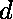 **(private key)**
    The condition is given as,
    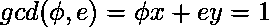 where y is the value of .

    要计算的值，

    1.  形成一个有四列的表格，即 a、b、d 和 k。
    2.  初始化 a = 1，b = 0，d = ，k =–第一行。
    3.  初始化第二行的 a = 0，b = 1，d = ，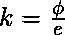。
    4.  从下一行，应用以下公式计算下一个 a、b、d 和 k 的值，如下所示
        *   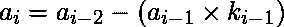
        *   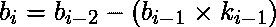
        *   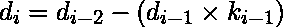
        *   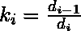

    一旦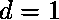，停止该过程并检查以下情况

    ```
    if 

    if 

    ```

    对于给定的示例，该表将是，

    | a | b | d | k |
    | --- | --- | --- | --- |
    | one | Zero | Twenty | – |
    | Zero | one | seven | Two |
    | one | -2 | six | one |
    | -1 | three | one | – |

    如上表所示，停止该过程并检查为
    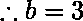给出的条件

    要验证是否正确，应满足上述条件，即
    。因此是正确的。

    *   **Step-5: Do the encryption and decryption**
    Encryption is given as,
    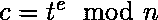
    Decryption is given as,
    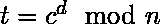

    举个例子，假设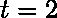，那么
    加密就是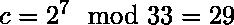

    解密是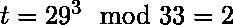

    因此在决赛中，、、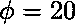、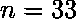、和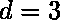

    **示例-2:[GATE CS-2017(Set 1)](https://www.geeksforgeeks.org/gate-gate-cs-2017-set-1-question-44/)**
    在 RSA 密码系统中，特定的 A 使用两个素数 p = 13 和 q =17 来生成她的公钥和私钥。如果 A 的公钥是 35。那么 A 的私钥是？

    1.  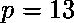和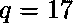
    2.  计算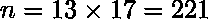和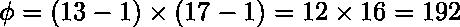
    3.  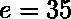(公钥)
    4.  Compute  (private key)

        | a | b | d | k |
        | --- | --- | --- | --- |
        | one | Zero | One hundred and ninety-two | – |
        | Zero | one | Thirty-five | five |
        | one | -5 | Seventeen | Two |
        | -2 | Eleven | one | – |

        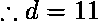(私钥)