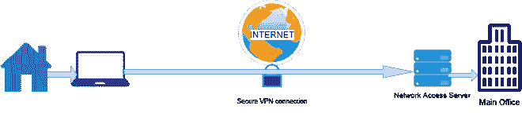
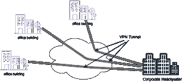

# 企业世界如何使用 VPN？

> 原文:[https://www . geesforgeks . org/如何在企业世界中使用 VPN/](https://www.geeksforgeeks.org/how-vpn-is-used-in-the-corporate-world/)

虚拟专用网通常代表虚拟专用网络。它的工作是确保公共网络上数据的安全传输。通过这样做，它允许用户像直接连接到专用网络一样发送数据。私有广域网技术是可用的，但是它们是有代价的。然而，互联网虚拟专用网只需要非常实惠的互联网连接。虚拟专用网通常被描述为一个隧道，数据在通过公共互联网之前在其中被加密。这样，如果黑客真的得到了你的数据，他们就无法理解了。一旦你的数据被接收到，它就被用一个特殊的密钥解密，这样它就可以被读取。

## **虚拟专用网的类型:**

虚拟专用网基本上有两种类型

*   **远程访问 VPN:** 远程访问 VPN 允许用户连接专用网络并远程访问其服务。它基本上被家庭用户和私人用户用来绕过互联网上的区域限制并访问被阻止的网站

远程访问虚拟专用网

*   **站点到站点的虚拟专用网络:**这种类型的虚拟专用网络也称为路由器到路由器的虚拟专用网络，主要用于合并。在这个虚拟专用网中，一台路由器充当虚拟专用网客户端，另一台路由器充当虚拟专用网服务器。这样，它们在两台计算机/服务器之间形成了站点到站点的连接。

站点到站点虚拟专用网络

站点到站点虚拟专用网进一步分为两种类型

*   **基于内部网的虚拟专用网络:**当同一公司的多个办公室使用站点到站点的虚拟专用网络连接时，它被称为基于内部网的虚拟专用网络
*   **基于外联网的虚拟专用网络:**当公司使用站点到站点的虚拟专用网络类型连接到另一家公司的办公室时，它被称为基于外联网的虚拟专用网络

## **什么是企业 VPN？**

远程虚拟专用网的不安全性促使公司转向更安全的虚拟专用网，即公司虚拟专用网。企业虚拟专用网基本上是组织使用的站点到站点虚拟专用网。它用于为员工提供安全的端到端加密，以访问公司网络，无论是内部网络还是云网络。

## **企业 VPN 与消费者 VPN 有何不同？**

一般来说，需求整合世界不同于消费者。消费者基本上使用虚拟专用网络在公共网络上拥有隐私，并访问地理上被封锁的网站，而在企业中，隐私保护和安全是使用虚拟专用网络的主要问题。他们还使用虚拟专用网来提高控制水平和生产率。

大多数情况下，公司不是使用由虚拟专用网提供商提供的服务器，而是使用自己的服务器，以便完全控制安全性、操作和可用性。企业虚拟专用网通过安全隧道进行连接，因此不需要为用于访问目标网络的每个终端客户端设置网络。这些类型的虚拟专用网是使用 IPsec 技术实现的，允许多个用户流量流经每个虚拟专用网隧道，因此其性能优于消费者虚拟专用网。

## 企业世界如何使用 VPN？

*   互联网的使用正在急剧增加，因此网络攻击也在增加。2020 年报告了近 116 万起网络攻击，是 2019 年的三倍，是 2016 年的 20 多倍。融入世界，数据是最重要的，因此它需要得到保护。要么公司可以建立自己的专用网络(广域网)，但成本太高，不是所有公司都能负担得起。因此，公司正在使用虚拟专用网来保护他们的数据和增强的安全性。
*   如今，信息技术公司继续向云迁移，因此网络攻击也在不断发展。因此，虚拟专用网通过限制未经授权来源的访问，成为保护公司数据和应用的有效方式。这可以通过允许访问预定 IP 地址的云数据来实现。因此，来自未经授权的 IP 地址的人无法访问它。
*   另一个原因是哪些公司使用虚拟专用网络，因为它允许您访问受限网站。有许多网站在特定的地区或国家被禁止，但在虚拟专用网专用服务器的帮助下。
*   虚拟专用网也有助于提高公司的生产率，例如，如果一名员工正在旅行，由于一些紧急情况，无论他们在哪里，他/她都必须切换到工作模式。因此，他们被迫使用个人网络或公共网络，这可能对公司数据构成威胁。因此，安全的公司虚拟专用网允许远程员工访问公司网络。