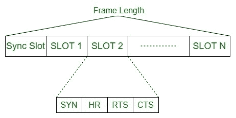

# HRMA 议定书

> 原文:[https://www.geeksforgeeks.org/hrma-protocol/](https://www.geeksforgeeks.org/hrma-protocol/)

**跳预留多址(HRMA)** 协议是一种基于竞争的带预留的媒体访问控制协议，它基于时隙预留协议，每个时隙都有一个单独的信道频率。

握手组件用于预留，以允许节点集节省一个跳频，以这种方式提供无冲突通信，并与被掩盖的终端问题保持战略距离。握手完成后，两个节点通过在相同的频道上发送数据和确认进行通信。这也是一个多信道媒体访问控制协议，它在简单的半双工 FHSS 无线电操作。

**特点:**
HRMA 给出了一种模式，在依赖简单半双工中等 FHSS 无线电的自组织系统中提供服务质量。数值结果表明，HRMA 可以实现比多信道时隙 ALOHA 高得多的吞吐量，特别是当正常分组长度与时隙大小相比很大时，在这种情况下，HRMA 的最极端吞吐量接近完美协议可以获得的吞吐量。

**工作:**

1.  当非活动节点在列出的时隙的 RTS 时间开始之前有信息分组要发送时，如果 HR 时间帧包含 HR 分组，则节点退出(任意数量的 HRMA 时隙)。
2.  在任何情况下，节点都会向计划的收集器发送一个即时战略，并为联系类型保留。当计划的接收节点得到一个 RTS 时，它在一个相似时隙的 CTS 时间内用一个 CTS 分组应答，并且它保持在一个相似的跳频上等待信息分组。
3.  如果发送方节点没有接收到 CTS，它会退出并在另一个时隙重试。无论如何，如果它获得了 CTS 分组，它在该点停留在当前时隙的相同跳频上，并开始向受益者发送信息分组。
4.  发射机和接收机节点都保持在相似的跳频上，直到信息包传输结束。
5.  在一个时隙的 CTS 时间之后，每隔一个肯定不发送或不接受跳同步的节点，然后以基本跳频模式跳到下一个跳频。
6.  在给定时隙的小时时间结束后，如果空闲节点有信息包要发送，它会放松并尝试在另一个时隙发送。