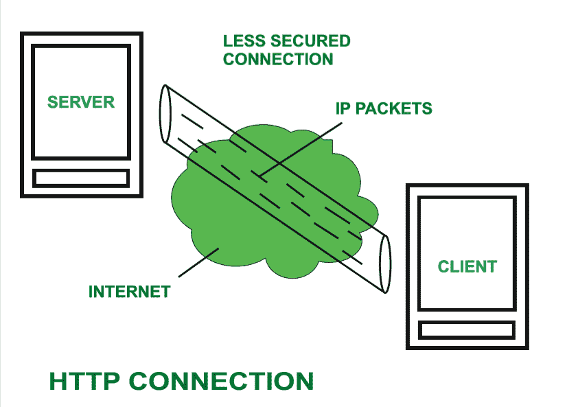
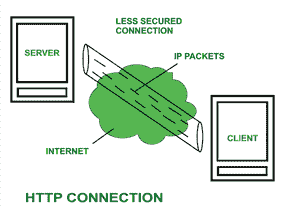

# HTTP 全格式

> 原文:[https://www.geeksforgeeks.org/http-full-form/](https://www.geeksforgeeks.org/http-full-form/)

**HTTP** 代表超文本传输协议。它是由**蒂姆·伯纳尔**发明的。超文本是一种借助于被称为[超文本标记语言(HTML)](https://www.geeksforgeeks.org/html-introduction/) 的标准编码语言进行特殊编码的文本类型。 **HTTP/2** 是 HTTP 的最新版本，发布于 2015 年 5 月。

用于在两台计算机之间传输超文本的协议被称为超文本传输协议。
HTTP 提供了网络浏览器和网络服务器之间建立通信的标准。它是一组将数据从一台计算机传输到另一台计算机的规则。文本、图像和其他多媒体文件等数据在万维网上共享。每当网络用户打开他们的网络浏览器，用户就间接地使用 HTTP。它是一种应用协议，用于分布式、协作式、超媒体信息系统。

**它是如何工作的？**
首先，每当我们想打开任何网站时，我们首先打开网络浏览器，然后我们会键入该网站的网址(例如，www.facebook.com)。该网址现已发送至[域名服务器(DNS)](https://www.geeksforgeeks.org/domain-name-server-dns-in-application-layer/) 。然后，域名系统首先在他们的数据库中检查该网址的记录，然后域名系统会将该网址对应的 IP 地址返回给网络浏览器。现在浏览器能够向实际的服务器发送请求。

服务器向客户端发送数据后，连接将被关闭。如果我们想从服务器得到其他东西，我们应该重新建立客户端和服务器之间的连接。

**历史:**
欧洲核子研究中心的蒂姆·伯纳斯·李和他的团队因发明了原始 HTTP 和相关技术而获得荣誉。

1.  **HTTP 0.9 版–**
    这是 1991 年推出的第一个 HTTP 版本。

2.  **HTTP 1.0 版–**
    1996 年，RFC 1945(征求意见稿)引入 HTTP 1.0 版。

3.  **HTTP 1.1 版–**
    1997 年 1 月，RFC 2068 引入 HTTP 1.1 版。1999 年 6 月，在 RFC 2616 下发布了对 HTTP 版本标准的改进和更新。

4.  **HTTP 2.0 版–**
    HTTP 2.0 版规范于 2015 年 5 月 14 日作为 RFC 7540 发布。

5.  **HTTP 3.0 版–**
    HTTP 3.0 版基于之前的 RFC 草案。它被重新命名为超文本传输协议 QUIC，这是一个由谷歌开发的传输层网络协议。

**HTTP 的特点:** HTTP 是基于 IP 的通信协议，用于将数据从服务器传递到客户端，反之亦然。

1.  服务器处理客户端发出的请求，并且服务器和客户端仅在当前请求和响应期间相互了解。
2.  只要服务器和客户端兼容，任何类型的内容都可以交换。
3.  一旦交换了数据，服务器和客户端就不再相互连接。
4.  它是基于客户端和服务器需求的请求和响应协议。
5.  它是无连接协议，因为在连接关闭后，服务器不记得客户端的任何信息，客户端也不记得服务器的任何信息。
6.  它是无状态协议，因为客户端和服务器都不期望彼此有任何东西，但是它们仍然能够通信。

**优势:**

*   由于较少的同时连接，内存使用率和 CPU 使用率较低。
*   由于 TCP 连接很少，因此网络拥塞较少。
*   因为握手是在初始连接阶段完成的，所以延迟减少了，因为后续请求不再需要握手。
*   可以在不关闭连接的情况下报告错误。
*   HTTP 允许请求或响应的 HTTP 管道。

**缺点:**

*   HTTP 需要高功率来建立通信和传输数据。
*   http 不太安全，因为它不像 https 那样使用任何加密方法使用 TLS 来加密正常的 HTTP 请求和响应。
*   HTTP 没有针对手机进行优化，过于饶舌。
*   HTTP 不提供真正的数据交换，因为它不太安全。
*   客户端直到从服务器接收到完整数据后才关闭连接，因此服务器需要等待数据完成，在此期间不能用于其他客户端。