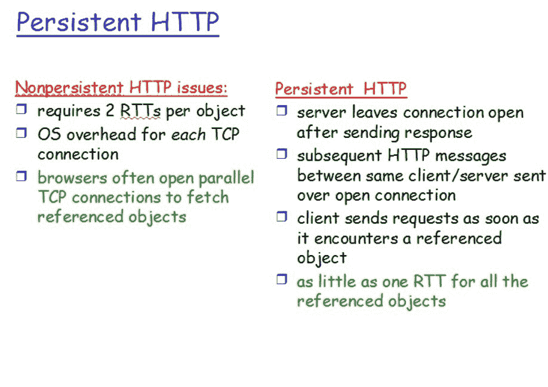
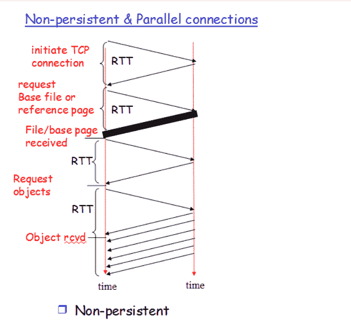
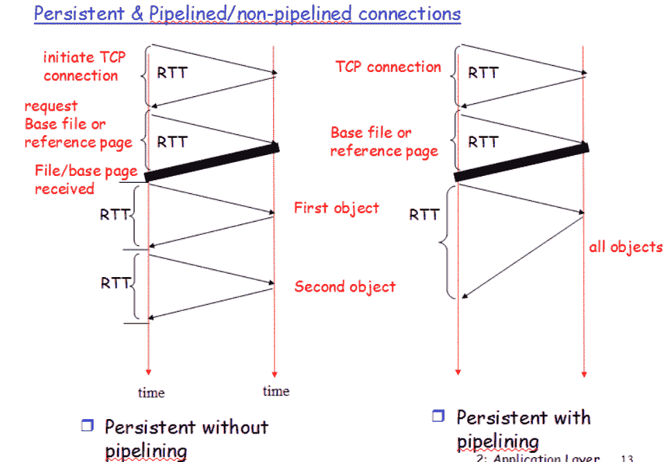

# HTTP 非持久&持久连接|设置 1

> 原文:[https://www . geesforgeks . org/http-非持久-持久-连接/](https://www.geeksforgeeks.org/http-non-persistent-persistent-connection/)

超文本传输协议(HTTP)是一种应用层协议，使用 TCP 作为底层传输，通常运行在端口 80 上。HTTP 是一种无状态协议，即服务器不维护关于过去客户端请求的信息。

**HTTP 连接**

1.  非持久性
2.  坚持的

在开始使用持久和非持久 HTTP 连接之前，让我们知道什么是 RTT。

**RTT** - >一个小包从客户端到服务器往返的时间。

```
RTT= 2*propagation time
```

1.对于持久或非持久连接，请确保使用一个 RTT 来启动 TCP 连接。
2。一个 RTT 用于 HTTP 请求，前几个字节用于 HTTP 响应返回。

所以为了知道总文件传输时间-->

```
 total = 2RTT+transmit time
```

**持久&非持久连接的区别。**


**非持续连接**

1.  无并联
2.  并联

**无并行连接非持久**
每个异议需要两个 RTT(假设没有窗口限制)，一个用于 TCP 连接，另一个用于 HTTP 图像/文本文件。

**带并联非持续性**


**持久连接**

1.  非流水线
2.  用管道输送



在**非管道连接**中，我们首先建立连接，需要两个 RTT，然后发送所有对象图像/文本文件，每个对象需要 1 个 RTT(不需要每个对象的 TCP)。

在**流水线连接中** 2RTT 用于连接建立，然后 1RTT(假设没有窗口限制)用于所有对象，即图像/文本。

**持久连接的优势:**
1)CPU 和内存使用率较低，因为连接数量较少。
2)允许请求和响应的 HTTP 流水线。
3)网络拥塞减少(TCP 连接减少)。
4)减少后续请求的延迟(无握手)。
5)可以报告错误，而不会导致关闭 TCP 连接。

**持久连接的缺点:**
即使在不需要的时候，资源也可能被占用，其他人可能无法使用。

像 Chrome、Firefox 和 Internet Explorer 等大多数现代浏览器都使用持久连接。

**参考:**T2】https://en.wikipedia.org/wiki/HTTP_persistent_connection

本文由 **SHAURYA UPPAL** 供稿。如果你喜欢 GeeksforGeeks 并想投稿，你也可以使用[write.geeksforgeeks.org](https://write.geeksforgeeks.org)写一篇文章或者把你的文章邮寄到 review-team@geeksforgeeks.org。看到你的文章出现在极客博客主页上，帮助其他极客。

如果你发现任何不正确的地方，或者你想分享更多关于上面讨论的话题的信息，请写评论。