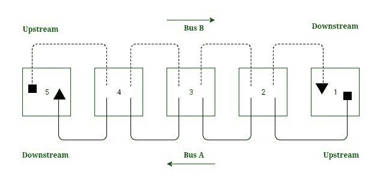
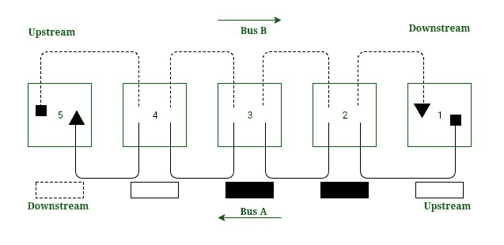

# IEEE 802.6(DDB)

> 原文:[https://www.geeksforgeeks.org/ieee-802-6-dqdb/](https://www.geeksforgeeks.org/ieee-802-6-dqdb/)

IEEE 802.6 标准，即 DQDB(分布式队列双总线)是一种[城域网](https://www.geeksforgeeks.org/types-of-area-networks-lan-man-and-wan/)协议。它可以被定义为在总线网络上使用的高速共享介质访问控制协议。它有两条单向总线，用于控制目的，总线可以通过网络传输数据、视频和语音，带宽按时隙分配。使用成对总线的优势在于它用于处理故障配置。它可以以 34-55 Mbps 的速度扩展到 30 英里。

**Fig.1:-** Working of DQDB

**定向交通:**
每辆公交车只支持一个方向的交通，且方向相反。公共汽车的起点用*正方形*表示，公共汽车的终点用*三角形*表示(图 1)。公共汽车交通从右向左移动(即从车站 1 到 5)，而公共汽车交通从左向右移动(即从车站 5 到 1)。

**上下游:**
DQDB 路网的站点关系取决于公交车的交通流向。
考虑图 1 中的公交 A，1 号站& 2 标为上游西铁站 3，4 号站& 5 为下游西铁站 3。这里，在公共汽车 A 中，站 1 是公共汽车的头部，因为没有上游站，站 5 没有下游站，并且它被认为是公共汽车 A 的末端

**工作:**
总线 A 的头部即站 1 生成空时隙供总线 A 使用。类似地，总线 B 的头部即站 5 生成空时隙供总线 B 使用。空时隙沿其总线向下行进，直到传输站将数据放入其中，并且预期目的地读取数据。

**Fig.2:-** DQDB Slot traveling

*例如:*
如果站点 2 想要向站点 4 发送数据(图 2)，它会在总线 A 上选择一个时隙，因为站点 4 在总线 A 的下游。总线 A 的头部，即站点 1，会创建一个空时隙。站 2 将其目的时隙的数据&地址放入通过时隙。站 3 读取该地址，并将该槽作为未读通过。站 4 识别其地址，读取数据并改变槽的状态，并将其与站 5 一起传递，在那里被吸收。

**时隙预约是怎么做的？**
要向下游发送数据，一个站点必须等待未被占用的时隙的到来，但是这里出现了一个问题，即如何阻止上游站点操纵公共汽车，因为公共汽车末端附近的站点会受到影响，因为不平衡会导致服务质量下降。解决这个问题的办法是在车站做预订。在这里，站 2 可以在公共汽车 B 上为公共汽车 A 预约。站 2 在公共汽车 B 上的一个时隙上设置一个预约位，以告诉它经过的每个站，该站正在公共汽车 A 上预约一个时隙。所有的站都必须尊重下游站的预约，并为所请求的站留下时隙。