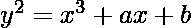
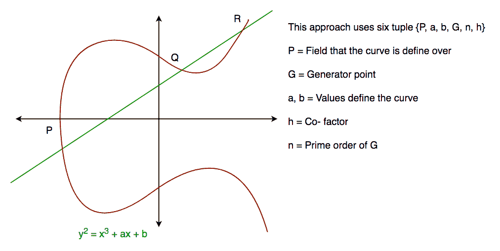
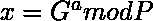
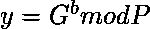
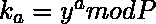
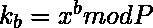

# 迪菲-赫尔曼算法的实现

> 原文:[https://www . geesforgeks . org/implementation-diffie-hellman-algorithm/](https://www.geeksforgeeks.org/implementation-diffie-hellman-algorithm/)

**背景**

**椭圆曲线密码(ECC)** 是一种公钥密码方法，基于有限域上椭圆曲线的代数结构。与非 ECC 加密相比，ECC 需要更小的密钥来提供同等的安全性(256 位 ECC 安全性与 3072 位 RSA 加密具有同等的安全性)。

为了更好地理解椭圆曲线密码，了解椭圆曲线的基础知识是非常重要的。椭圆曲线是由以下形式的方程定义的平面代数曲线



其中‘a’是 x 的系数，而‘b’是方程的常数

曲线是非奇异的；也就是说，它的图没有尖点或自相交(当共有效场的特征等于 2 或 3 时)。

一般来说，椭圆曲线如下图所示。当画一条直线与曲线相交时，椭圆曲线几乎可以相交 3 点。如我们所见，椭圆曲线关于 x 轴是对称的。该属性在算法中起着关键作用。



**迪菲-赫尔曼算法**

Diffie-Hellman 算法正被用于建立共享秘密，该秘密可用于秘密通信，同时使用椭圆曲线在公共网络上交换数据，以生成点并使用参数获得秘密密钥。

*   为了算法的简单性和实际实现，我们将只考虑 4 个变量，一个素数 P 和 G(P 的一个本原根)以及两个私有值 a 和 b。
*   p 和 G 都是公开的数字。用户(比如爱丽丝和鲍勃)选择私有值 a 和 b，他们生成一个密钥并公开交换。对方收到密钥，然后生成一个密钥，之后他们有相同的密钥进行加密。

**分步讲解**

<figure class="table">

| 爱丽丝 | 上下移动 |
| --- | --- |
| 可用公钥= P，G | 可用公钥= P，G |
| 所选私钥= a | 选择私钥= b |
| 生成的密钥=

 | 生成的密钥= |
| 交换生成的密钥 |
| 收到密钥= y | 收到的密钥= x |
| 生成的密钥= | 生成的密钥= |
| 代数上，可以证明 |
| 用户现在有一个对称密钥要加密 |

**示例:**

```
Step 1: Alice and Bob get public numbers P = 23, G = 9

Step 2: Alice selected a private key a = 4 and
        Bob selected a private key b = 3

Step 3: Alice and Bob compute public values
Alice:    x =(9^4 mod 23) = (6561 mod 23) = 6
        Bob:    y = (9^3 mod 23) = (729 mod 23)  = 16

Step 4: Alice and Bob exchange public numbers

Step 5: Alice receives public key y =16 and
        Bob receives public key x = 6

Step 6: Alice and Bob compute symmetric keys
        Alice:  ka = y^a mod p = 65536 mod 23 = 9
        Bob:    kb = x^b mod p = 216 mod 23 = 9

Step 7: 9 is the shared secret.
```

**实施:**

## C

```
/* This program calculates the Key for two persons
using the Diffie-Hellman Key exchange algorithm */
#include<stdio.h>
#include<math.h>

// Power function to return value of a ^ b mod P
long long int power(long long int a, long long int b,
                                     long long int P)
{
    if (b == 1)
        return a;

    else
        return (((long long int)pow(a, b)) % P);
}

//Driver program
int main()
{
    long long int P, G, x, a, y, b, ka, kb;

    // Both the persons will be agreed upon the
        // public keys G and P
    P = 23; // A prime number P is taken
    printf("The value of P : %lld\n", P);

    G = 9; // A primitive root for P, G is taken
    printf("The value of G : %lld\n\n", G);

    // Alice will choose the private key a
    a = 4; // a is the chosen private key
    printf("The private key a for Alice : %lld\n", a);
    x = power(G, a, P); // gets the generated key

    // Bob will choose the private key b
    b = 3; // b is the chosen private key
    printf("The private key b for Bob : %lld\n\n", b);
    y = power(G, b, P); // gets the generated key

    // Generating the secret key after the exchange
        // of keys
    ka = power(y, a, P); // Secret key for Alice
    kb = power(x, b, P); // Secret key for Bob

    printf("Secret key for the Alice is : %lld\n", ka);
    printf("Secret Key for the Bob is : %lld\n", kb);

    return 0;
}
```

## Java 语言(一种计算机语言，尤用于创建网站)

```
// This program calculates the Key for two persons
// using the Diffie-Hellman Key exchange algorithm
class GFG{

// Power function to return value of a ^ b mod P
private static long power(long a, long b, long p)
{
    if (b == 1)
        return a;
    else
        return (((long)Math.pow(a, b)) % p);
}

// Driver code
public static void main(String[] args)
{
    long P, G, x, a, y, b, ka, kb;

    // Both the persons will be agreed upon the
    // public keys G and P

    // A prime number P is taken
    P = 23;
    System.out.println("The value of P:" + P);

    // A primitive root for P, G is taken
    G = 9;
    System.out.println("The value of G:" + G);

    // Alice will choose the private key a
    // a is the chosen private key
    a = 4;
    System.out.println("The private key a for Alice:" + a);

    // Gets the generated key
    x = power(G, a, P);

    // Bob will choose the private key b
    // b is the chosen private key   
    b = 3;
    System.out.println("The private key b for Bob:" + b);

    // Gets the generated key
    y = power(G, b, P);

    // Generating the secret key after the exchange
    // of keys
    ka = power(y, a, P); // Secret key for Alice
    kb = power(x, b, P); // Secret key for Bob

    System.out.println("Secret key for the Alice is:" + ka);
    System.out.println("Secret key for the Bob is:" + kb);
}
}

// This code is contributed by raghav14
```

## 蟒蛇 3

```
from random import randint

if __name__ == '__main__':

    # Both the persons will be agreed upon the
    # public keys G and P
    # A prime number P is taken
    P = 23

    # A primitive root for P, G is taken
    G = 9

    print('The Value of P is :%d'%(P))
    print('The Value of G is :%d'%(G))

    # Alice will choose the private key a
    a = 4
    print('The Private Key a for Alice is :%d'%(a))

    # gets the generated key
    x = int(pow(G,a,P)) 

    # Bob will choose the private key b
    b = 3
    print('The Private Key b for Bob is :%d'%(b))

    # gets the generated key
    y = int(pow(G,b,P)) 

    # Secret key for Alice
    ka = int(pow(y,a,P))

    # Secret key for Bob
    kb = int(pow(x,b,P))

    print('Secret key for the Alice is : %d'%(ka))
    print('Secret Key for the Bob is : %d'%(kb))
```

## java 描述语言

```
<script>

// This program calculates the Key for two persons
// using the Diffie-Hellman Key exchange algorithm

// Power function to return value of a ^ b mod P
function power(a, b, p)
{
    if (b == 1)
        return a;
    else
        return((Math.pow(a, b)) % p);
}

// Driver code
var P, G, x, a, y, b, ka, kb;

// Both the persons will be agreed upon the
// public keys G and P

// A prime number P is taken
P = 23;
document.write("The value of P:" + P + "<br>");

// A primitive root for P, G is taken
G = 9;
document.write("The value of G:" + G + "<br>");

// Alice will choose the private key a
// a is the chosen private key
a = 4;
document.write("The private key a for Alice:" +
               a + "<br>");

// Gets the generated key
x = power(G, a, P);

// Bob will choose the private key b
// b is the chosen private key   
b = 3;
document.write("The private key b for Bob:" +
               b + "<br>");

// Gets the generated key
y = power(G, b, P);

// Generating the secret key after the exchange
// of keys
ka = power(y, a, P); // Secret key for Alice
kb = power(x, b, P); // Secret key for Bob

document.write("Secret key for the Alice is:" +
               ka + "<br>");
document.write("Secret key for the Bob is:" +
               kb + "<br>");

// This code is contributed by Ankita saini

</script>
```

**输出:**

```
The value of P : 23
The value of G : 9

The private key a for Alice : 4
The private key b for Bob : 3

Secret key for the Alice is : 9
Secret Key for the Bob is : 9
```

本文由**苏维克南迪**供稿。如果你喜欢极客博客并想投稿，你也可以用 contribute.GeeksforGeeks.org 写一篇文章或者把你的文章邮寄到 contribute@GeeksforGeeks.org。看到你的文章出现在极客博客主页上，帮助其他极客。
如果你发现任何不正确的地方，或者你想分享更多关于上面讨论的话题的信息，请写评论。

</figure>