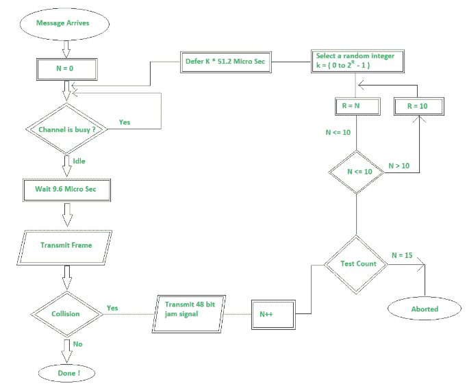

# 实现 CSMA/光盘的退避算法

> 原文:[https://www . geeksforgeeks . org/实现-a-back-off-算法-for-csma-cd/](https://www.geeksforgeeks.org/implementation-of-a-back-off-algorithm-for-csma-cd/)

先决条件–[CSMA/光盘的退避算法](https://www.geeksforgeeks.org/back-off-algorithm-csmacd/)
以太网可用于提供一组连接节点对连接节点的物理介质的共享访问。据说这些节点形成了冲突域。当有数据等待发送时，每个发送网卡也会监控自己的传输。如果观察到冲突，它会立即停止传输，转而传输 48 位阻塞序列。

传输程序的流程图如下所示。

**Flow Chart –** Back-off

发送器将当前帧的发送次数( **N** )初始化为零，并开始监听电缆，查看是否有任何消息位在传输。如果电缆没有空闲，它会等待(延迟)直到电缆空闲。在载波空闲之后，它等待 9.6 微秒以上，以允许节点为即将发生的下一次传输做好准备。这样做是为了避免饥饿。

*   **发送帧:**
    它通过电缆发送帧，如果没有冲突发生，则消息发送成功。如果有冲突，因为信息帧会返回给你，那么路上每个检测到冲突的站都应该发出干扰信号，这样每个检测到的站都应该停止发送信号。
*   **Jamming Signal :**
    Different type of frequency is reserved for jamming signal. It is sent in order to stop all the stations to discard the packets which you’ve accepted. After seeing the jamming signal the sender abort sending the packet.

    碰撞后，碰撞次数 if 增加( **N++** )如上图所示。

*   **Test Count :**
    If the network is busy, a re-transmission may still collide with some other re-transmitted frame (or possibly new frames being sent for the first time by another NIC). So the test count counts the number of re-transmission attempts using the variable **N** and attempts to re-transmit the same frame upto 15 times. After 15, it gets aborted.

    **注:**
    N 的值因 LAN 而异。它依赖于实现。

    如果 N 值小于 15，则检查 N 值是否小于 10。如果小于 10，那么变量 **R** 将被设置为与 N 相同，但是如果 N 的值大于 10，那么 **R** 的值将被设置为 10。这给出了一个概念，即 **R** 的值被限制到 10。

*   **选择随机:**
    从( **0 到 2 R -1** 的范围内选择随机整数。然后评估等待时间( **K * 51.2** )。这里 51.2 是给一个站的时隙时间( **T 时隙** )。同样，这取决于实现，它因局域网而异，取决于带宽。
    之后，再次重复整个过程。

**例:**
假设 2 个站 A 和 B 同时开始传输数据，那么就会发生碰撞。两次碰撞后，N = 2，因此 R = 2，集合为{0，1，2，3}给出四分之一的碰撞机会。这对应于从{0，51.2，102.4，153.6}微秒中选择的等待。

3 次碰撞后，N = 3，因此 R = 3，集合为{0，1，2，3，4，5，6，7}，即八分之一的碰撞几率。

但是经过 4 次碰撞，N=4，所以集合变成{0，1，2，3，4，5，6，7，8，9，10，11，12，13，14，15}，也就是 16 分之一的碰撞几率。缩放是通过乘法实现的，称为指数回退。这就是 CSMA/光盘扩展到大量网卡的方式——即使可能发生碰撞。该算法包括阈值 1024。这是十倍碰撞，因为即使 N 的值增加到 15，我们也将 R 的值设置为 10，如果碰撞次数超过 15，则中止。原因是随着碰撞次数的增加，所需的网卡数量越来越多，站点延迟的时间也越来越长。由于一组数字{0，1，…，1023}是一个很大的数字集，因此进一步增加集合的大小没有什么好处。

每次传输发生时，单个帧的重传次数被限制为 16 次尝试(N = 15)。此后，该帧被丢弃。但实际上，除非或直到网络没有过载，否则不允许以这种方式丢弃数据包。

**说明:**
第一次传输帧时-复位:N = 0。

如果发生冲突，第一次重新传输尝试将使用 N = N + 1 = 0 + 1 = 1，R = 1，节点将从{ 0，1 }的范围中选择一个随机数 K。

如果节点在传输同一帧时面临另一个冲突，则 N = N + 1 = 2，R = 2，节点将从{ 0，1，2，3 }的范围中选择一个随机数 K。

等等…