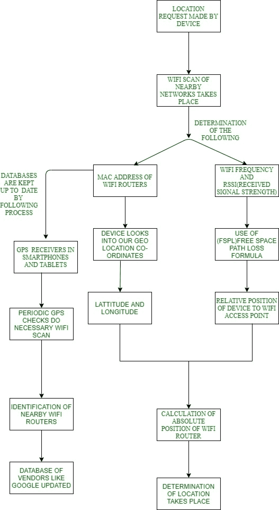

# 使用 WiFi 的室内导航

> 原文:[https://www.geeksforgeeks.org/indoor-navigation-using-wifi/](https://www.geeksforgeeks.org/indoor-navigation-using-wifi/)

无论我们是在购物中心、购物中心还是大学校园旅行，我们都可能需要花一些时间来查看普通地图，以更好地了解我们在哪里或我们需要去哪里，室内地图的作用就在这里。

室内导航是一个最近的概念，仍有很大的研究空间。我们通过室内定位系统在室内旅行。入侵防御系统就像一个设备网络，帮助我们无线找到建筑物内各种物体或人的位置。它完全依赖于附近的锚或本地标签，这些标签帮助我们提供环境信息，帮助我们找到特定设备的位置。

**确定室内位置的方式:**
室内定位服务可以通过使用信标和无线网络来提供。无线网络或信标的使用完全取决于需求。当我们要求非常高的精度时，信标基本上是首选，但是在庞大的大学校园中，信标不是更好的选择，因为它们必须安装在彼此附近，这使得它的使用不切实际且不经济。使用无线网络的缺点是，定位的准确性将完全取决于信号强度，这有时会受到影响，但随着无线网络速度和 SDK(如安卓 9 和 10)的最新发展，这是一个很容易解决的问题。

**使用 Wi-Fi 确定用户位置的过程:**使用 WIFI 时，我们的设备需要以下信息来计算距离。

1.  纬度和经度
2.  我们的设备与每个无线网络的相对位置。它是利用无线频率(通常为 2.4 千兆赫)和信号强度计算的，如下式所示。
    这是修正的自由空间路径损耗公式，其中频率以 dBm 为单位，信号强度以兆赫为单位。
3.  WIFI 塔的绝对位置也是使用上述信息计算的(第 1 点和第 2 点)。然后，这些信息被集成到安卓工作室创建的代码中。

下面的流程图解释了室内定位系统的工作原理

**适合室内导航的 SDKS(及其功能)如下:** **奥利奥(安卓 8):**

1.  **地理围栏:**它有助于创建虚拟周界。
2.  提供缓存。

**使应用程序能够:**

1.  跑快点
2.  消耗更少的功率和内存
3.  提供流畅的应用内体验

**脚(Android 9):**

1.  为美国室内定位服务提供平台支持。
2.  RTT(无线网络往返时间)应用编程接口，用于测量到附近无线网络接入点(通常为 3 个)的距离。
3.  它的精度在 1 到 2 米之间。
4.  有了这种精确度，我们就可以让室内导航变得非常容易。

**Android 10:**

1.  提供高质量的多窗口支持。
2.  管理应用程序在可折叠屏幕上的显示方式。
3.  支持跨应用程序和窗口的多任务处理，并提供屏幕连续性
4.  它取消了导航栏区域，允许用户使用全屏来提供更丰富和沉浸式的体验。
5.  更多用户对位置数据的控制。

6.  防止设备跟踪。
7.  阻止不必要的干扰。
8.  提供适当的显示支持，以便使用有限的带宽提供高质量的视频。
9.  支持高性能和低延迟模式。
10.  在实时游戏、导航和主动语音通话方面提供高端用户体验。
11.  降低功耗。