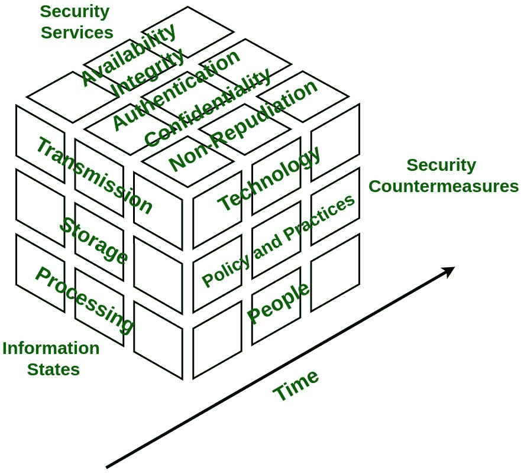

# 网络安全中的信息保障模型

> 原文:[https://www . geesforgeks . org/information-assurance-model-in-cyber-security/](https://www.geeksforgeeks.org/information-assurance-model-in-cyber-security/)

**信息保证**关注通过确保机密性、完整性、可用性和不可否认性来保护和保障关键信息和相关信息系统的方法的实施。这是一种注重战略的方法，更侧重于部署政策，而不是建设基础设施。

**信息保障模型:**
[安全](https://www.geeksforgeeks.org/what-is-information-security/)模型是基于四个维度的多维模型:

1.  **信息状态–**
    信息是指对数据的解释，可以在存储、处理或传输的三种状态中找到。

2.  **安全服务–**
    它是为系统提供安全性的模型的基本支柱，由可用性、完整性、机密性、身份验证和不可否认性五项服务组成。

3.  **安全对策–**
    该维度具有通过考虑技术、政策&实践和人员来保护系统免受即时漏洞攻击的功能。

4.  **时间–**
    这个维度可以用很多方式来看待。在任何给定的时间，数据都可以离线或在线获得，信息和系统可能会不断变化，从而带来未经授权访问的风险。因此，在系统开发周期的每个阶段，信息保证模型的每个方面都必须得到很好的定义和实施，以最大限度地降低未经授权访问的风险。

**信息状态:**

1.  **Transmission –** 
    It defines time wherein data is between processing steps. 

    **示例:**
    通过网络传输时，用户向阅读器发送电子邮件，包括发送过程中遇到的内存和存储。

2.  **存储–**
    定义数据保存在硬盘等介质上的时间。示例:用户将文档保存在文件服务器的磁盘上。

3.  **Processing –** 
    It defines time during which data is in processing state. 

    **例:**
    数据在工作站的[随机存储器(RAM)](https://www.geeksforgeeks.org/different-types-ram-random-access-memory/) 中处理。

**安全服务:**

1.  [**Confidentiality**](https://www.geeksforgeeks.org/pgp-authentication-and-confidentiality/) **–** 
    It assures that information of system is not disclosed to unauthorized access and is read and interpreted only by persons authorized to do so. Protection of confidentiality prevents malicious access and accidental disclosure of information. Information that is considered to be confidential is called as **sensitive information**. 

    为确保机密性，数据根据损坏严重程度分为不同类别，然后采取相应的严格措施。

    **示例:**
    保护电子邮件内容，使其仅被所需的一组用户阅读。这可以通过数据加密来保证。双因素身份验证、强密码、安全令牌和生物识别验证是身份验证用户访问敏感数据的一些流行规范。

2.  **Integrity –** 
    It ensures that sensitive data is accurate and trustworthy and can not be created, changed, or deleted without proper authorization. Maintaining integrity involves modification or destruction of information by unauthorized access. 

    为确保完整性，应规划和实施备份，以便在出现安全漏洞时恢复任何受影响的数据。除此之外，加密校验和也可以用于数据验证。

    **示例:**
    实施措施以验证电子邮件内容在传输过程中未被修改。这可以通过使用密码术来实现，该密码术将确保预期用户接收到正确和准确的信息。

3.  **Availability –** 
    It guarantees reliable and constant access to sensitive data only by authorized users. It involves measures to sustain access to data in spite of system failures and sources of interference. 

    为了确保可用性，必须消除损坏的数据，必须加快恢复时间，并改善物理基础架构。

    **示例:**
    电子邮件服务的访问和吞吐量。

4.  **Authentication –** 
    It is security service that is designed to establish validity of transmission of message by verification of individual’s identity to receive specific category of information. 

    为了确保可用性，使用了各种单因素和多因素身份验证方法。单因素身份验证方法使用单个参数来验证用户身份，而双因素身份验证使用多个因素来验证用户身份。

    **示例:**
    登录网站时输入用户名和密码就是认证的示例。输入正确的登录信息可以让网站验证我们的身份，并确保只有我们才能访问敏感信息。

5.  **Non-Repudiation –** 
    It is mechanism to ensure sender or receiver cannot deny fact that they are part of data transmission. When sender sends data to receiver, it receives delivery confirmation. When receiver receives message it has all information attached within message regarding sender. 

    **示例:**
    一个常见的示例是从一部手机向另一部手机发送短信。收到消息后，将显示确认消息，表明接收方已收到消息。作为回报，接收者收到的信息包含发送者的所有信息。

**安全对策:**

1.  **人–**
    人是信息系统的心脏。信息系统的管理员和用户必须遵循政策和实践来设计好的系统。他们必须定期了解信息系统，并准备好采取适当的行动来保护系统。

2.  **政策&实践–**
    每个组织都有一些以政策形式定义的规则，每个在组织中工作的人都必须遵循这些规则。必须实施这些策略，以便在系统受到威胁时正确处理敏感信息。

3.  **技术–**
    必须使用适当的技术，如防火墙、路由器和入侵检测，以防御系统漏洞、威胁。每当信息安全受到威胁时，所使用的技术必须有助于快速响应。