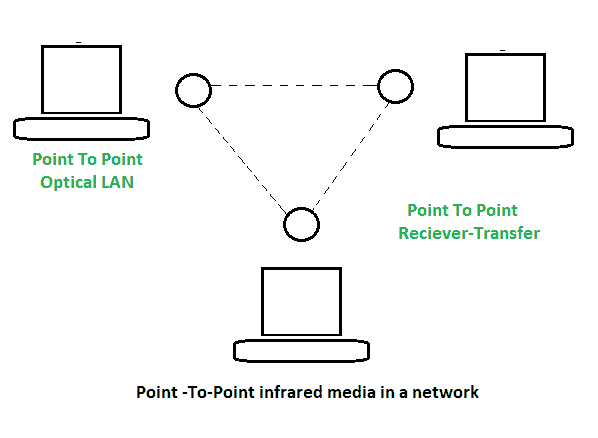
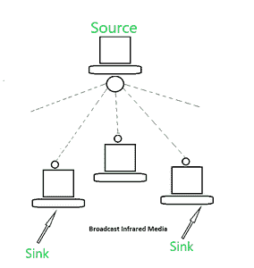

# 红外光透射

> 原文:[https://www . geesforgeks . org/红外光传输/](https://www.geeksforgeeks.org/infrared-light-for-transmission/)

**用于传输的红外光:**
红外光是眼睛看不见的光的频率。波的频率在 300 千兆周到 400 太赫兹之间。在这种情况下，辐射在电磁波谱的范围内。红外线可能是一种通信媒介，其性质与无线电频率完全不同。红外线的必要特性是它不能穿透墙壁。这表明它通常被简单地包含在一个空间中。由于这一特性，红外经常被用于减少干扰和在许多房间中重新处理类似波段的机会。

它的波长比可见光长，但比无线电波短。红外线的波长范围从 850 纳米到 900 纳米。红外通信的另一个优点是提供给人们使用的海量信息手段，然而还没有被充分利用。最大的缺点是太阳会产生红外波段的辐射。这可能会对红外通信造成大量干扰。红外波段在未来高速无线局域网的发展中经常被使用。

**应用与标准:**
针对大专学历红外电路(IRDA)制定了多项标准。IRDA-C 标准为像鼠标这样的导体设备中使用的双向通信提供了标准；键盘、操纵杆和手持计算机。IRDA-C 普通型以每秒 75 千比特的触摸速率工作，因此距离变化很大，可达 8 米。另一种被称为 IRDA-D 普通的方式提供了从 115 千字节/秒到 4Mb/秒的信息速率，距离可达一米。红外电路被设计成一种无线方式，不同于将笔记本电脑等设备连接到指针上。目的对目的传输允许更高的信息速率。然而，设备应该留在它们的位置。然而，广播允许以较低的信息速率提供额外的灵活性。红外线的一个优点是使用它不需要大专独立机构的许可。红外信号的唯一缺点是它们不能穿透墙壁或其他物体，并且它们是被坚固的轻型源稀释的单元。

**特征点对点红外系统:**

*   频率范围为 100 GHz 到 1000 太赫兹。
*   数据速率在 100 kbps 到 16 mbps 之间。
*   衰减取决于发射光的质量、纯度、大气条件和信号障碍。
*   电磁干扰受强光影响。
*   安装需要精确对准。

**特征广播红外系统:**

*   频率范围为 100 GHz 到 1000 太赫兹。
*   带宽容量小于 1 mbps。
*   衰减取决于发射光的质量、纯度和大气条件。
*   电磁干扰受强光影响。
*   安装相当简单。

**红外线的应用:**

1.  有了这些设备，我们可以通过短距离无线信号进行通话。
2.  通过红外传输，计算机可以双向传输文件和其他数字数据。
3.  由于非常高的带宽(约 400TH2)，可以支持非常高的数据速率。
4.  用于键盘、鼠标电脑和打印机之间的通信。
5.  它用于医疗、科学和工业应用。