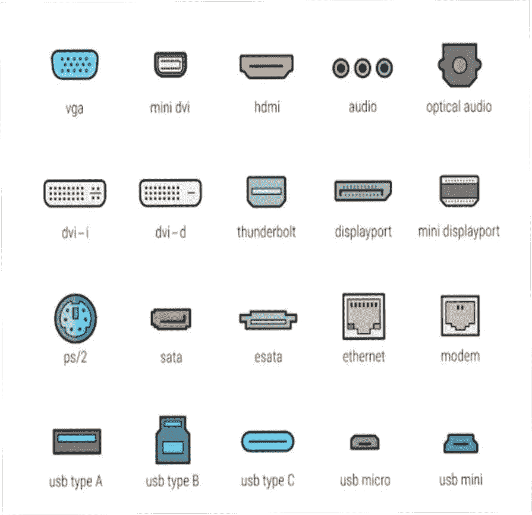

# 输入输出端口

> 原文:[https://www.geeksforgeeks.org/input-output-ports/](https://www.geeksforgeeks.org/input-output-ports/)

**[港口](https://www.geeksforgeeks.org/introduction-of-ports-in-computers/) :**

连接点充当计算机和外部设备(如打印机、调制解调器等)之间的接口。

**有两种类型的端口:**

1.**内部端口**–

它将系统主板连接到内部设备，如硬盘、光驱、内置蓝牙等。

2.**外部端口**–

它将系统主板连接到内部设备，如鼠标、打印机、USB 等。

端口类型

**一些重要的端口类型如下:**

1. [**串口**](https://www.geeksforgeeks.org/difference-between-serial-port-and-parallel-ports/) **:**

*   用于外置调制解调器和老式电脑鼠标
*   两种版本-9 针、25 针
*   数据以每秒 115 千比特的速度传输

2.****:****

*   **用于扫描仪和打印机**
*   **25 针型号**

**3. [**【通用串行总线(或 USB)**](https://www.geeksforgeeks.org/universal-serial-bus-usb-in-computer-network/) **端口:****

*   **它可以连接各种外部 USB 设备，如外部硬盘、打印机、扫描仪、鼠标、键盘等。**
*   **数据以每秒 12 兆比特的速度传输。**

**4 **。火线** [**港口**](https://www.geeksforgeeks.org/introduction-of-ports-in-computers/) **:****

*   **以非常快的速度传输大量数据。**
*   **将摄像机和视频设备连接到计算机。**
*   **数据以每秒 400 到 800 兆位的速度传输。**

**5. [**【以太网】**](https://www.geeksforgeeks.org/local-area-network-lan-technologies/) **端口:****

*   **连接到网络和高速互联网。**
*   **数据以每秒 10 兆位到 1000 兆位的速度传输，这取决于网络带宽。**