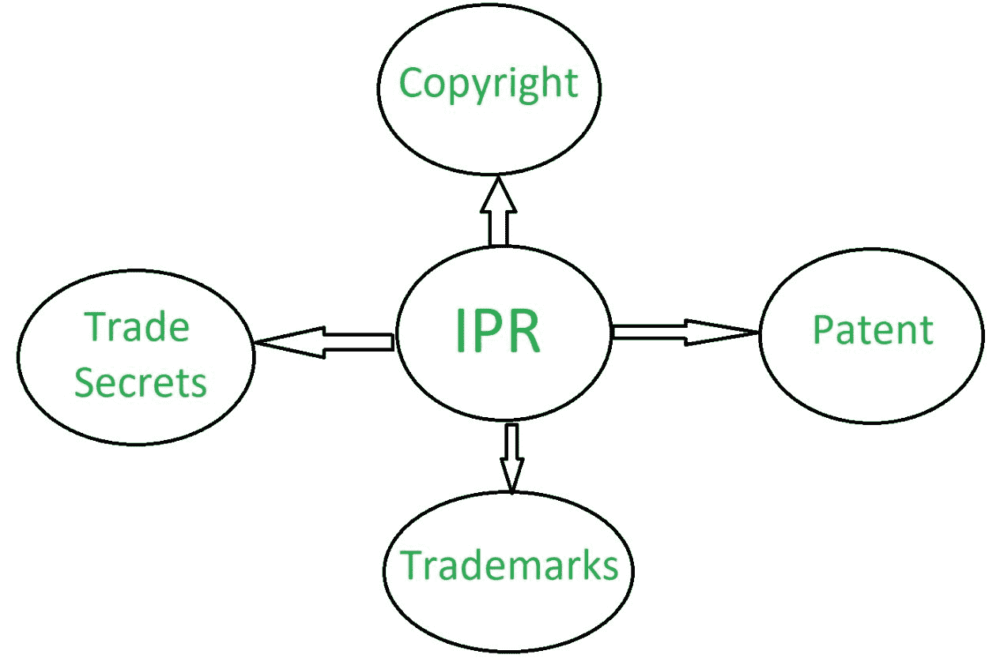

# 知识产权

> 原文:[https://www.geeksforgeeks.org/intellectual-property-rights/](https://www.geeksforgeeks.org/intellectual-property-rights/)

知识产权是赋予每个人根据自己的想法创造新事物的权利。知识产权通常赋予创作者在一定时期内使用其作品的完全权利。

知识产权是一种法律权利，它涵盖了给予个人的利益，这些个人是作品的所有者和发明者，并以他们的智力创造力或能力创造了一些独特的东西。每个人都与文学、音乐、发明等领域相关。，可以被授予这样的权利，然后可以由他们在业务实践中使用。

创作者/发明者在没有他/她事先信息的情况下，对作品的任何误用或使用拥有完全的权利。然而，这些权利是在有限的时间内发行的，以保持平衡。

**什么是知识产权？**

1.  工业设计
2.  科学发现
3.  防止不公平竞争
4.  文学、艺术和科学作品
5.  人类所有领域的发明
6.  商标、服务标志、商业名称和名称

**知识产权类型:**
知识产权可以分为四种类型:

1.  **版权:**
    版权是一个描述对使用和分发某些创造性表达作品的权利的控制所有权的术语，包括书籍、视频、电影、音乐和计算机程序。
2.  **专利:**
    专利赋予其所有者在有限的时间内排除他人制造、使用、销售和进口发明的权利。授予专利权的交换条件是能够公开披露发明。
3.  **商标:**
    商标是一种图形表示，用于区分一方的商品和服务与其他方的商品和服务。商标可以由字母、数字、单词、短语、标志、图形、形状、气味、声音或这些东西的组合组成。
4.  **商业秘密:**
    商业秘密描述关于任何产品的通用配方和任何组织进步背后的关键。它还包括不同公司对质量不同的相同产品的不同秘密配方。

**知识产权优势:**
知识产权优势如下:

*   知识产权给创作者或发明者以专有权。
*   它鼓励个人分发和共享信息和数据，而不是保密。
*   它提供法律辩护，并为创作者提供创作的动力。
*   它有助于社会和金融发展。
*   它激励人们创造新事物，而不用担心智力被窃取。