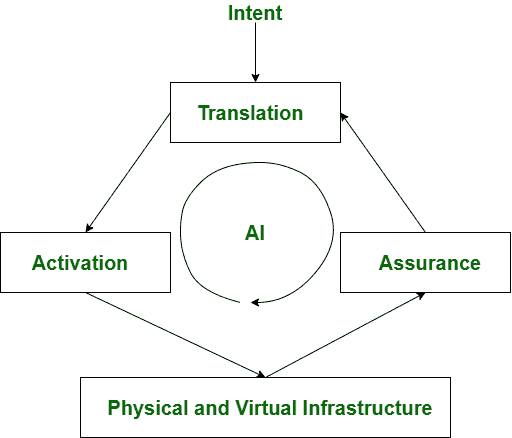

# 基于意图的网络(IBN)

> 原文:[https://www.geeksforgeeks.org/intent-based-networking-ibn/](https://www.geeksforgeeks.org/intent-based-networking-ibn/)

**基于意图的网络(IBN)** 是一种将基础设施管理和业务意图结合起来的系统方法。这是一种网络管理方法，其中[人工智能(AI)](https://www.geeksforgeeks.org/artificial-intelligence-an-introduction/) 和[机器学习(ML)](https://www.geeksforgeeks.org/machine-learning/) 通过自动化可在网络上应用的所有组织任务发挥主要作用，即它有助于实现特定的目的或意图。

在 IBN 方法中，网络可以将意图转化为网络策略。此外，借助自动化，它可以将合适的配置部署到网络中。IBN 的输入是通过应用程序接口或图形用户界面提供的。

**IBN 网络示例–**
思科数字网络架构(思科 DNA)。

**基于意图的网络工作(IBN) :**
IBN 是软件定义网络(SDN)的延伸。它由一个网络控制器组成，该控制器通过管理网络上的分布式设备来充当网络的中央控制点。随着集成的进行，中央控制器在网络抽象中也起着重要的作用。

IBN 有 3 个功能块，即–

**Figure –** Intent Based Networking (IBN)

1.  **翻译–**
    翻译块可以捕获业务意图并将其翻译成整个系统的策略。
2.  **保证–**
    激活块负责广域网的端到端验证。它预测已经发生的关于最初意图的变化，然后提供修复它的建议。这个推荐过程完全由人工智能和人工智能来完成，人工智能和人工智能被结合在这个网络中。这里不断研究网络的安全和性能因素，并在需要时进行必要的重新配置。
3.  **激活–**
    在指定意图和制定策略之后，激活块利用网络范围的自动化在部署设备之前验证设备的配置。

**基于意图的网络优势(IBN) :**

*   **要执行的手动任务减少–**
    IBN 在 ML 和 AI 的帮助下自动将命令转化为动作。网络管理员无需执行手动配置。实现所需配置的任务和维修工作由 IBN 自动完成。
*   **安全–**
    IBN 不断监控威胁，甚至在加密流量中。安全违规会立即得到承认和限制。此外，在人工智能的帮助下，它可以为实时应用提供更安全的环境。
*   **增强网络分析能力–**
    IBN 不断收集自身数据进行分析，提供有关网络性能和安全威胁的重要信息。
*   **运营成本–**
    IBN 系统的运营成本较低。
*   **速度–**
    实现目标的响应时间很快，因为 IBN 系统为应用程序提供了敏捷性。节省了原本可以花在计划、测试和手动配置上的时间。

**基于意图的网络的缺点(IBN) :**

*   **复杂设计–**
    IBN 系统具有复杂的设计，因为它是几个操作系统、环境和网络组件的组合。
*   **验证和确认–**
    IBN 系统需要严格的验证和确认才能正常运行。
*   **成功率–**
    IBN 系统的成功率取决于应用编程接口，因为网络访问取决于应用编程接口。

**基于意图的网络应用(IBN) :**

1.  **性能测试–**
    IBN 系统可以帮助进行应用程序的性能测试
2.  **安全性–**
    通过 AI 和 ML 算法的支持，可以为应用提供高度的安全性。
3.  **协助过滤网络流量–**
    IBN 系统还为网络应用程序提供了防火墙，可以帮助过滤互联网流量，并增强安全措施。