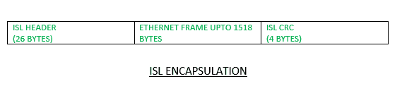
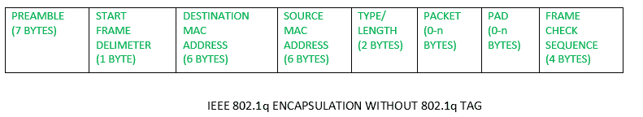
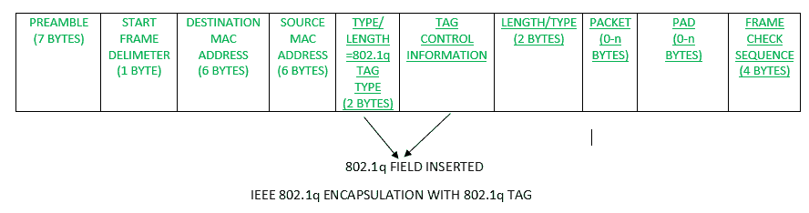

# 交换机间链路(ISL)和 IEEE 802.1Q

> 原文:[https://www . geesforgeks . org/inter-switch-link-ISL-IEEE-802-1q/](https://www.geeksforgeeks.org/inter-switch-link-isl-ieee-802-1q/)

VLANs 用于在第 2 层划分广播域。默认情况下，所有交换机端口都位于 VLAN 1。配置除 VLAN 1 之外的虚拟局域网，然后为了传输这些虚拟局域网的流量，用户必须建立一个连接到另一台交换机的交换机端口中继。如果帧被转发到接入链路，则认为该帧属于该交换机端口上配置的 VLAN。但是，如果帧被转发到中继链路，那么另一台设备如何知道流量属于哪个 VLAN？出现了 VLAN 识别方法的概念。

**VLAN 识别方法–**
如果帧被转发到中继链路，则在帧报头中添加一个报头或标签，指定该帧所属的 VLAN。该帧在发送方交换机处被封装，在接收方交换机处被移除，然后被转发到属于该 VLAN 的端口(根据交换机的处理)。

有两种 VLAN 鉴别方法:

1.  **交换机间链路(ISL)–**
    这是一种 VLAN 识别方法，其中 VLAN 信息被明确标记到以太网帧上。交换机间链路是思科交换机的专利。ISL 在第 2 层通过用新的报头封装数据帧并执行新的循环冗余校验(CRC)来发挥作用。

在交换机间链路中，原始帧被封装，并在帧通过中继链路传输之前添加额外的报头。在接收端，报头被删除，帧被转发到指定的 VLAN。

交换机间链路最多支持 1000 个虚拟局域网。原生 VLAN 的概念对于 ISL 并不重要，因为包括原生 VLAN 帧在内的所有帧都会被标记。



ISL 帧封装为 30 字节，插入 26 字节报头和 4 字节 FCS(帧校验序列)。因此总共有 30 字节的开销。因此，不太优选。甚至思科也建议使用 802.1Q。

**配置(交换机间链路):**

```
Switch(config)#interface Fa0/1
Switch(config-if)#switchport trunk encapsulation isl
Switch(config-if)#switchport mode trunk
```

*   **802.1Q –**
    It is IEEE standard method of frame tagging. If user wants to trunk between a Cisco switch link and a different brand switch link, then have to use 802.1Q encapsulation for the trunk to work.

    在 802.1Q 中，中继设备在通过中继链路发送帧之前，会在原始帧中插入一个 4 字节的标签，并重新计算帧校验序列(FCS)。在接收端，标签被移除，帧被转发到指定的 VLAN。

    

    

    在 4 个字节中，最重要的是 12 位 VLAN。此字段说明帧所属的 VLAN 编号。VLAN 可以从 1 到 4094 不等，即支持 4094 个虚拟局域网，因为 VLAN 0 4095 是保留的虚拟局域网。802.1Q 支持本地 Vlan 的概念，即流量将不会被标记到该 Vlan。

    **注意–**交换机间链路(ISL)和 802.1Q 用于提供交换机间 VLAN 通信。如果帧被转发到接入链路，则会删除交换机间链路或 802.1Q 帧标记。

    **配置(802.1Q) :**

    ```
    Switch(config)#interface Fa 0/1
    Switch(config-if)#switchport trunk encapsulation 802.1q
    Switch(config-if)#switchport mode trunk
    ```