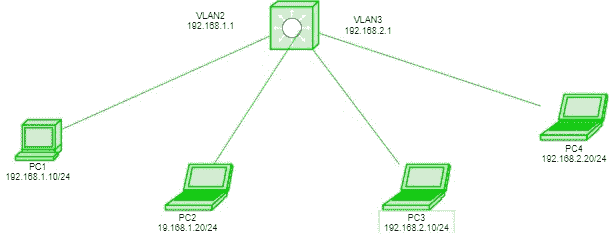

# 第 3 层交换机的 VLAN 间路由

> 原文:[https://www . geesforgeks . org/VLAN 间-路由-第 3 层-交换机/](https://www.geeksforgeeks.org/inter-vlan-routing-layer-3-switch/)

先决条件–[接入和中继端口](https://www.geeksforgeeks.org/access-trunk-ports/)
通常，路由器用于划分广播域，交换机(位于第 2 层)在单个广播域中运行，但交换机也可以使用 **VLAN(虚拟局域网)**的概念划分广播域。

**VLAN** 是相同或不同广播域中设备的逻辑分组。默认情况下，所有交换机端口都位于 VLAN 1。由于单个广播域被划分为多个广播域，路由器或第 3 层交换机用于不同虚拟局域网之间的相互通信。不同虚拟局域网相互通信的过程称为虚拟局域网间路由。

假设我们制作了两个名为销售和财务的逻辑设备组(VLAN)。如果销售部门的设备想要与财务部门的设备通信，则必须执行 VLAN 间路由。这些可以由路由器或第 3 层交换机执行。

**交换机虚拟接口(SVI)–**
SVI 是多层交换机上的一个逻辑接口，为去往与该 VLAN 相关联的所有交换机端口的数据包提供第 3 层处理。可以为 VLAN 创造一个单一的 SVI。第 3 层交换机上的 SVI 提供管理和路由服务，而第 2 层交换机上的 SVI 仅提供管理服务，如创建 VLANs 或 telnet/SSH 服务。

**第 3 层交换机进行 Vlan 间路由的过程–**
为各自的 VLAN 创建的 SVI 充当该 VLAN 的默认网关，就像路由器的子接口一样(在路由器上的过程中)。如果要将数据包传送到不同的虚拟局域网，即在第 3 层交换机上执行 VLAN 路由，则首先将数据包传送到第 3 层交换机，然后再传送到目的地，就像在棍子上使用路由器一样。

**配置–**



这是一个拓扑，其中我们有一台第 3 层交换机连接到主机设备，即 PC1、PC2、PC3 和 PC4。主机 PC1、PC2 将位于 Vlan 10 中，主机 PC3、PC4 将位于 Vlan 20 中。向所有主机提供 IP 地址。PC1-192.168.1.10/24，PC2-192.168.1.20/24，PC3-192 . 168 . 2 . 10/24，PC4-192.168.2.20/24。

现在在第 3 层交换机上创建 VLAN，即在交换机端口 fa0/1、2 和 fa0/3、4 上为 VLAN 3 创建 VLAN 2。

```
Switch# vlan 2
Switch# vlan 3
Switch# int range fa0/1-2
Switch# switchport access vlan 2
Switch# int range fa0/3-4
Switch# switchport access vlan 3
```

现在为 VLAN 2 创建 SVI，为其提供 IP 地址 192.168.1.1/24，为 VLAN 3 创建 SVI，为其提供 IP 地址 192.168.2.1/24

```
Switch# ip routing
Switch# int vlan 2
Switch# ip address 192.168.1.1 255.255.255.0
Switch# int vlan 3
Switch# ip address 192.168.2.1 255.255.255.0
```

现在，如果我们尝试将 PC1 ping 通 PC4。

数据包首先被传送到交换机，然后到达目的地。由于目的地存在于其他网络中，因此数据包将首先被传送到两个虚拟局域网都有 SVI 的交换机(充当网关)。

**优势–**
在**直板路由器**方法中，交换机和路由器都需要，但是在使用第 3 层交换机时，单个交换机将执行 VLAN 间路由和第 2 层功能(Vlan)，因此这种方法具有成本效益，也不需要太多配置。