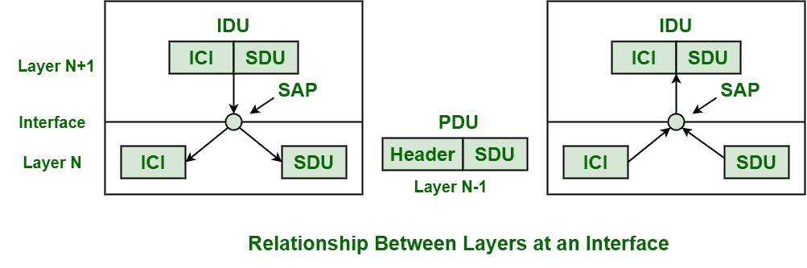
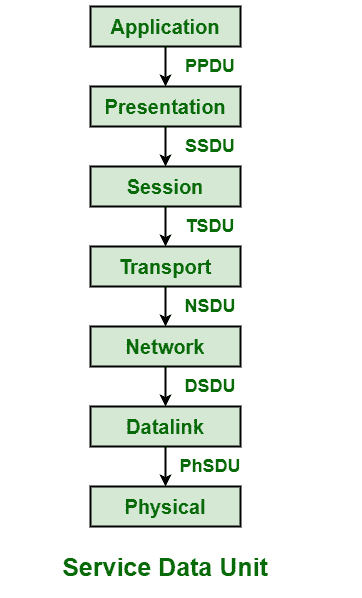

# 接口和服务

> 原文:[https://www.geeksforgeeks.org/interfaces-and-services/](https://www.geeksforgeeks.org/interfaces-and-services/)

**接口和服务**是一个过程，它通常为每一层提供并给出一种通用的技术来相互通信。提供了分层网络请求和瞄准服务所需的基本标准术语。

服务被定义为一组基本操作。服务被一层一层地提供给它上面的每一层。

下图显示了界面上各层之间的关系。在图中，第 N+1 层、第 N 层和第 N-1 层涉及并参与了彼此之间的通信过程。

**涉及的组件及其功能:**

*   **Service Data Unit (SDU) –**
    SDU is a piece of information or data that is generally passed by layer just above current layer for transmission. Unit of data or information is passed down to a lower layer from an OSI (Open System Interconnection) layer or sublayer. Data is passed with request to transmit data. SDU basically identifies or determines information that is been transferred among entities of peer layers that are not interpreted by supporting entities of lower-layer.

    

*   **Protocol Data Unit (PDU) –**
    PDU is a single unit of information or data that is transmitted or transferred among entities of peer layers of a computer network. When application data is passed down to protocol stack on its way to being transmitted all over network media, some of protocols add information an data to it at each and every level. PDU is used to represent and describe data is it gets transferred from one layer of OSI model to another layer.

    

*   **接口数据单元(IDU)–**
    IDU 用于在网络分层架构中的两层之间有一种约定的通信方式。它从(N+1)传递到 N。
*   **服务接入点(SAP)–**
    SAP 通常用作 OSI 网络或模型中网络端点的标识符标签。它也是系统内存中缓冲区的数据结构和标识符。它是分层体系结构中的一个点，在这个点上通常提供网络，并且提供服务的层的正上方的层可能可以访问它。
*   **接口控制信息(ICI)–**
    ICI 是一个临时参数，在 N 层和 N-1 层之间传递，包含两层之间的服务功能。

**优势:**

*   **兼容性增加–**
    网络和通信协议的分层方法通常在它们提供的所有设备、系统和网络之间提供并显示出更大的兼容性。
*   **更便宜–**
    简单的开发和实施方式转化为效率甚至有效性的提高，进而转化为更大的经济合理化和非常便宜的产品，同时不影响质量。
*   **移动性增加–**
    每当我们在架构设计中使用分层和分段策略时，移动性总会增加。
*   **更好的可扩展性–**
    每当我们使用分层或分级的方法来实现网络协议时，设计和实现的规模都比水平方法好得多。