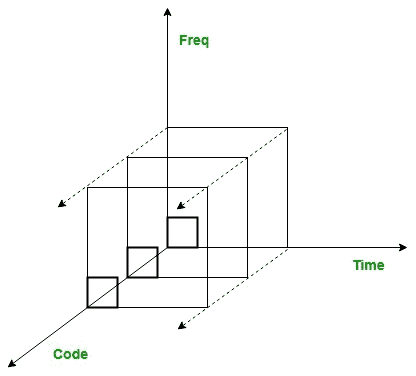
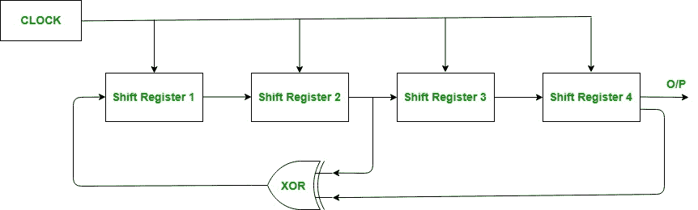

# 暂行标准(IS) 95

> 原文:[https://www.geeksforgeeks.org/interim-standard-is-95/](https://www.geeksforgeeks.org/interim-standard-is-95/)

IS-95 代表**暂行标准 95** ，又称 **CDMAOne** 。这是第一个基于 T4 码分多址的数字蜂窝技术，由高通开发。它是一个基于直扩码分多址的 2G 蜂窝系统。要理解 IS-95，我们需要分别理解 DS 和 CDMA。

**DSSS** 是直接序列扩频技术，这是一种扩频技术，其中要传输的数据使用扩频码编码，然后使用相同的码接收和解码。它用于避免干扰、间谍活动和干扰。所用的扩频码只有发射机和接收机知道。

**CDMA** 代表码分多址。它对所有用户使用相同的带宽。但是，每个用户都被分配了一个单独的代码来区分。

窄带宽信号与被称为伪噪声码序列(PN 码)的非常大带宽的信号相乘。每个用户都有自己的彼此正交的 PN 码。这些伪码的自相关最大，互相关为零。它们在很长一段时间后会自我重复，因此看起来是随机的。PN 序列由*线性反馈移位寄存器*产生。

**IS-95 中的功率控制:**
它解决了远近问题，即不同距离的发射机发射相同功率的信号，那么发射机(离基站较近)的信号功率将大于发射机(离基站较远)的信号功率。因此在功率控制技术中，离基站较近的发射机发射的功率信号比离基站较远的发射机发射的功率信号小。

它有两种类型:

1.  **开环功率控制:**
    发射机感知基站接收信号的功率，然后在后续传输中相应调整发射功率。
2.  **闭环功率控制:**
    基站将接收到的信号功率信息发送给发射机，并告知在后续传输中相应地增加或减少传输功率。