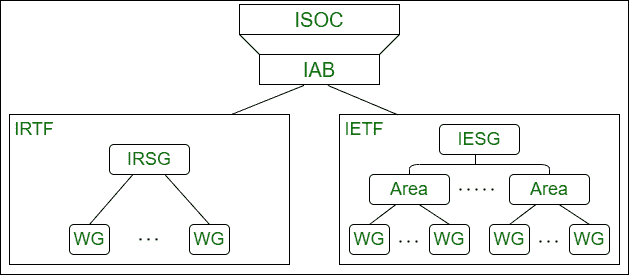

# 互联网管理

> 原文:[https://www.geeksforgeeks.org/internet-administration/](https://www.geeksforgeeks.org/internet-administration/)

互联网管理局基本上是一个协调和指导互联网成长和发展的团体。它确保设备和网络遵循所有协议，以保证互联网的平稳运行。忽视互联网增长和发展的一些组织是–

**互联网协会(ISOC):**
ISOC 是一个国际性的非营利组织，其成立的目的是通过维护和支持 IAB、IETF、IRTF 和 IANA 等其他互联网管理机构来为互联网标准流程提供支持，从而实现其目标。它还促进与互联网有关的研究和其他活动。

**互联网架构委员会(IAB) :**
互联网架构委员会的技术顾问，IAB 的主要目的是监督 TCP/IP 协议套件的持续开发，并以技术顾问的身份为互联网社区的研究成员服务，这是由互联网工程任务组(IETF)和互联网研究任务组(IRTF)这两个组成部分完成的。此外，IAB 还是 RFCs 的编辑经理，并且是互联网和其他标准、组织和论坛之间的外部联系人。

**互联网工程任务组(IETF) :**
由互联网工程指导小组(IESG)管理，IETF 是一个工作组论坛，负责识别运营问题，提出解决方案，并制定和审查作为互联网标准的规范。这些组被收集到不同的区域，如应用程序、路由、安全、协议和网络管理，每个区域都集中在一个特定的主题上。

**互联网研究任务组(IRTF) :**
由互联网研究指导小组(IRSG)管理，IRTF 是一个工作组论坛，专注于与互联网协议、技术、应用和架构相关的长期研究主题。