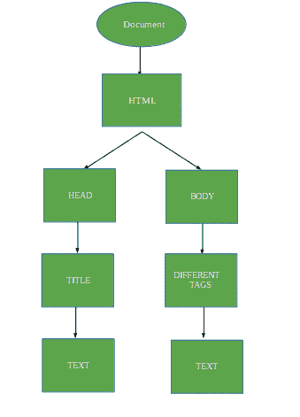
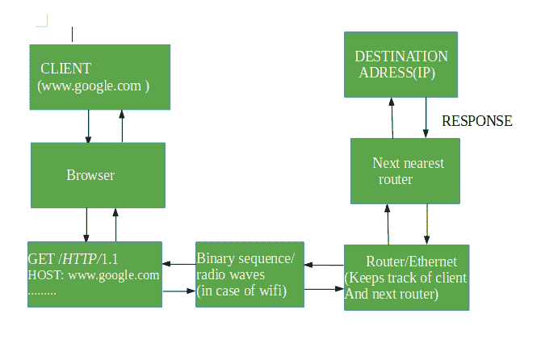

# 互联网和网页编程

> 原文:[https://www.geeksforgeeks.org/internet-and-web-programming/](https://www.geeksforgeeks.org/internet-and-web-programming/)

互联网是一个由计算机和服务器组成的庞大网络，它们相互通信。互联网把整个广阔的世界连接在一起。它实际上是如何在非常低的水平上工作的？

**客户端:**
首先，当我们键入一个类似 www.google.com 的 URL 时，浏览器会将其转换为包含:
的文件

1.  GET /HTTP/1.1(其中 GET 表示我们正在向服务器请求一些数据，HTTP 表示我们正在使用的协议，1.1 表示 HTTP 请求的版本)
2.  主持人:www.google.com
3.  和一些其他信息

现在，这个文件被浏览器转换成二进制代码，如果我们通过以太网连接，如果我们使用 WiFi，它会通过电线发送，首先，它会将其转换成无线电信号，由路由器以非常低的级别解码。它被转换成二进制，然后发送到服务器。

该信息或“二进制代码”到达目的地，如果仅因为 IP 地址而被发送方接收，则做出响应。

一台路由器会将信息发送给另一台，这种情况一直持续到二进制代码到达目的地。

**服务器端:**
现在服务器接收二进制码并解码，以如下方式发送响应:

1.  HTTP/1.1 200 ok(其中 200 ok 是状态)
2.  内容类型:类型/HTML
3.  页面正文

现在，这被服务器转换回二进制，并发送到请求它的 IP 地址。客户端收到代码后，浏览器会以下列方式再次解码信息:

1.  首先，它检查状态
2.  它开始从 HTML 标签中读取文档，并构建一个树状结构。
3.  然后，HTML 树被转换成相应的二进制代码，并呈现在屏幕上。
4.  最终，我们看到了网站前端。

下面是 HTML 文档的树形结构:

下图显示了整个过程:

要理解基本的网络术语，请参考:[互联网和网络](https://www.geeksforgeeks.org/the-internet-and-the-web/)