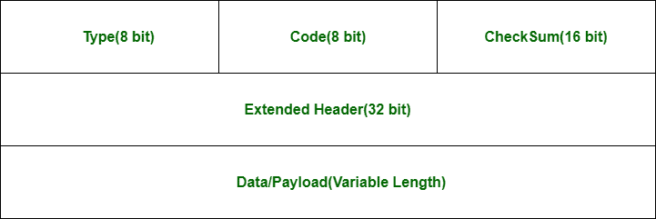
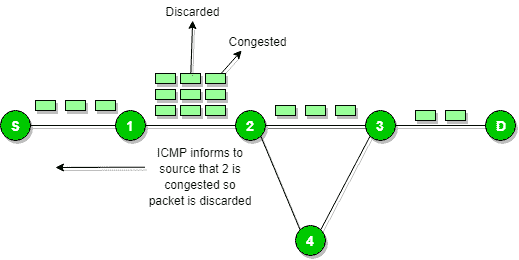
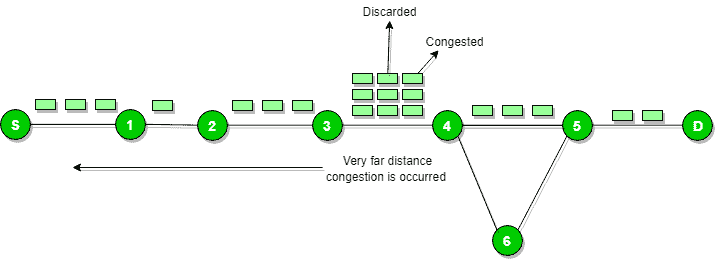
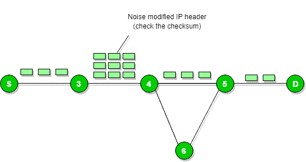
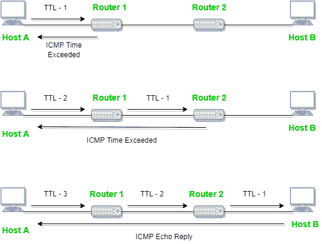
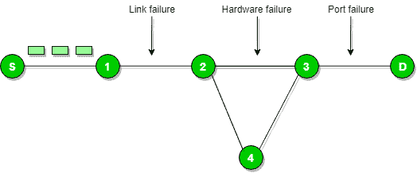
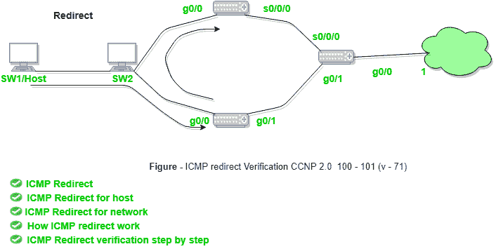

# 互联网控制消息协议(ICMP)

> 原文:[https://www . geesforgeks . org/internet-control-message-protocol-icmp/](https://www.geeksforgeeks.org/internet-control-message-protocol-icmp/)

因为 IP 没有发送错误和控制消息的内置机制。它依赖于互联网控制消息协议(ICMP)来提供错误控制。它用于报告错误和管理查询。它是一种支持协议，由路由器等网络设备用来发送错误消息和操作信息。例如，所请求的服务不可用或者无法到达主机或路由器。

**ICMPv4 数据包格式:**

**源抑制消息:**
源抑制消息是降低发送到主机(目的地)的消息的流量速率的请求。或者我们可以说，当接收主机检测到向其发送数据包的速率(流量速率)太快时，它会向源发送源抑制消息，以减慢速度，从而不会丢失任何数据包。

ICMP 将从丢弃的数据包中获取源 IP，并通过发送源抑制消息来通知源。

那么信源会降低传输速度，这样路由器就不会拥塞。

当拥塞路由器远离源时，ICMP 会逐跳发送源抑制消息，这样每台路由器都会降低传输速度。

**参数问题:**
每当数据包到达路由器时，计算出的报头校验和应该等于接收到的报头校验和，那么路由器只接受该数据包。

如果不匹配，数据包将被路由器丢弃。

ICMP 将从丢弃的数据包中获取源 IP，并通过发送参数问题消息通知源。

**时间超过消息:**

当一些片段在网络中丢失时，路由器持有的片段将被丢弃，然后 ICMP 将从丢弃的数据包中获取源 IP，并通过发送超时消息，通知源由于生存时间字段达到零而丢弃的数据报。

**目的地不可达:**
目的地不可达是由主机或其入站网关生成的，通知客户端由于某种原因目的地不可达。

当网络中发生任何类型的故障(链路故障、硬件故障、端口故障等)时，目的主机发送 ICMP 错误消息的时间并不是唯一路由器给出 ICMP 错误消息的必要条件。

**重定向消息:**
重定向请求数据包在备用路由上发送。该消息通知主机更新其路由信息(在备用路由上发送数据包)。

**Ex。**如果主机试图通过路由器发送数据，R1 和 R1 通过路由器 R2 发送数据，主机与 R2 之间有一条直接的路径。然后，R1 将发送重定向消息，通知主机有直接通过 R2 到达目的地的最佳途径。然后，主机将目的地的数据包直接发送到 R2。
路由器 R2 会将原始数据报发送到预期目的地。
但是如果数据报包含路由信息，那么即使有更好的路由，也不会发送该消息，因为重定向应该只由网关发送，而不应该由互联网主机发送。

每当数据包后来被转发到错误的方向时，它会被重定向到当前方向，然后 ICMP 会发送重定向消息。

本文由 **Aman Chauhan** 供稿。

如果你发现任何不正确的地方，或者你想分享更多关于上面讨论的话题的信息，请写评论。