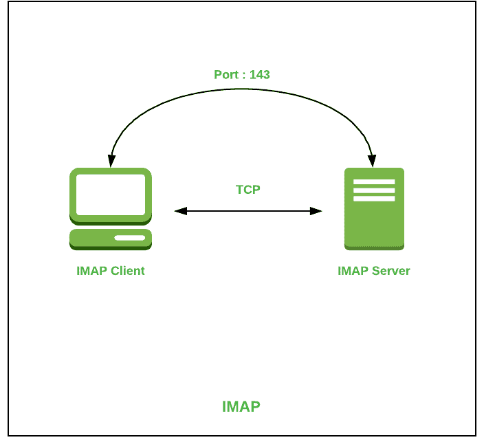

# 互联网消息访问协议(IMAP)

> 原文:[https://www . geesforgeks . org/internet-message-access-protocol-IMAP/](https://www.geeksforgeeks.org/internet-message-access-protocol-imap/)

**先决条件–**[应用层协议](https://www.geeksforgeeks.org/protocols-application-layer/)

[**互联网消息访问协议(IMAP)**](https://www.geeksforgeeks.org/differences-between-pop3-and-imap/) 是一种应用层协议，作为从邮件服务器接收电子邮件的合同。它是由 Mark Crispin 在 1986 年设计的一个远程访问邮箱协议，目前的 IMAP 版本是 IMAP4。它被用作检索电子邮件最常用的协议。该术语也称为互联网邮件访问协议、交互式邮件访问协议和临时邮件访问协议。

**IMAP 的特点:**

*   它能够管理多个邮箱，并将它们组织成不同的类别。
*   提供添加消息标志以跟踪正在查看的消息。
*   它能够在下载之前决定是否从邮件服务器检索电子邮件。
*   当附加了多个文件时，可以轻松下载媒体。

**IMAP 的工作:**
IMAP 遵循客户端-服务器架构，是最常用的电子邮件协议。它是在通过网络连接的其他计算机上运行的客户端和服务器进程的组合。该协议驻留在用于通信的 TCP/IP 协议上。一旦通信建立，服务器默认监听端口 143，该端口是非加密的。对于安全加密通信端口，使用 993。

**IMAP 的架构:**

**优势:**

*   它为用户维护的所有会话提供同步。
*   它通过 POP3 协议提供安全性，因为电子邮件只存在于 IMAP 服务器上。
*   用户可以远程访问所有内容。
*   它提供了设备之间的简单迁移，因为它是由一个集中式服务器同步的。
*   不需要物理分配任何存储来保存内容。

**缺点:**

*   IMAP 维护起来很复杂。
*   用户的电子邮件仅在有互联网连接时可用。
*   加载消息较慢。
*   有些电子邮件不支持 IMAP，这使得管理起来很困难。
*   由于不支持 IMAP，许多基于浏览器的解决方案不可用。