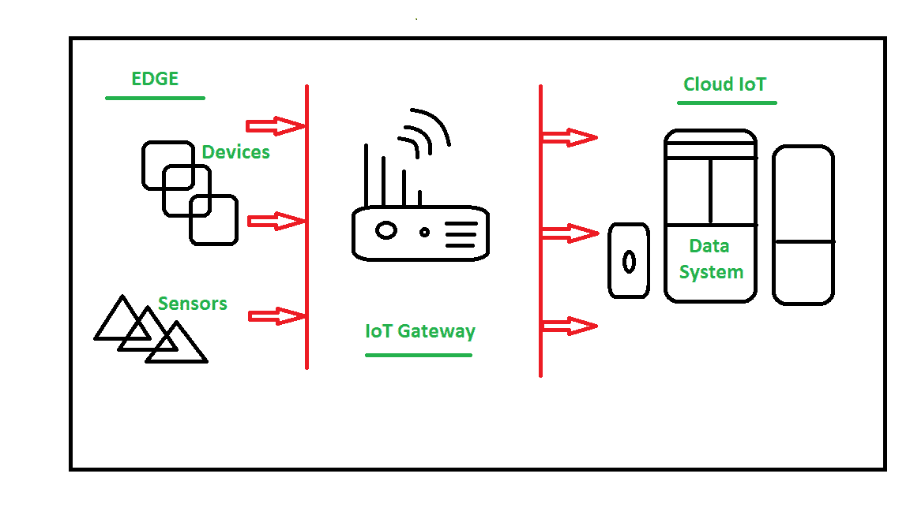

# 物联网网关

> 原文:[https://www . geeksforgeeks . org/物联网-物联网-网关/](https://www.geeksforgeeks.org/internet-of-things-iot-gateways/)

**网关**提供了不同通信技术之间的桥梁，这意味着我们可以说在[物联网(IoT)](https://www.geeksforgeeks.org/introduction-to-internet-of-things-iot-set-1/) 中，网关充当了打开云和控制器(传感器/设备)之间连接的媒介。借助网关，可以建立设备到设备或设备到云的通信。网关可以是典型的硬件设备或软件程序。

它支持传感器网络和互联网之间的连接，同时支持物联网通信，它还执行许多其他任务，例如该物联网网关执行协议转换、聚合所有数据、在将数据发送到云之前对其进行本地处理和过滤、本地存储数据以及基于一些输入数据自主控制设备，从而提供额外的设备安全性。

下图显示了物联网网关如何在传感器和云(数据系统)之间建立通信:

由于物联网设备以低功耗(电池电量)工作，换句话说，它们受到能源限制，因此如果它们直接与云/互联网通信，在功耗方面不会有效。因此，他们首先使用短程无线传输模式/网络(如紫蜂、蓝牙等)与网关通信，因为它们消耗更少的电力，或者他们也可以使用远程连接(如蜂窝和无线网络等)。

然后，Gateway 通过将数据转换为标准协议(如 MQTT)将它们链接到互联网/云。使用以太网、WiFi/蜂窝或卫星连接。与电池供电的传感器节点不同，网关主要由市电供电。实际上有多个网关设备。

让我们考虑一个简单的物联网网关，当我们使用智能手机的 WiFi、蓝牙、蜂窝网络等多种无线电技术在任何物联网项目上发送和接收数据时，我们的智能手机也可以作为一个基本的物联网网关。

**物联网网关的关键功能:**

*   建立沟通桥梁
*   提供额外的安全性。
*   执行数据聚合。
*   数据的预处理和过滤。
*   提供本地存储作为缓存/缓冲区。
*   边缘水平的数据计算。
*   能够管理整个设备。
*   设备诊断。
*   增加更多功能。
*   验证协议。

**物联网网关工作:**

1.  从传感器网络接收数据。
2.  对未过滤的数据执行预处理、过滤和清理。
3.  传输到标准通信协议中。
4.  将数据发送到云。

物联网网关是物联网基础设施的关键要素，因为网关为通信建立连接，还执行如上所述的其他任务。因此，当我们开始考虑物联网生态系统时，物联网网关是最重要的事情之一。