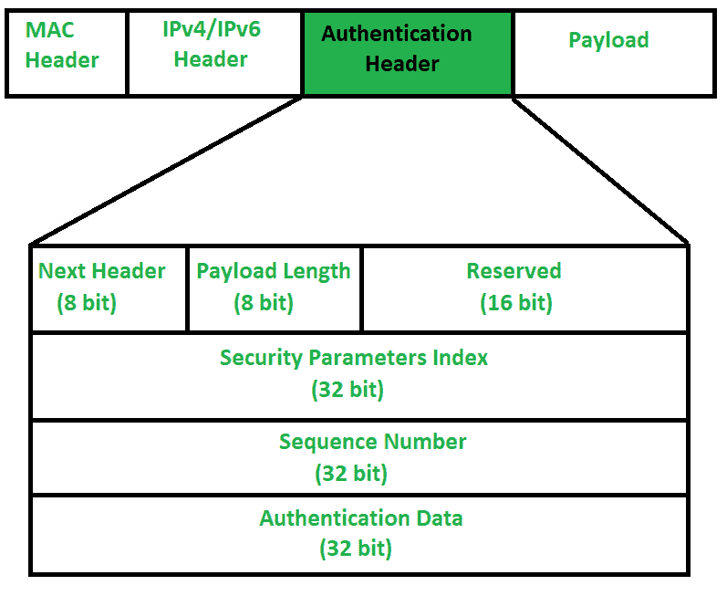

# 互联网协议认证头

> 原文:[https://www . geesforgeks . org/internet-protocol-authentication-header/](https://www.geeksforgeeks.org/internet-protocol-authentication-header/)

前提:[互联网协议第 6 版(IPv6)报头](https://www.geeksforgeeks.org/internet-protocol-version-6-ipv6-header/)
IP 认证报头用于提供无连接完整性和数据来源认证。身份验证标头提供了两个主要优势，

*   **消息完整性–**
    表示消息来源时未被修改。
*   **来源认证–**
    这意味着，来源正是我们期望数据的来源。

当数据包从源 A 发送到目的地 B 时，它由我们需要发送的数据和包含数据包信息的报头组成。身份验证报头验证数据的来源和有效负载，以确认在源和目的地之间的传输过程中，其间是否进行了修改。

但是，在传输过程中，某些 IP 报头字段的值可能会发生变化(如跳数、选项、扩展报头)。因此，此类字段的值不能受到身份验证头的保护。身份验证报头不能保护 IP 报头的每个字段。它为需要保护的领域提供保护。

**认证头:**
可能出现的问题是，IP 头怎么会知道相邻的扩展头是认证头。嗯，在 IP 报头中有一个协议字段，它告诉数据包中存在的报头类型。因此，IP 报头中的协议字段应该具有值“51”，以便检测认证报头。

1.  **Next Header –**
    Next Header is 8-bit field that identifies type of header present after Authentication Header. In case of TCP, UDP or destination header or some other extension header it will store correspondence IP protocol number . Like, number 4 in this field will indicate IPv4, number 41 will indicate IPv6 and number 6 will indicate TCP.
2.  **Payload Length –**
    Payload length is length of Authentication header and here we use scaling factor of 4\. Whatever be size of header, divide it by 4 and then subtract by 2\. We are subtracting by 2 because we’re not counting first 8 bytes of Authentication header, which is first two row of picture given above. It means we are not including Next Header, Payload length, Reserved and Security Parameter index in calculating payload length. Like, say if payload length is given to be X. Then (X+2)*4 will be original Authentication header length.
3.  **Reserved –**
    This is 16-bit field which is set to “zero” by sender as this field is reserved for future use.
4.  **Security Parameter Index (SPI) –**
    It is arbitrary 32-bit field. It is very important field which identifies all packets which belongs to present connection. If we’re sending data from Source A to Destination B. Both A and B will already know algorithm and key they are going to use. So for Authentication, hashing function and key will be required which only source and destination will know about. Secret key between A and B is exchanged by method of [Diffie Hellman algorithm](https://www.geeksforgeeks.org/implementation-diffie-hellman-algorithm/). So Hashing algorithm and secret key for Security parameter index of connection will be fixed. Before data transfer starts security association needs to be established.

    在**安全关联**中，双方需要在数据交换之前进行沟通。安全关联告诉什么是正在使用的安全参数索引、哈希算法和密钥。

5.  **Sequence Number –**
    This unsigned 32-bit field contains counter value that increases by one for each packet sent. Every packet will need sequence number. It will start from 0 and will go till 232 – 1 and there will be no wrap around. Say, if all sequence numbers are over and none of it is left but we cannot wrap around as it is not allowed. So, we will end connection and re-establish connection again to resume transfer of remaining data from sequence number 0\. Basically sequence numbers are used to stop replay attack.

    在[重放攻击](https://www.geeksforgeeks.org/replay-attack/)中，如果同一条消息被发送两次或更多次，接收者将无法知道两条消息是否都是从单一来源发送的。比方说，我向接收者要求 100 美元，入侵者则要求另外 100 美元。接收者将无法知道中间有入侵者。

6.  **认证数据(完整性校验值)–**
    认证数据是可变长度字段，包含数据包的完整性校验值(ICV)。使用哈希算法和密钥，发送方将创建消息摘要，并将其发送给接收方。另一方面，接收者将使用相同的散列算法和密钥。如果两个消息摘要匹配，那么接收者将接受数据。否则，接收者将通过说消息已经在其间被修改来丢弃它。所以基本上，认证数据是用来验证传输的完整性。身份验证数据的长度也取决于您选择的哈希算法。

**结论:**
认证头如何有用？

*   消息完整性也称为无连接完整性
*   源认证
*   重放攻击保护