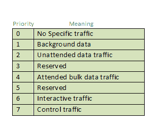
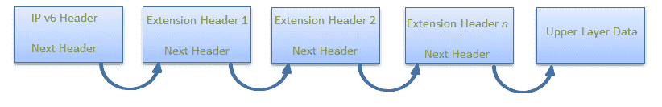
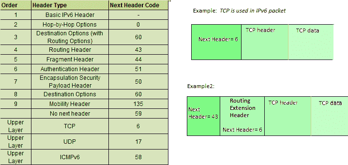
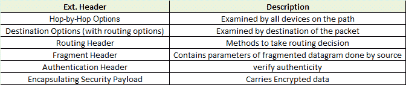

# 互联网协议版本 6 (IPv6)报头

> 原文:[https://www . geesforgeks . org/internet-protocol-version-6-IPv6-header/](https://www.geeksforgeeks.org/internet-protocol-version-6-ipv6-header/)

前提:[互联网协议第六版介绍](https://www.geeksforgeeks.org/internet-protocol-v6-ipv6/)

IP 版本 6 是互联网协议的新版本，在复杂性和效率方面比 IP 版本 4 好得多。让我们看看 IP 版本 6 的报头，了解它与 IPv4 报头有何不同。

**IP 版本 6 表头格式:**

**版本(4 位):**表示包含位序列 0110 的互联网协议版本。

**流量类别(8 位):**流量类别字段指示 IPv6 数据包的类别或优先级，类似于 IPv4 数据包中的*服务字段*。它帮助路由器根据数据包的优先级来处理流量。如果路由器出现拥塞，优先级最低的数据包将被丢弃。
截至目前，仅使用 4 位(其余位正在研究中)，其中 0 至 7 位分配给拥塞控制流量，8 至 15 位分配给非控制流量。

拥塞控制流量的优先级分配:

不受控制的数据流量主要用于音频/视频数据。因此，我们对不受控制的数据流量给予了更高的优先级。
允许源节点设置优先级，但途中路由器可以更改。因此，目的地不应期望与源节点设置的优先级相同。

**流标签(20 位):**流标签字段由源用来标记属于同一流的数据包，以便请求中间 IPv6 路由器的特殊处理，例如非默认服务质量或实时服务。为了区分流量，中间路由器可以使用数据包的源地址、目的地址和流量标签。在源和目标之间，可能存在多个流，因为许多进程可能同时运行。不支持流标签字段功能的路由器或主机，对于默认路由器处理，流标签字段设置为 0。在设置流标签时，源还应该指定流的生存期。

**有效负载长度(16 位):**这是一个 16 位(无符号整数)字段，表示有效负载的总大小，它告诉路由器特定数据包在其有效负载中包含的信息量。有效负载长度字段包括扩展报头(如果有)和上层数据包。如果有效载荷的长度大于 65，535 字节(有效载荷高达 65，535 字节可以用 16 位来表示)，那么有效载荷长度字段将被设置为 0，并且在逐跳选项扩展报头中使用巨型有效载荷选项。

**下一个报头(8 位):**下一个报头表示紧跟在 IPv6 报头之后的扩展报头的类型(如果存在)。而在某些情况下，它表示包含在上层数据包中的协议，如 TCP、UDP。

**跳数限制(8 位):**跳数限制字段与 IPv4 数据包中的 TTL 相同。它表示允许 IPv6 数据包传输的最大中间节点数。转发数据包的每个节点将其值递减 1，如果该值递减到 0，数据包将被丢弃。这用于丢弃由于某些路由错误而陷入无限循环的数据包。

**源地址(128 位):**源地址是数据包原始来源的 128 位 IPv6 地址。

**目的地址(128 位):**目的地址字段指示最终目的地的 IPv6 地址(大多数情况下)。所有中间节点都可以使用此信息来正确路由数据包。

**扩展头:**为了纠正 *IPv4 选项字段*的局限性，在 IP 版本 6 中引入了扩展头。扩展报头机制是 IPv6 体系结构中非常重要的一部分。IPv6 固定头的下一个头字段指向第一个扩展头，第一个扩展头指向第二个扩展头，依此类推。

IPv6 数据包可能包含零个、一个或多个扩展头，但这些扩展头应该以推荐的顺序出现:

**规则:**逐跳选项报头(如果存在)应始终放在 IPv6 基本报头之后。

**惯例:**

1.  除了目标标头外，任何扩展标头最多只能出现一次，因为目标标头在上面的列表中出现了两次。
2.  如果目的地报头出现在路由报头之前，则路由报头中指定的所有中间节点将对其进行检查。
3.  如果目的地报头正好出现在上层之上，那么它将仅被目的地节点检查。

给定所有扩展报头在 IPv6 数据包中的链接顺序以及每个扩展报头的工作方式 **:**

**参考文献**:
https://www.ietf.org/rfc/rfc2460.txt
https://www.ietf.org/rfc/rfc3697.txt
https://www . Cisco . com/en/US/technologies/tk 648/tk 872/technologies _ white _ paper 0900 aecd 8054 d37d . html

本文由 **Abhishek Agrawal** 供稿。如果你喜欢极客博客并想投稿，你也可以用 write.geeksforgeeks.org 写一篇文章或者把你的文章邮寄到 review-team@geeksforgeeks.org。看到你的文章出现在极客博客主页上，帮助其他极客。

如果你发现任何不正确的地方，或者你想分享更多关于上面讨论的话题的信息，请写评论。