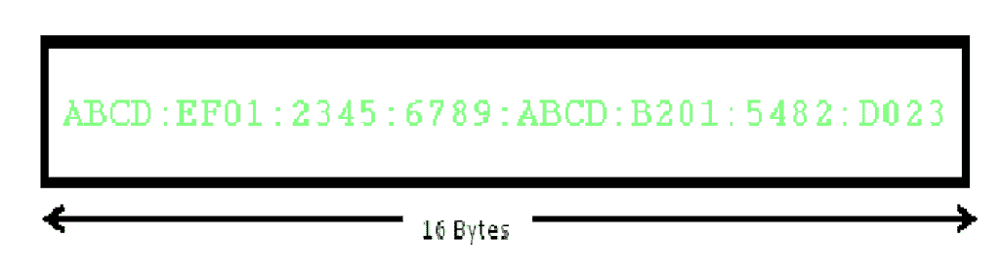
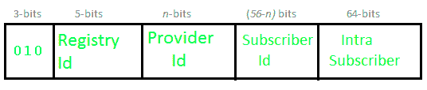
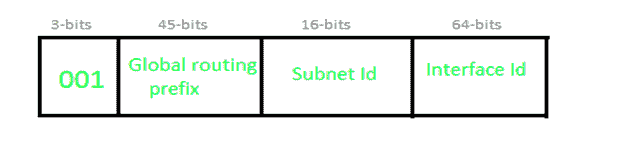
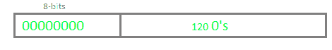
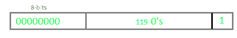
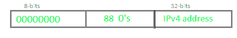
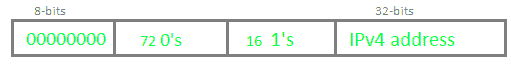
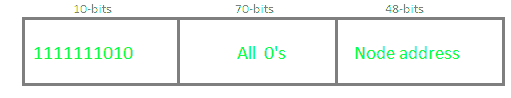
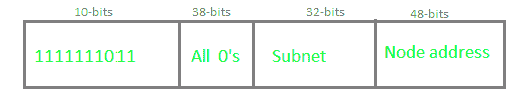

# 互联网协议第 6 版(IPv6)

> 原文:[https://www . geesforgeks . org/internet-protocol-version-6-IPv6/](https://www.geeksforgeeks.org/internet-protocol-version-6-ipv6/)

IP v6 是由互联网工程任务组(IETF)为应对 IP v4 耗尽问题而开发的。IP v6 是一个 128 位地址，地址空间为 2^128，比 IPv4 大得多。在 IPv6 中，我们使用冒号-Hexa 表示。共有 8 个组，每个组代表 2 个字节。

在 IPv6 表示中，我们有三种寻址方法:

*   单播
*   多点传送
*   任播

**1。单播地址–**
单播地址标识单个网络接口。发送到单播地址的数据包被传送到该地址标识的接口。

**2。组播地址–**
组播地址由多个主机使用，称为组，获取一个组播目的地址。这些主机不需要地理上在一起。如果任何数据包被发送到该多播地址，它将被分发到对应于该多播地址的所有接口。

**3。选播地址–**
选播地址被分配给一组接口。发送到任播地址的任何数据包都将只传送到一个成员接口(可能是最近的主机)。

**注意:**IPv6 中没有定义广播。

**IPv6 地址的类型:**
IPv6 地址中有 128 位，但通过查看前几位，我们可以识别它是什么类型的地址。

<figure class="table">

| 前缀 | 分配 | 地址空间的一部分 |
| --- | --- | --- |
| 0000 0000 | 内向的; 寡言少语的; 矜持的 | 1/256 |
| 0000 0001 | 未分配 | 1/256 |
| 0000 001 | 为 NSAP 保留 | 1/128 |
| 0000 01 | 美国联合航空公司(United Airlines) | 1/64 |
| 0000 1 | 美国联合航空公司(United Airlines) | 1/32 |
| 0001 | 美国联合航空公司(United Airlines) | 1/16 |
| 001 | 全球单播 | 1/8 |
| 010 | 美国联合航空公司(United Airlines) | 1/8 |
| 011 | 美国联合航空公司(United Airlines) | 1/8 |
| One hundred | 美国联合航空公司(United Airlines) | 1/8 |
| One hundred and one | 美国联合航空公司(United Airlines) | 1/8 |
| One hundred and ten | 美国联合航空公司(United Airlines) | 1/8 |
| One thousand one hundred and ten | 美国联合航空公司(United Airlines) | 1/16 |
| 1111 0 | 美国联合航空公司(United Airlines) | 1/32 |
| 1111 10 | 美国联合航空公司(United Airlines) | 1/64 |
| 1111 110 | 美国联合航空公司(United Airlines) | 1/128 |
| 1111 1110 0 | 美国联合航空公司(United Airlines) | 1/512 |
| 1111 1110 10 | 链路本地单播地址 | 1/1024 |
| 1111 1110 11 | 站点本地单播地址 | 1/1024 |
| 1111 1111 | 多播地址 | 1/256 |

**注意:**在 IPv6 中，所有 0 和 1 都可以分配给任何主机，不存在像 IPv4 那样的限制。

**基于提供商的单播地址:**
这些地址用于全球通信。

前 3 位表示它属于这种类型。
**注册表 Id (5 位):**注册表 Id 标识其所属的区域。在 32 个国家(即 2^5)中，仅使用了 4 个注册 id。

**提供商 Id:** 根据在一个区域下运营的服务提供商的数量，某些位将被分配给提供商 Id 字段。该字段无需固定。假设提供商标识= 10 位，那么订户标识将为 56–10 = 46 位。
**用户 Id:** 提供商 Id 固定后，剩下的部分可以被 ISP 作为普通 IP 地址使用。
**内部用户:**此部分可根据使用服务的组织的需要进行修改。

**基于地理位置的单播地址:**

**全局路由前缀:**全局路由前缀包含经纬度的所有详细信息。到目前为止，它还没有被使用。在基于地理的单播地址路由中，将基于位置。
**接口 Id:** 在 IPv6 中，我们不用主机 Id，而是用接口 Id 这个术语。

**一些特殊地址:**
**未指明–**

**环回–**

**IPv4 兼容–**T2]

**IPv4 映射–**

**本地单播地址:**
定义了两种类型的本地单播地址- *链路-本地*和*站点-本地*。

**链接-本地地址:**

链路本地地址用于寻址单个链路。它也可以用于与同一链路上的节点通信。链路本地地址总是以 1111111010(即 FE80)开头。路由器不会转发任何带有链路本地地址的数据包。

**现场本地地址:**

站点本地地址相当于 IPv4 中的私有 IP 地址。可能会保留一些地址空间，这些空间只能在组织内路由。前 10 位设置为 1111111011，这就是为什么站点本地地址总是以 FEC0 开头。以下 32 位是子网标识，可用于在组织内创建子网。节点地址用于唯一标识链路；因此，我们在这里使用 48 位 MAC 地址。

**参考文献:**

*   https://tools . IETF . org/html/RFC 3513
*   https://en . Wikipedia . org/wiki/IPv6 _ address

本文由 **Abhishek Agrawal** 供稿。如果你发现任何不正确的地方，或者你想分享更多关于上面讨论的话题的信息，请写评论。

</figure>