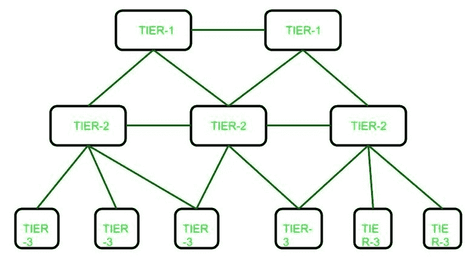

# 互联网服务提供商(ISP)层级结构

> 原文:[https://www . geesforgeks . org/internet-service-provider-ISP-hierarchy/](https://www.geeksforgeeks.org/internet-service-provider-isp-hierarchy/)

**互联网服务提供商(ISP)** 是为终端用户提供互联网连接的公司，但 ISP 基本上有三个级别。互联网服务提供商有三个级别:第一级互联网服务提供商、第二级互联网服务提供商和第三级互联网服务提供商。



这些解释如下。

*   **Tier-1 ISP:** 
    These ISPs are at the top of the hierarchy and they have a global reach they do not pay for any internet traffic through their network instead lower-tier ISPs have to pay a cost for passing their traffic from one geolocation to another which is not under the reach of that ISPs. Generally, ISPs at the same level connect to each other and allow free traffic passes to each other. Such ISPs are called peers. Due to this cost is saved. They build infrastructure, such as the Atlantic Internet sea cables, to provide traffic to all other Internet service providers, not to end users. 

    **示例:**
    一级互联网提供商的一些示例:

```
Cogent Communications,
Hibernia Networks,
AT&T

```

*   **Tier-2 ISP:** 
    These ISPs are service provider who connect between tier 1 and tier 3 ISPs. They have regional or country reach and they behave just like Tier-1 ISP for Tier-3 ISPs. 

    **示例:**
    二级互联网服务提供商示例:

```
Vodafone,
Easynet,
BT

```

*   **Tier-3 ISP:** 
    These ISPs are closest to the end users and helps them to connect to the internet by charging some money. These ISPs work on purchasing model. These ISPs have to pay some cost to Tier-2 ISPs based on traffic generated. 

    **示例:**
    三级互联网服务提供商示例:

```
Comcast,
Deutsche Telekom,
Verizon Communications 

```