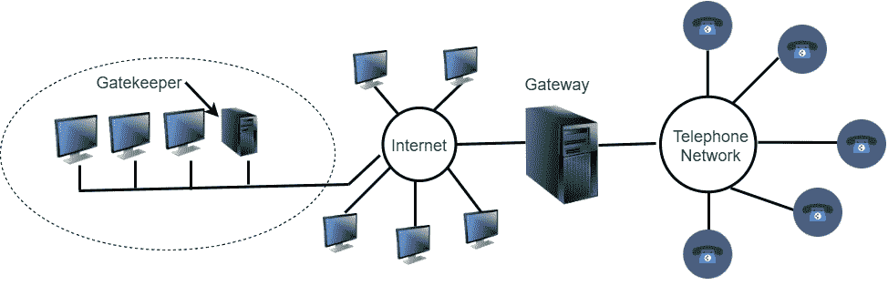
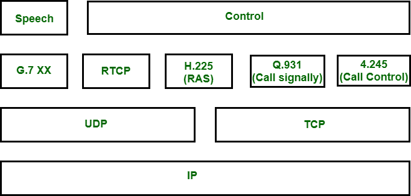

# 互联网电话协议| H.323

> 原文:[https://www . geesforgeks . org/internet-电话-协议-h-323/](https://www.geeksforgeeks.org/internet-telephony-protocol-h-323/)

互联网电话协议也称为[IP 语音](https://www.geeksforgeeks.org/voice-over-internet-protocol-voip/)。这是一个实时交互式音频/视频应用程序。从名字互联网电话，它使用互联网作为一个电话网络与额外的功能。为了在双方之间进行通信，它使用分组交换互联网。

有两种不同类型的协议支持互联网电话。

1.  H.323
2.  会话发起协议

**H.323 :**
基本上，H.323 可能是 ITU 制定的一个标准，它允许普通公共电话网络上的电话与连接到互联网的计算机通话。H.323 的架构如图所示:

323 架构模型

在中心，放置了**网关**，将互联网连接到电话网络。网关将消息从一种协议翻译成另一种协议。它在互联网上讲 H.323 协议，在电话端讲 PSTN，即公共交换电话网协议。它将同时充当计算机和电话。一个局域网可能有一个**看门人**，控制其管辖下的终端，称为**区**。

**H.323 的协议:**
为了保持音频或视频通信，h . 323 使用了多种协议。使用的各种协议如下图所示。

323 协议栈

1.  **G.711 或 g . 723.1–**
    这些协议用于压缩。
2.  **H.245–**
    在这种情况下，允许多种压缩协议，h . 245 允许终端协商使用哪种协议进行压缩。H.245 还协商比特率。
3.  **RTCP–**
    用于控制 RTP 通道。
4.  **q . 931–**
    该协议用于建立和释放连接、提供拨号音、发出铃声。
5.  **h . 225–**
    该协议使终端能够与门卫通话。该协议还管理电脑到网守的通道，称为 RAS 通道。该信道允许终端加入和离开该区域，请求和返回带宽并提供状态更新。
6.  **RTP–**
    用于实际数据传输。