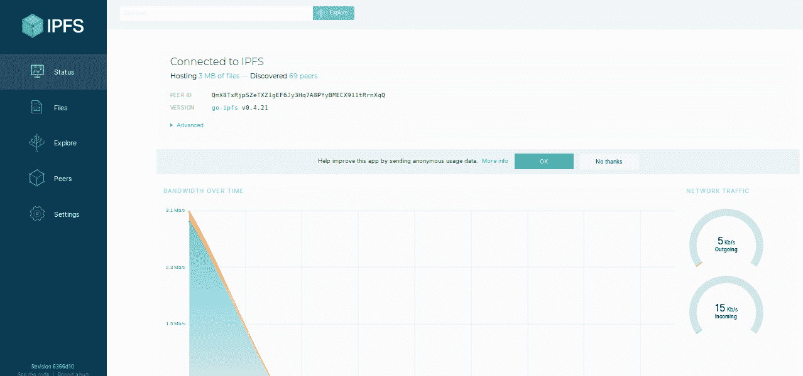

# 星际文件系统

> 原文:[https://www.geeksforgeeks.org/interplanetary-file-system/](https://www.geeksforgeeks.org/interplanetary-file-system/)

**简介:**
IPFS(星际文件系统)是一个对等、版本控制、内容寻址的文件系统。它利用了计算机科学的概念，如分布式哈希表、位交换(受 BitTorrent 启发)、MerkleDag(受 Git 协议启发)。

**历史:**
IPFS 是由胡安·贝内特于 2015 年在协议实验室创建的。目前有多个应用程序正在 IPFS 之上构建。

**描述:**
目前默认的互联网数据交换方式是 HTTP，但在某些情况下会失败。大文件不能使用 HTTP 传输，数据在 HTTP 上不是永久的，HTTP 主要使用客户端-服务器协议，这导致低延迟，很难建立对等连接，实时媒体流在 HTTP 上也很难。使用 IPFS 克服了所有这些失败。
不同于 IP 寻址的 HTTP，IPFS 网络是内容寻址的。这意味着，当任何数据上传到 IPFS 网络时，它会返回一个哈希，然后使用该哈希请求数据。任何人都可以在 IPFS 网络上提供存储，每个人都受到加密令牌的激励。数据在整个网络中分布和复制，这导致了数据的持久性。在请求数据时，它会搜索该数据的最近副本，这会导致高延迟并克服任何瓶颈点。由于数据是完全分布式的，因此没有数据集中化的空间。

IPFS 可以被视为一个单独的 BitTorrent 群，在一个 Git 存储库中交换对象。
-胡安·贝内特(IPFS 白皮书)

**IPFS 使用的概念:**

*   **分布式哈希表:**
    它用于跨网络中的节点存储和检索数据。这是一个类似于散列表的类。使用分布式哈希表，网络上的任何节点都可以请求对应于哈希键的值。
*   **块交换:**
    它用于 BitTorrent 协议(也称为 BitSwap)中，在节点之间交换数据。它是一种对等文件共享协议，协调不可信集群之间的数据交换。它采用“T3”针锋相对的“T4”策略，奖励互相贡献的节点，惩罚只请求资源的节点。这有助于 IPFS 节点并行检索数据的多个部分。
*   **Merkle DAG:**
    它使用一个 [Merkle 树](https://www.geeksforgeeks.org/introduction-to-merkle-tree/)或者一个 Merkle DAG，类似于 Git 版本控制系统中使用的那个。它用于以分布式友好方式跟踪网络上文件的更改。数据通过内容的加密散列进行内容寻址。

**IPFS 节点:**
网络上的每个节点都使用一个节点标识号来标识，这个节点标识号只不过是其公钥的散列。网络上的每个人都可以将文件存储在他们的本地存储器中，并且他们被激励这样做。每个节点都维护一个分布式哈希表，用于查找网络上其他对等体的标识以及这些对等体可以提供哪些数据。

**IPFS 入门:**
要上 IPFS 网我们可以从[官网](https://ipfs.io/ipfs/QmeQT76CZLBhSxsLfSMyQjKn74UZski4iQSq9bW7YZy6x8/docs/install/)安装 IPFS。

*   根据给定的说明安装后，可以使用在终端或命令行中初始化存储库

```
 >ipfs init
```

输出:

> 正在/home/omkar/snap/ipfs/1170/初始化 IPFS 节点。ipfs
> 正在生成 2048 位 RSA 密钥文件…已完成
> 对等身份:qmx8txrjpsztxz1gef 6j 3 hq7a8 pyybmecx 911 rrnxqq
> 要开始，请输入:
> 
> IPF cat/IPF/QMS 4 ustl 54 uo8 fzr 9455 qax zwumuyvmcx 9 ba 8 nuh 4 uvv/readme

*   守护进程可以作为终端执行

```
>ipfs daemon
```

输出:

> 正在初始化守护进程……
> go-ipfs 版本:0.4.21-8ca278f45
> Repo 版本:7
> 系统版本:amd64/linux
> Golang 版本:go1.12.6
> Swarm 侦听 on/ip4/127 . 0 . 0 . 1/TCP/4001
> Swarm 侦听 on/ip4/192 . 168 . 0 . 107/TCP/4001
> Swarm 侦听 on/

*   现在，一旦你在线，你就可以使用 IPFS 门户网站访问网络。此外，您可以使用终端获取您的同行的 id

```
 >ipfs swarm peers
```

输出:

> /IP 4/170 . 11 . 91 . 8/TCP/4001/IPF/qmacpdmgv2bgheerwet 3n 8 szbutfsqqluvuj//IP 4/191 . 236 . 12 . 16/TCP/4002/IPF/qmw 2 wqi 7j7c7 ugjtaratp7 tdnike 4b 2 qxtfcpdsgatq
> /IP 4/131 . 121 . 91 . 93/TCP

您还可以在网络用户界面上找到关于您的节点和对等节点的信息。



**IPFS 优势:**

1.  本地网络中的用户可以相互通信，即使广域网由于某种原因被阻塞。
2.  由于不需要服务器，创作者可以免费分发他们的作品。
3.  数据加载速度更快，因为它具有更高的带宽。

**IPFS 的劣势:**

1.  IPFS 安装有很多麻烦，它一点也不用户友好。
2.  IPFS 消耗了大量带宽，而计量互联网用户并不欣赏这些带宽。
3.  IPFS 目前被科技爱好者使用，正常人不倾向于建立自己的节点，这导致网络上的节点短缺。

**结论**

IPFS 综合了迄今为止各种最好的系统和协议。IPFS 是一个新的分散式互联网基础设施的宏伟愿景，未来可以在此基础上构建许多不同类型的应用。