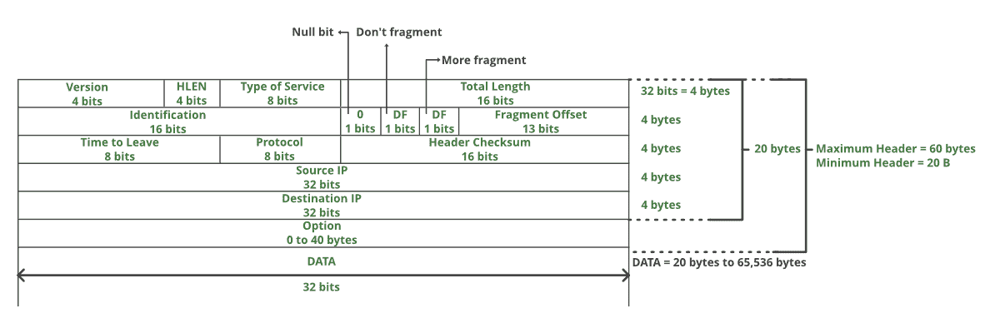

# 介绍和 IPv4 数据报头

> 原文:[https://www . geesforgeks . org/introduction-and-IP v4-数据报-header/](https://www.geeksforgeeks.org/introduction-and-ipv4-datagram-header/)

网络层是现场视察模型的第三层(自下而上)。网络层负责通过多个网络传送数据包。网络层被认为是现场视察模型的主干。它选择并管理节点间数据传输的最佳逻辑路径。这一层包含路由器、网桥、防火墙和交换机等硬件设备，但它实际上创建了最高效通信路由的逻辑映像，并通过物理介质来实现。网络层协议存在于每台主机或路由器中。路由器检查通过它的所有 IP 数据包的报头字段。互联网协议和网络软件 IPX/SPX 是与网络层相关的最常见的协议。
在 OSI 模型中，网络层响应上层(传输层)的请求，向下层(数据链路层)发出请求。

**网络层职责:**

> **数据包转发/数据包路由:**由计算机网络中的节点将数据包从一个网段中继到另一个网段
> 
> **无连接通信(IP):** 在分组交换网络中使用的一种数据传输方法，其中每个数据单元根据其携带的信息分别寻址和路由
> 
> **数据包的分段:**对太大而无法在网络上传输的数据包进行分段

网络传输技术有两种，电路交换网络和分组交换网络。
**电路交换 vs 分组交换**
在电路交换网络中，所有数据包的传输都指定一条路径。而在分组交换网络的情况下，每个分组可以通过不同的路径发送到目的地。

在电路交换网络中，数据分组按顺序接收，而在分组交换网络中，数据分组可能按顺序接收。

分组交换进一步细分为虚电路和数据报。

**IPv4:**
IPv4 是一种用于分组交换网络的无连接协议。它采用尽力交付模式，既不能保证交付，也不能保证适当的顺序或避免重复交付。互联网协议版本 4 (IPv4)是互联网协议的第四次修订，是在不同类型的网络上进行数据通信时广泛使用的协议。IPv4 是一种无连接协议，用于分组交换层网络，如以太网。它通过为每个设备提供标识来提供网络设备之间的逻辑连接。根据网络类型，有许多方法可以用各种设备配置 IPv4，包括手动和自动配置。

IETF 出版物 RFC 791 中定义并指定了 IPv4。
IPv4 使用 32 位地址进行以太网通信，分为 A、B、C、D 和 e 五类，A 类、B 类和 C 类寻址网络主机的位长不同。D 类地址保留用于军事目的，而 E 类地址保留用于未来使用。

IPv4 采用 32 位(4 字节)寻址，给出 2 32 地址。IPv4 地址以点-十进制表示法写入，由四个八位字节的地址组成，以十进制表示，用句点分隔，例如 192.168.1.5。

**IPv4 数据报报头**
报头的大小是 20 到 60 字节。

> ***版本:*** 版本的 IP 协议(4 位)，对于 IPv4 为 4
> 
> ***HLEN:*** IP 报头长度(4 位)，即报头中 32 位的字数。此字段的最小值为 5，最大值为 15。
> 
> ***服务类型:*** 低延迟、高吞吐量、可靠性(8 位)
> 
> ***总长度:*** 报头+数据的长度(16 位)，最小值为 20 字节，最大值为 65，535 字节。
> 
> ***标识:*** 唯一数据包标识，用于标识单个 IP 数据报的一组片段(16 位)
> 
> ***标志:*** 3 个各 1 位的标志:保留位(必须为零)，不分段标志，更多分段标志(相同顺序)
> 
> ***【片段偏移量:*** 表示特定数据报中特定片段前面的数据字节数。根据 8 字节数指定，最大值为 65，528 字节。
> 
> ***生存时间:*** 数据报的生存期(8 位)，它通过限制数据包在传送到目的地之前的跳数来防止数据报在网络中循环。
> 
> ***协议:*** 数据要传递到的协议名称(8 位)
> 
> ***报头校验和:*** 16 位报头校验和，用于检查数据报报头中的错误
> 
> ***源 IP 地址:*** 发送方的 32 位 IP 地址
> 
> ***目的 IP 地址:*** 接收方的 32 位 IP 地址
> 
> ***选项:*** 可选源路由、记录路由等信息。网络管理员用来检查路径是否正常工作。

由于选项的存在，数据报报头的大小可以是可变长度的(20 字节到 60 字节)。

上一次 GATE 考试已经就以上题目提出了以下问题。
T3】GATE | GATE CS 2006 |问题 5T5[GATE | GATE-CS-2010 |问题 15](https://www.geeksforgeeks.org/gate-gate-cs-2010-question-15/)T8[GATE | GATE-CS-2014 第 3 集|问题 35](https://www.geeksforgeeks.org/gate-gate-cs-2014-set-3-question-35/)T11[GATE | GATE CS 2015 第 1 集|问题 65](https://www.geeksforgeeks.org/gate-gate-cs-2015-set-1-question-32/)

发现有不正确的地方请写评论，或者想分享更多以上讨论话题的信息。