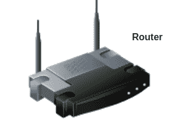
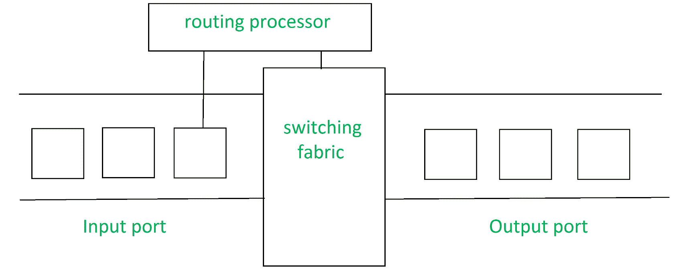

# 引入路由器

> 原文:[https://www.geeksforgeeks.org/introduction-of-a-router/](https://www.geeksforgeeks.org/introduction-of-a-router/)

先决条件–[网络设备](https://www.geeksforgeeks.org/network-devices-hub-repeater-bridge-switch-router-gateways/)
路由器**路由器**是一种在计算机网络之间转发数据包的网络设备。
让我们通过一个非常一般的例子来理解这一点，假设你在你的网络浏览器中搜索*www.google.com*，那么这将是一个请求，它将从你的系统发送到谷歌的服务器来服务于该网页，现在你的请求只不过是一个数据包流，不仅仅是直接进入谷歌的服务器，而是通过一系列被称为路由器的网络设备，路由器接受这些数据包并将其转发到正确的路径，从而到达目的地服务器。

路由器有许多接口，可以通过这些接口连接到许多主机系统。

**路由器的功能:**
路由器基本上执行两个主要功能:

1.  **转发–**
    路由器从其输入端口接收数据包，检查其报头，执行一些基本功能，如检查校验和，然后查找路由表以找到合适的输出端口，将数据包转储到该输出端口，并将数据包转发到该输出端口。
2.  **路由–**
    路由是路由器确定数据包到达目的地的最佳路径的过程，它维护一个路由表，该路由表仅由路由器使用不同的算法生成。

**路由器的体系结构:**
通用路由器由以下组件组成:

1.  **输入端口–**
    这是允许数据包进入路由器的接口，它执行几个关键功能，如终止路由器上的物理链路，这是由下图中最左边的部分完成的，中间部分完成与链路层的互操作工作，如解封装，在输入端口的最后部分查找转发表，并用于根据目的地址确定合适的输出端口。
2.  **交换结构–**
    这是路由器的核心，它连接输入端口和输出端口。它有点像网络设备中的网络。交换结构可以通过多种方式实现，其中一些突出的方式是:
    *   **通过内存切换:**在这种情况下，我们有一个处理器，它从输入端口复制数据包，并将其发送到适当的输出端口。它作为传统的中央处理器工作，输入和输出端口作为输入和输出设备
    *   **通过总线进行切换:**在这个实现中，我们有一条总线将所有输入端口连接到所有输出端口。当接收到一个数据包并确定它必须传送到哪个输出端口时，输入端口会在数据包上放置一个特定的令牌，并将其传输到总线。所有输出端口都能看到数据包，但它将被传送到令牌已被放入的输出端口，然后令牌被该输出端口刮下，数据包被转发
    *   **通过互连网络进行切换:**这是一个更复杂的网络，这里我们使用 2N 总线将 n 个输入端口连接到 n 个输出端口，而不是单一总线。
3.  **输出端口–**
    这是数据包从路由器传输出去的网段。输出端口查看其排队缓冲区(当多个数据包必须通过同一输出端口传输时，会形成排队缓冲区)，接收数据包，执行链路层功能，最后将数据包传输到输出链路
4.  **路由处理器–**
    它执行路由协议，它像传统的中央处理器一样工作。它采用各种路由算法，如链路状态算法、距离矢量算法等。准备转发表，查找转发表以确定路由和输出端口。