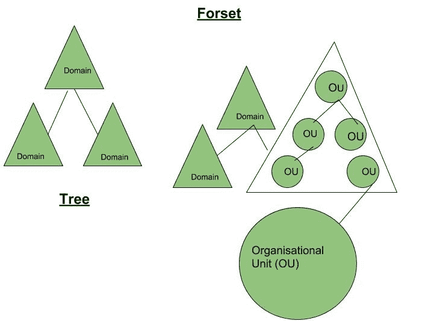

# 活动目录域服务介绍

> 原文:[https://www . geesforgeks . org/active directory 域服务简介/](https://www.geeksforgeeks.org/introduction-of-active-directory-domain-services/)

一个**目录**是一个存储网络上对象信息的层次结构。从最一般的意义上说，目录是对象的综合列表。电话簿是一种存储有关人员、企业和政府机构信息的目录。电话簿通常记录姓名、地址和电话号码。

活动目录(AD)是一种微软技术，用于管理网络上的计算机和其他设备。它是运行本地和基于互联网的服务器的操作系统 Windows Server 的主要功能。

**活动目录的优势–**

*   分级组织结构。
*   多主机身份验证和多主机复制(从多个
    管理点访问和修改 AD DS 的能力)
*   对网络资源的单点访问。
*   能够与运行早期版本的活动目录甚至 Unix 的外部网络建立信任关系。

**目录服务–**
目录服务是对象的分层排列，其结构使访问变得容易。然而，作为定位器服务并不是广告的唯一目的。它还帮助组织对其网络中进行的所有活动进行集中管理。本质上是网络目录服务:

*   提供有关网络中用户对象、计算机和服务的信息。
*   将此信息存储在安全的数据库中，并提供管理和搜索目录的工具。
*   允许管理用户帐户和资源，根据组织需要一致地应用策略。

活动目录提供几种不同的服务，这些服务属于“活动目录域服务”的范畴。这些服务包括:

1.  **域服务–**
    存储集中式数据，管理用户与域之间的通信；包括登录验证和搜索功能
2.  **证书服务–**
    它生成、管理和共享证书。证书使用加密使用户能够使用公钥在互联网上安全地交换信息。
3.  **轻量级目录服务–**
    支持使用开放(LDAP)协议的目录应用。
4.  **目录联盟服务–**
    提供单点登录(SSO)在单个会话中对多个网络应用程序中的用户进行身份验证。
5.  **权限管理–**
    控制信息权限和管理。AD RMS 对服务器上的内容(如电子邮件或 Word 文档)进行加密，以限制访问。

**域控制器–**
运行 AD DS 的服务器称为域控制器。域控制器托管并复制林中的目录服务数据库。目录服务还为管理和验证林中的资源提供服务。这些服务器托管 AD DS 中的基本服务，包括以下内容:
–Kerberos 密钥分发中心(KDC)
–NetLogon(NetLogon)
–Windows 时间(W32time)
–站点间消息传递(IsmServ)

**活动目录对象:**

1.  **容器对象–**
    这些对象里面可以包含其他对象，我们可以从中进行收藏。用于外部森林、树、域、组织单位。
2.  **Leaf Objects –**
    These objects can not contain other objects inside them. For Ex- users, computers, printers, etc.

    

    **常用术语和活动目录概念:**

    *   **模式–**
        一组规则，即模式，定义目录中包含的对象和属性的类别，对这些对象的实例的约束和限制，以及它们的名称格式。
    *   **全局目录–**
        包含目录中每个对象信息的全局目录。这允许用户和管理员查找目录信息，而不管目录中的哪个域实际包含数据。有关全局目录的更多信息，请参见全局目录的作用。
    *   **林根域–**
        安装在活动目录林中的第一个域称为根域。
    *   **站点–**
        AD DS 中的站点代表网络的物理结构或拓扑。AD DS 利用存储在目录中的网络拓扑信息作为站点、子网和站点链接对象，构建
        最高效的复制拓扑。
    *   **轻量级目录访问协议–**
        AD 基于轻量级目录访问协议(LDAP)。该协议为客户端和服务器之间的对话提供了一种通用语言。