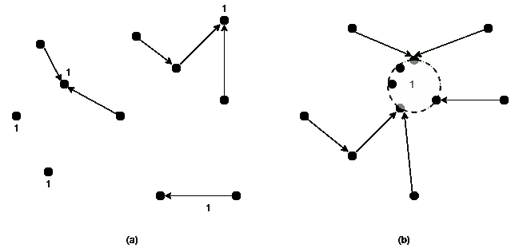

# 选播路由介绍

> 原文:[https://www . geeksforgeeks . org/introduction-of-any cast-routing/](https://www.geeksforgeeks.org/introduction-of-anycast-routing/)

在任播中，数据包被传送到组中最近的成员。**选播路由**找到这些路径。有时，节点提供一种服务，例如一天中的某个时间或内容分发，对于这种服务，节点获取的是正确的信息，而不是所联系的节点；任何节点都可以。例如，任播作为域名系统的一部分在互联网中使用。

**拓扑:**
规则的距离矢量和链路状态路由可以产生选播路由，因为不需要为选播设计新的路由方案。假设我们想对组 1 的成员进行任意广播。他们将被给予地址“1”，而不是不同的地址。距离矢量路由将像往常一样分发矢量，节点将选择到目的地 1 的最短路径。这将导致节点发送到目的地 1 的最近实例。也就是说，它认为节点 1 的所有实例都是同一个节点，如下图所示的拓扑。

(a)到组 1 的任播路由(b)路由协议看到的拓扑

此过程也适用于链路状态路由，尽管还需要考虑路由协议不能发现通过节点 1 的看似短的路径。这将导致超空间跳跃，因为节点 1 的实例实际上是位于网络不同部分的节点。然而，链路状态协议已经对路由器和主机进行了区分。我们早先掩盖了这个事实，因为我们的讨论不需要它。