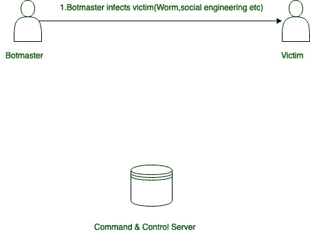
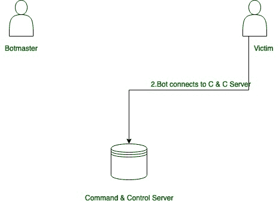

# 计算机网络中僵尸网络的引入

> 原文:[https://www . geesforgeks . org/计算机网络僵尸网络介绍/](https://www.geeksforgeeks.org/introduction-of-botnet-in-computer-networks/)

**受损计算机的网络**称为僵尸网络。受损的电脑也被称为“T2”僵尸或机器人“T3”。

**编程语言:**
这些软件大多是用 C++ & C 写的。

**动机:**
这一切都始于互联网的黑暗面，它引入了一种新的犯罪，称为**网络犯罪**在恶意软件(恶意软件)僵尸网络中，最**普遍的**和**严重威胁**。几个大型机构、政府组织、几乎每一个社交网站脸书、推特、Instagram 等、电子商务网站亚马逊、Flipkart 等，总之，每一家与互联网相关的公司都成了这种恶意软件的受害者。这类恶意软件最搞笑的部分**是在市场上可以免费租借。可用于 DDoS 攻击(蓝精灵攻击)、网络钓鱼、勒索等。**

****它是如何工作的:**
要么你编写代码来构建软件，要么从可用的(泄露的)僵尸网络中使用它，比如 ZEUS 僵尸网络(所有僵尸网络之王)、Mirai 未来组合僵尸网络、BASHLITE 等。然后找到易受攻击的系统，在那里你可以通过一些手段安装这个软件，比如社会工程(例如钓鱼)，很快这个系统就成为机器人大军的一部分。那些控制它的人被称为机器人大师，它使用命令和控制通道与机器人军队交流。**

****僵尸网络通信:**
首先，想成为僵尸主的人找到目标系统(这里的目标系统是指找到易受攻击的系统)，然后使用网络钓鱼、点击欺诈等流行的社会工程技术，在其中安装小(Kbs)可执行文件。代码中包含了一个小补丁，即使所有后台进程都在运行，它也不可见。一个天真的用户甚至不会知道他/她的系统成为了机器人大军的一部分。感染后，机器人寻找与主人沟通的渠道。大多数情况下，通道(命令和控制通道)使用现有的协议来请求命令并从主机接收更新，因此如果有人试图查看流量行为，那么很难弄清楚。**

**Botmaster 用于编写脚本，以便在不同的操作系统上运行可执行文件。**

```
**For Windows:** Batch Program 
**For Linux:** BASH Program 
```

**以下是可以在机器人上执行的主要操作:**

1.  ****网络注入:**
    机器人大师可以向机器人曾经访问过的任何安全网站注入代码片段。**
2.  ****网络过滤器:**
    这里使用了一个特殊的符号，比如:“！”对于旁路特定域，屏幕截图使用“@”。**
3.  ****网络假货:**
    网页重定向可以在这里完成。**
4.  ****DnsMAP:**
    将任何 IP 分配给任何一个主想要路由到机器人家族的域。**

****僵尸网络类型:基于渠道:****

1.  ****互联网中继聊天(IRC)僵尸网络:**
    互联网中继聊天(IRC)充当 C & C 通道。机器人从集中式 IRC 服务器接收命令。命令采用普通聊天消息的形式。
    **限制:**只需关闭 IRC 服务器，整个僵尸网络就会崩溃。**
2.  ****点对点(P2P)僵尸网络:**
    利用 P2P 协议和分散的节点网络形成。
    由于结构分散，非常难关停。每个 P2P 机器人既可以充当客户端，也可以充当服务器。机器人经常相互通信，并发送“保持活动”的信息。
    **限制:**数据传输延迟较高。**
3.  ****超文本传输协议(HTTP)僵尸网络:**
    集中式结构，利用 HTTP 协议隐藏自己的活动。机器人使用特定的网址或 IP 地址定期连接到 C & C 服务器。与 IRC 机器人不同，HTTP 机器人定期访问 C & C 服务器以获取更新或新命令。**

****僵尸网络生命周期**可以通过以下几个阶段来理解:**

**第一阶段:**

****

**第二阶段:**

****

**第三阶段:**

****

**第四阶段:**

****

**这是僵尸网络的简介。**