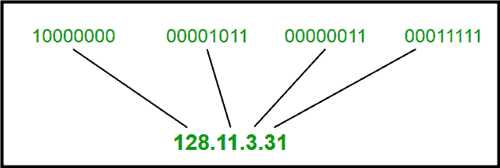
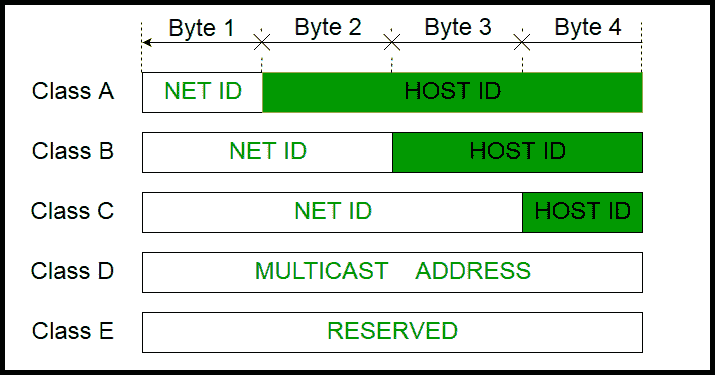
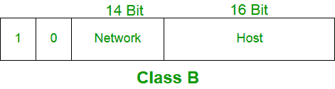
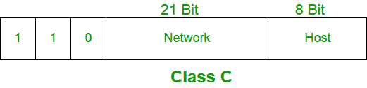
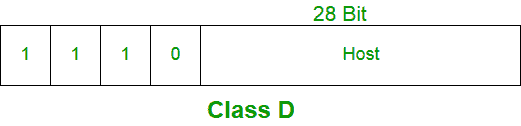
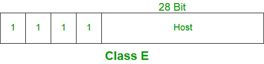

# 有类 IP 寻址介绍

> 原文:[https://www . geesforgeks . org/有类 ip 地址介绍/](https://www.geeksforgeeks.org/introduction-of-classful-ip-addressing/)

IP 地址是一个包含如何到达特定主机的信息的地址，尤其是在局域网之外。IP 地址是一个 32 位的唯一地址，地址空间为 2 32 。
写 IP 地址一般有两种表示法，点分十进制表示法和十六进制表示法。

点分十进制记数法:

十六进制记数法:

关于点分十进制记数法需要注意的几点:

1.  任何段(字节)的值都在 0 和 255 之间(两者都包括在内)。
2.  任何段中的值前面都没有零(054 是错误的，54 是正确的)。

**有类寻址**
32 位 IP 地址分为五个子类。这些是:

*   甲级
*   乙类
*   丙类
*   D 类
*   E 级

每个类别都有一个有效的 IP 地址范围。D 类和 E 类分别保留用于组播和实验目的。第一个八位字节中的比特顺序决定了 IP 地址的类别。
IPv4 地址分为两部分:

*   **网络 ID**
*   **主机 ID**

IP 地址的类别用于确定用于网络标识和主机标识的位，以及该特定类别中可能的网络和主机总数。每个 ISP 或网络管理员都会为连接到其网络的每个设备分配一个 IP 地址。

**注:** IP 地址由互联网分配号码管理局(IANA)和区域互联网注册管理机构(RIR)在全球范围内管理。

**注意:**在计算主机 IP 地址的总数时，有 2 个 IP 地址没有计算在内，因此从总数中减少，因为任何网络的第一个 IP 地址都是网络号，而最后一个 IP 地址是为广播 IP 保留的。

**甲类:**

属于 A 类的 IP 地址被分配给包含大量主机的网络。

*   网络标识长度为 8 位。
*   主机标识长度为 24 位。

A 类中第一个二进制八位数的高位总是设置为 0。第一个八位字节中的其余 7 位用于确定网络标识。主机标识的 24 位用于确定任何网络中的主机。A 类的默认子网掩码是 255.x.x.x。因此，A 类共有:

*   2^7-2= 126 网络 ID(这里减去 2 地址，因为 0.0.0.0 和 127.x.y.z 是特殊地址。)
*   2^24–2 = 16，777，214 个主机 ID

属于 A 类的 IP 地址范围从 1 . x . x . x–126 . x . x . x

**乙类:**

属于 B 类的 IP 地址被分配给从中型到大型网络的网络。

*   网络标识长度为 16 位。
*   主机标识长度为 16 位。

B 类 IP 地址第一个二进制八位数的高位总是设置为 10。其余 14 位用于确定网络标识。主机标识的 16 位用于确定任何网络中的主机。乙类的默认子网掩码是 255.255.x.x。乙类总共有:

*   2^14 = 16384 网络地址
*   2^16–2 = 65534 主机地址

    

    **丙类:**

    属于类别 C 的 IP 地址被分配给小型网络。

    *   网络标识长度为 24 位。
    *   主机标识长度为 8 位。

    C 类 IP 地址的第一个八位字节的高位总是设置为 110。其余 21 位用于确定网络标识。主机标识的 8 位用于确定任何网络中的主机。C 类的默认子网掩码是 255 . 255 . 255 . x。C 类总共有:

    *   2^21 = 2097152 网络地址
    *   2^8–2 = 254 个主机地址

    属于 C 类的 IP 地址范围为 192 . 0 . 0 . x–223 . 255 . 255 . x .
    

    **D 类:**

    属于类别 D 的 IP 地址被保留用于多重广播。属于类别 D 的 IP 地址的第一个八位字节的高阶位总是设置为 1110。剩余的位是感兴趣的主机能够识别的地址。

    D 类没有任何子网掩码。属于类别 D 的 IP 地址范围为 224 . 0 . 0 . 0–239 . 255 . 255 . 255。
    

    **E 级:**

    属于 E 类的 IP 地址被保留用于实验和研究目的。E 类的 IP 地址范围为 240 . 0 . 0 . 0–255 . 255 . 255 . 254。这个类没有任何子网掩码。E 类第一个二进制八位数的高位总是设置为 1111。
    

    **特殊 IP 地址范围:**

    **169 . 254 . 0 . 0–169 . 254 . 0 . 16**:链接本地地址
    **127 . 0 . 0 . 0–127 . 0 . 0 . 8**:环回地址
    **0 . 0 . 0 . 0–0 . 0 . 8**:用于在当前网络内通信。

    **主机标识分配规则:**

    主机标识用于识别网络中的主机。主机标识根据以下规则分配:

    *   在任何网络中，主机标识必须对该网络唯一。
    *   无法分配所有位都设置为 0 的主机标识，因为此主机标识用于表示 IP 地址的网络标识。
    *   无法分配所有位都设置为 1 的主机标识，因为该主机标识被保留为广播地址，用于向该特定网络上的所有主机发送数据包。

    **网络标识分配规则:**

    位于同一物理网络上的主机由网络标识来标识，因为同一物理网络上的所有主机都被分配了相同的网络标识。网络标识根据以下规则分配:

    *   网络标识不能以 127 开头，因为 127 属于 A 类地址，保留用于内部环回功能。
    *   网络标识设置为 1 的所有位都被保留用作 IP 广播地址，因此无法使用。
    *   网络标识的所有位都设置为 0，用于表示本地网络上的特定主机，不被路由，因此不被使用。

    **有类寻址总结:**

    

    **有类寻址的问题:**

    这种有类寻址方法的问题是，浪费了数百万个 A 类地址，浪费了许多 B 类地址，而 C 类中可用的地址数量太少，无法满足组织的需求。D 类地址用于多播路由，因此只能作为单个块使用。E 类地址被保留。

    由于存在这些问题，有类网络在 1993 年被无类域间路由(CIDR)所取代。我们将在下一篇文章中讨论无类寻址。

    **参考文献:**
    [【https://en.wikipedia.org/wiki/Classful_network】](https://en.wikipedia.org/wiki/Classful_network)
    [TechNet–微软](https://technet.microsoft.com/en-us/library/cc940018.aspx)
    [有类网络–维基百科](https://en.wikipedia.org/wiki/Classful_network)

    本文由**Mayank Kumar****Gaurav migrani**供稿。如果你喜欢 GeeksforGeeks 并想投稿，你也可以使用[write.geeksforgeeks.org](https://write.geeksforgeeks.org)写一篇文章或者把你的文章邮寄到 review-team@geeksforgeeks.org。看到你的文章出现在极客博客主页上，帮助其他极客。

    如果你发现任何不正确的地方，或者你想分享更多关于上面讨论的话题的信息，请写评论。