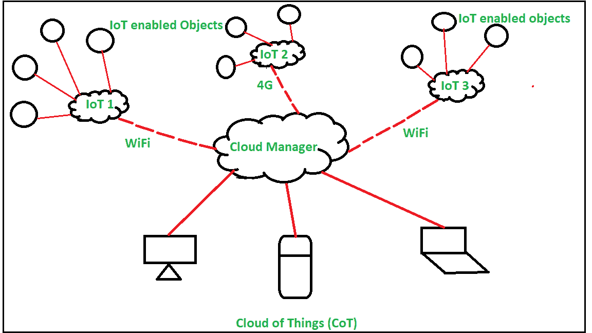
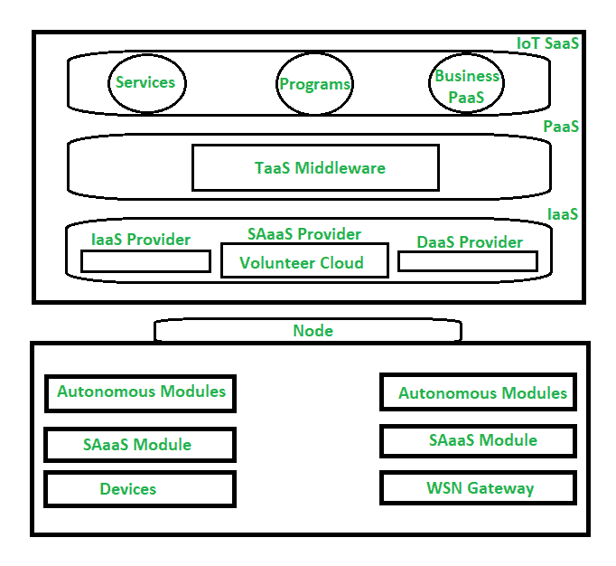

# 物云(CoT)介绍

> 原文:[https://www . geesforgeks . org/物联网简介-cot/](https://www.geeksforgeeks.org/introduction-of-cloud-of-things-cot/)

先决条件–[IOT 组件](https://www.geeksforgeeks.org/components-of-iot-and-relation-with-cloud-computing/)、[云计算与 IOT 的关系](https://www.geeksforgeeks.org/complementary-relationship-between-cloud-computing-and-iot/)
**物联网(CoT)** 是指[物联网(IoT)](https://www.geeksforgeeks.org/introduction-to-internet-of-things-iot-set-1/) 与[云计算(CC)](https://www.geeksforgeeks.org/cloud-computing/) 的融合。物联网是一个基于云的高性能物联网应用平台，允许远程监控、管理和控制支持物联网的设备。我们可以使用物联网来连接我们的设备和机器，并对其进行监控和管理。云计算(CC)在与物联网(IoT)融合后，创造了一种新的技术力量/新范式，被称为物联网，它提供了一种效率更高的新商业模式。

如今，支持物联网的设备数量如此之多，并且物联网生成的数据量也在不断增加，以至于不可能在本地和临时存储数据。虚拟资源利用率和存储容量要求也这么高。这就是为什么物联网与云计算集成，形成物联网或云物联网。物联网通过允许开发更先进的智能应用程序，在处理/分析数据以及从物联网生成的数据中创造更多有用性方面为物联网提供了很大帮助。

**物联网应用领域:**

*   卫生保健
*   智能家居
*   智慧城市
*   智能能源
*   智能移动性
*   智能监控
*   智能物流
*   环境监测

**常用 CoT 平台:**

*   说话
*   OpenIoT
*   云插头
*   物超所值的物超所值的物超所值的物超所值的物超所值的物超所值的物超所值的物超所值的物超所值物超所值
*   邻避
*   叶夫根克

**物联网架构(CoT) :**
软件即服务(SaaS)、平台即服务(PaaS)、基础设施即服务(IaaS)是云计算在云上构建、存储、创建和使用数据/应用的不同模式。同样，感知即服务、大数据分析即服务、数据库即服务、身份与策略管理即服务、视频监控即服务、数据即服务、传感器即服务等是物联网(CoT)的不同模式/形式。这些对象通过各种不同的网络环境相互连接。

**物联网中的问题:**

*   安全和隐私
*   不必要的数据通信
*   能量效率
*   协议支持
*   服务发现
*   缩放比例
*   IPv6 部署
*   资源分配
*   身份管理
*   数据存储位置
*   服务质量供应