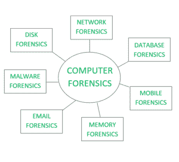
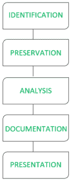

# 计算机取证介绍

> 原文:[https://www . geesforgeks . org/计算机取证入门/](https://www.geeksforgeeks.org/introduction-of-computer-forensics/)

**引言**
计算机取证是一种科学的调查和分析方法，目的是从数字设备或计算机网络和组件中收集适合在法庭或法律机构中出示的证据。
它包括执行结构化调查，同时维护记录在案的证据链，以查明计算机上到底发生了什么，以及谁对此负责。

**类型**

*   磁盘取证:通过搜索活动、修改或删除的文件，从设备的主存储或辅助存储中提取原始数据。
*   网络取证:它是计算机取证的一个分支，涉及监控和分析计算机网络流量。
*   数据库取证:它处理数据库及其相关元数据的研究和检查。
*   恶意软件取证:处理可疑代码的识别，研究病毒、蠕虫等。
*   电子邮件取证:它处理电子邮件及其恢复和分析，包括删除的电子邮件、日历和联系人。
*   内存取证:处理以原始形式从系统内存(系统寄存器、缓存、内存)中收集数据，然后对其进行分析以供进一步调查。
*   手机取证:主要处理手机和智能手机的检查和分析，帮助检索联系人、通话记录、传入和传出的短信等。和其他数据。

**特色**

*   识别:识别什么样的证据存在，存储在哪里，如何存储(以何种格式)。电子设备可以是个人电脑、手机、掌上电脑等。
*   保存:数据被隔离、保护和保存。它包括禁止未经授权的人员使用数字设备，以便数字证据不会被错误地或故意地篡改，以及制作原始证据的副本。
*   分析:法医实验室人员重建数据片段，并根据证据得出结论。
*   文档:创建所有可见数据的记录。它有助于重现和回顾犯罪现场。调查的所有结果都被记录在案。
*   演示:所有记录的调查结果都在法庭上出示，以供进一步调查。

**程序:**
程序从识别使用的装置和收集犯罪现场的初步证据开始。然后取得法院对证据的扣押令，导致证据的扣押。证据随后被运送到**法医实验室**进行进一步调查，将证据从犯罪现场运送到实验室的程序称为监管链。证据随后被复制用于分析，并且原始证据保持安全，因为分析总是在复制的证据上而不是原始证据上进行。

然后对复制的可疑活动证据进行分析，并相应地以非技术口吻记录调查结果。记录在案的调查结果随后会提交给法院进行进一步调查。

**一些用于调查的工具:**
笔记本电脑或个人电脑工具–

*   **COFEE–**微软开发的一套 Windows 工具。
*   **验尸官工具包–**一套用于 Unix 分析的程序。
*   **侦探工具包–**适用于 Unix 和 Windows 的工具库。

**记忆工具:**

*   挥发性
*   WindowsSCOPE

**移动设备工具:**

*   XACT 微系统公司

**应用**

*   知识产权盗窃
*   工业间谍
*   雇佣纠纷
*   欺诈调查
*   工作场所滥用互联网和电子邮件
*   伪造相关事宜
*   破产调查
*   与法规遵从性相关的问题

**计算机取证的优势:**

*   在法庭上出示证据，这可能导致对罪犯的惩罚。
*   它有助于公司收集其计算机系统或网络上可能被泄露的重要信息。
*   高效追踪来自世界任何地方的网络罪犯。
*   有助于保护组织的资金和宝贵的时间。
*   允许提取、处理和解释事实证据，从而证明网络犯罪行为在法庭上。

**计算机取证的弊端:**

*   在数字证据被法庭接受之前，必须证明它没有被篡改。
*   安全地制作和保存电子记录是昂贵的。
*   法律从业者必须有丰富的计算机知识。
*   需要拿出真实可信的证据。
*   如果用于数字取证的工具不符合规定的标准，那么在法庭上，证据可能会被司法部门否决。
*   调查官员缺乏技术知识可能无法提供理想的结果。