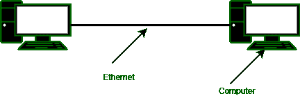
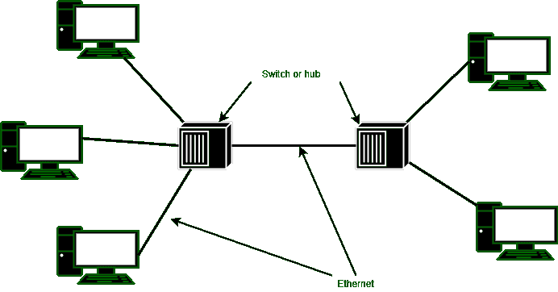

# 千兆以太网介绍

> 原文:[https://www . geeksforgeeks . org/千兆以太网简介/](https://www.geeksforgeeks.org/introduction-of-gigabit-ethernet/)

该委员会开始致力于一个更快的以太网，很快被称为千兆以太网。目标是在保持所有以太网标准的同时提高性能。千兆位以太网必须使用相同的 48 位地址方案提供单播和广播服务，并保持相同的帧格式。千兆以太网的所有配置都必须使用点对点链路。在图(a)中，两台计算机直接相互连接。

图(A)一个两站以太网

但是，使用连接到多台计算机的交换机或集线器，并且可能使用额外的交换机或集线器，如图(b)所示。在这两张图中，以太网电缆上正好有两个设备。

图(b)多站以太网

**千兆以太网的特点:**

*   它支持两种不同的模式，即全双工模式和半双工模式。全双工模式允许同时双向通信。当中央交换机连接到外围计算机时，使用这种模式。
*   在这种情况下，所有线路都被缓冲，因此每台计算机和交换机都可以随时发送帧。在这种模式下，竞争是不可能的。
*   计算机是交换机唯一可能的发送方，即使交换机当前正在向计算机发送帧，传输也会成功。
*   当计算机连接到集线器而不是交换机时，使用半双工模式。集线器不缓冲传入的帧。
*   所有线路内部电连接，模拟经典以太网中使用的多点电缆。在这种模式下需要标准的 CSMA/光盘协议，因为可能会发生冲突。因为 64 字节的帧现在可以比传统以太网传输快 100 倍，所以最大电缆长度必须少 100 倍或 25 米。

**表为不同的** [**以太网**](https://www.geeksforgeeks.org/ethernet-frame-format/) **:**

*   千兆以太网支持铜缆和光缆，如表 1 所示。当以 1 Gbps 的速度发送信号时，它需要编码，并且每纳秒必须发送一位。
*   这个技巧最初是用短的屏蔽铜缆和光纤完成的。对于光纤，允许两种波长，并导致两个不同的版本:0.85 微米和 1.3 微米。

**表-1:** 千兆以太网布线

| **名称** | **电缆** | **最大。段** | **优势** |
| --- | --- | --- | --- |
| 1000Base-SX | 纤维光学 | 550 米 | 多模光纤(50，62.5 微米) |
| 1000Base-LX | 纤维光学 | 5000 米 | 单(10)或多模式(50，62.5) |
| 1000Base-CX | 2 对 STP | 25 米 | 屏蔽双绞线 |
| 1000Base-T | 4 双 UTP | 100 米 | 标准 5 类 UTP |

*   借助更便宜的发光二极管，可以实现短波长信号。由于 50 微米光纤可以达到 500 米，因此可以用于建筑物内的连接，也可以用于多模光纤。较长波长的信号需要昂贵的激光器。
*   随着千兆以太网的出现，又引入了一个扩展。巨型帧允许帧达到 9 KB。这个扩展是专有的。如果使用以太网，则它不再与早期版本兼容，因此它不被标准认可。但是它得到了大多数供应商的支持。