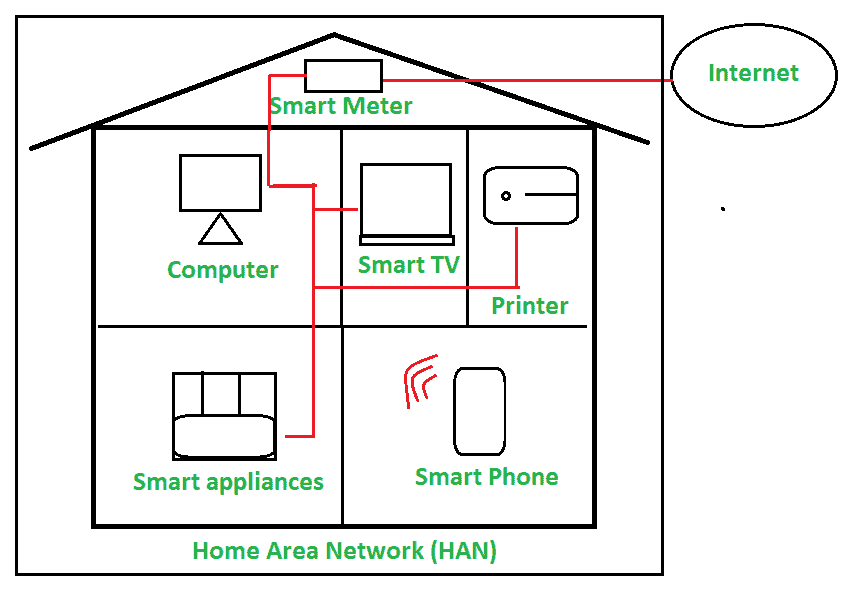

# 家庭局域网(HAN)介绍

> 原文:[https://www . geesforgeks . org/home-area-network-Han/](https://www.geeksforgeeks.org/introduction-of-home-area-network-han/)简介

**家庭区域网络(HAN)** 是用户家中的网络，所有笔记本电脑、电脑、智能手机和其他智能电器和数字设备都连接到网络中。这有助于家庭内连接到家庭网络的数字设备之间的通信。家庭区域网络可以是有线或无线的。大部分无线网络用于 HAN。一个集中式设备用于功能[网络地址转换(NAT)](https://www.geeksforgeeks.org/network-address-translation-nat/) 。该家庭区域网络通过网络连接实现智能设备之间的通信和资源共享。

**示例–**
想象一个家庭，其中计算机、打印机、游戏系统和平板电脑、智能手机、其他智能电器通过网络通过有线或无线相互连接，这就是家庭区域网络的一个示例。

**HAN 的基础设施:**

*   使用由 ISP 提供的[调制解调器](https://www.geeksforgeeks.org/difference-between-modem-and-router/)将以太网暴露给广域网。在家里，它们有 DSL 调制解调器或电缆调制解调器。
*   一个[路由器](https://www.geeksforgeeks.org/difference-between-modem-and-router/)用于管理家庭区域网(HAN)和[广域网(WAN)](https://www.geeksforgeeks.org/types-of-area-networks-lan-man-and-wan/) 之间的连接。
*   无线接入点用于将无线数字设备连接到网络。
*   智能设备/数字设备用于连接到家庭区域网络。

**以 HAN–**连接的设备

*   笔记本电脑和计算机
*   智能手机
*   网络打印机
*   [网络连接存储(NAS)](https://www.geeksforgeeks.org/network-attached-storage-in-dbms/) 设备
*   安全警报
*   智能电视和灯泡
*   智能扬声器
*   车库门和开门器
*   媒体播放器或流媒体设备等

**家庭局域网(HAN)的优势:**

1.  **可访问性–**
    家庭区域网络为网络中的设备访问互联网连接提供了更好的可访问性。
2.  **资源共享–**
    网络上的资源可以通过网络共享。例如，如果你想分享一个视频文件从你的电脑到智能电视，这是非常使用 HAN。
3.  **安全性–**
    家庭区域网络提供了更好的安全性，因为它启用了安全软件、密码等来防止未经授权的访问。
4.  **管理–**
    连接到家庭网络的所有设备/电器都易于管理，用户只需很少的努力就可以控制。
5.  **维护–**
    家庭网络一旦建立，不需要频繁维护，只需稍加维护和监控，就能正常工作。
6.  **多用户–**
    家庭区域网络允许多个用户在该家庭中工作，没有任何问题。所有成员都可以按照他们的要求同时工作。
7.  **舒适生活–**
    这个网络将所有设备连接到一个网络，随着物联网技术的加入，一切都变得自动化，为人类提供更舒适的生活方式。

**家庭局域网(HAN)的缺点:**

1.  **昂贵–**
    建立 HAN 有点贵，因为它需要智能设备和电器才能在网络中工作。例如，它需要笔记本电脑、智能电视、智能洗衣机、智能手机等。
2.  **连接速度慢–**
    当家中所有用户都使用共享家庭局域网时，他们可能会面临网速慢的问题。例如，当任何人通过大量上网下载大量文件时，其他人可能会感觉网速变慢。
3.  **高安全性–**
    它要求高安全性，否则如果攻击者以任何设备为目标并进入家庭网络，那么他们可能会从笔记本电脑中窃取重要数据，因为所有设备都相互连接并在共享网络上工作。