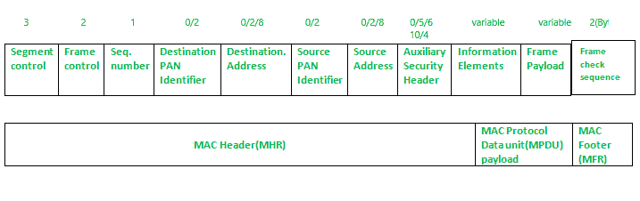

# IEEE 1901.2 a 简介

> 原文:[https://www.geeksforgeeks.org/introduction-of-ieee-1901-2a/](https://www.geeksforgeeks.org/introduction-of-ieee-1901-2a/)

**概述:**
在本文中，我们将详细讨论 IEEE 1901.2a。虽然大多数受限网络技术是无线的，但 IEEE 1901.2a-2013 是一种有线技术，它更新了最初的 IEEE 1901.2 标准。这是窄带电力线通信标准。

**NB-PLC 场景:**
NB-PLC 常用于以下场景:

*   **智能计量–**
    NB-PLC 可以自动读取公用事业仪表，如电表、煤气表和水表。
*   **配电自动化–**
    NB-PLC 可用于配电自动化，这需要监控和控制电网的所有组件。
*   **公共照明–**
    这是 NB-PLC 的常见应用，包括在城市、道路、高速公路和公园等公共空间看到的灯光。
*   **电动汽车充电站–**
    NB-PLC 可用于电动汽车充电站供电。
*   **微电网–**
    NB-PLC 可用于创建微电网，微电网是可以独立于主电网运行的小型能源电网。
*   **可再生能源–**
    NB-PLC 可用于太阳能、风能、水电和地热应用。有几种可编程逻辑控制器标准，但缺乏低频可编程逻辑控制器解决方案促使创建了 IEEE 1901.2a。低于 500 千赫。

**注:**
IEEE 1901.2 a 中规定了连续和直流电力线路，数据速率可提高到 500 kbps。在终端上，IEEE 1901.2a PHY 层和 MAC 层可以与 IEEE 802.15.4g/e 混合，在某些情况下允许双 PHY 解决方案。

**特征:**

1.  **标准化和联盟–**
    可靠性差、吞吐量有限、缺乏管理和兼容性差影响了最早的几代 NB-PLC 系统。因此，许多组织制定了自己的世代要求。正交频分复用被用于当前的 NB-PLC 规范(OFDM)。使用正交频分复用在多个载波频率上对数字数据进行编码。IEEE 1901.2a 是家庭插头网络倡议的一部分，该倡议是促进可编程逻辑控制器技术营销和认证的关键行业团体之一。

2.  **物理层–**
    NB-PLC 针对 3 至 500 kHz 的频段进行定义。IEEE 1901.2 工作组整合了对世界所有地区的支持，以制定一个全球标准。IEEE 1901.2a 支持最大的编码集，并支持鲁棒性和吞吐量。所有频段的音调映射和调制，如鲁棒调制(ROBO)、差分二进制相移键控(DBPSK)、差分正交相移键控(DQPSK)、差分 8 点相移键控(D8PSK)，以及可选的 16 正交幅度调制(16QAM)，都包含在标准中。

3.  **MAC 层–**
    IEEE 1901.2 a MAC 帧格式与 IEEE 802.15.4 MAC 帧相关，但是，它包含了最新的 IEEE 802.15.4e-2012 修正案，允许实现基本功能。信息元素是从 IEEE 802.15.4e 转移到 IEEE 1901.2a 的重要组件之一。还提供了其他功能，如 IE 支持、IEEE 802.15.9 密钥管理协议和 SSID。分段控制是 IEEE 1901.2 中的一个领域。这处理的是大于媒体访问控制协议数据单元所能承载的上层数据包的分段或碎片(MPDU)。

IEEE 1901.2 的媒体访问控制帧格式

**IEEE 1901.2 a 的拓扑:**
IEEE 1901.2a 场景和部署拓扑基于物理电力线。信号传输受到噪声、干扰、失真和衰减等变量的限制，就像无线技术一样。因为这些变量随着距离的增加而变得更加突出，所以大多数 NB-PLC 实现都具有网状拓扑。网状网络的好处是允许设备中继来自其他设备的流量，从而可以分隔更远的距离。IEEE 1901.2a 标准允许使用任何上层协议。因此，支持 IPv6 6LoWPAN 和 RPL IPv6 变体。这些协议允许使用网络层路由在可编程逻辑控制器上创建网状网络。

**IEEE 1901.2 a 的安全性:**
IEEE 1901.2a 的安全性与 IEEE 802.15.4g 的安全性相同。AES 用于加密和身份验证。此外，当支持 IEEE 802.15.9 密钥管理协议时，IEEE 1901.2a 与 IEEE 802.15.4g 兼容。区别如下。

*   在所有携带加密帧段的媒体访问控制帧中，应该设置帧控制字段中的安全启用位。
*   无论是否必要，数据加密都应该在分组分段之前进行。在数据包加密期间，段控制字段不包括在加密方法的输入中。
*   数据解密发生在接收方的数据包重组之后。
*   启用安全性时，加密的有效负载加上非分段有效负载的消息完整性代码(MIC)身份验证标签构成了媒体访问控制有效负载。如果有效负载被分段，则 MIC 仅出现在最后一个数据包(段)中。

**竞争技术:**
在 NB-PLC 领域有两项技术与 IEEE 1901.2a 竞争:G3-PLC(原 ITU G.9903)和 PRIME(现 ITU G.9904)。这两种技术都是基于一个单一的使用案例:使用 CENELEC A 频段在欧洲实现智能计量。IEEE 1901.2 与 G3-PLC 相当接近。G3-PLC 需要数据链路层协议选择来引导和发布设备地址，并且它与 IEEE 802.15.4g/e 和端到端 IPv6 范例不兼容，仅举几个问题。PRIME 更类似于 ATM 系统，第 7 层协议(DLMS/COSEM)直接运行在第 2 层之上。IP 支持需要添加第 3 层协议。